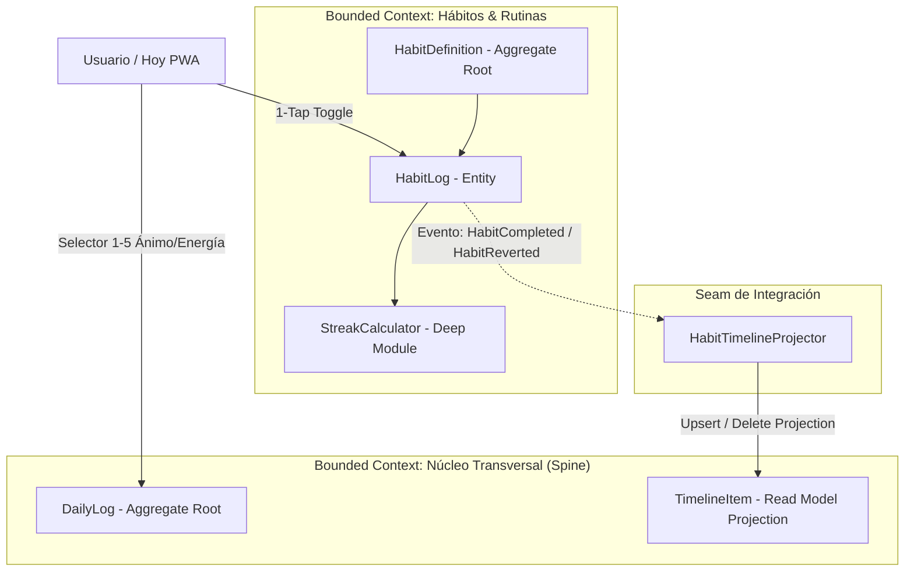

# Especificación Funcional: Fase 2 - Hábitos y Rutinas + Daily Hub (Vista 'Hoy')

- **Feature**: Hábitos y Rutinas + Daily Hub (`/hoy`)
- **Ruta del Artefacto**: `.specs/02-habits-and-daily-hub/spec.md`
- **Fase**: 2 (Pilar Hábitos y Bitácora Diaria)
- **Estado**: Propuesto (En espera de Puerta de Aprobación 1)
- **Fecha**: 2026-09-05
- **Autor**: System Architect (SubiKit)
- **Aprobador**: Subi

---

## 1. Resumen del Problema y Propuesta de Valor

### 1.1 Contexto y Dolor Actual
El seguimiento de hábitos personales tiende al abandono cuando existe fricción operativa: pantallas lentas, navegación compleja o la necesidad de abrir múltiples secciones para registrar el estado diario. Asimismo, Subi necesita una pantalla unificada donde, al abrir la aplicación en su smartphone o laptop cada mañana o noche, tenga visibilidad inmediata de su día:
1. ¿Cómo me siento hoy (ánimo y energía)?
2. ¿Cuáles son mis hábitos prioritarios que tocan hoy?
3. ¿Cuál es mi racha y consistencia acumulada?
4. ¿Qué eventos y actividades ocurrieron a lo largo de la jornada?

### 1.2 Propuesta de Valor
* **Fricción Cero (1-Tap Toggle)**: Marcar o desmarcar un hábito diario requiere un solo toque táctil con respuesta inmediata (actualización optimista en cliente).
* **Daily Hub (`/hoy`) como Centro Neurálgico**: Centraliza en una vista única el pulso del día:
  - Registro ágil de Ánimo y Energía (escala 1 a 5 con feedback visual).
  - Progreso porcentual diario (ej. 4/5 hábitos completados = 80%).
  - Línea de tiempo cronológica del día alimentada automáticamente por proyecciones transversales (`timeline_items`).
* **Resiliencia y Flexibilidad de Hábitos**: Soporte para hábitos cotidianos, hábitos de días específicos (ej. entrenamiento Lun/Mié/Vie) y hábitos flexibles (ej. leer 3 veces por semana), con período de gracia de 48 horas que protege la racha ante olvidos momentáneos sin alterar la verdad histórica.

---

## 2. Bounded Contexts y Arquitectura de Dominio

En concordancia con `CONTEXT.md`, la solución articula dos Bounded Contexts:



### 2.1 Principios de Diseño Aplicados
1. **Deep Module (John Ousterhout)**: El cálculo de rachas (`StreakCalculator`) expone una API extremadamente concisa (`Calculate(habit, logs, targetDate)`) mientras encapsula la matemática de frecuencias no lineales, fines de semana, días exentos y períodos de gracia.
2. **Seams (Michael Feathers)**: La sincronización entre un hábito completado y el timeline transversal se realiza a través de una costura (`IHabitTimelineProjector`). Esto permite modificar o testear la proyección sin acoplar la persistencia del log de hábitos con la tabla `timeline_items`.
3. **Invariantes de Negocio Rigurosos**:
   - **Invariante 1 (Propiedad)**: Todo hábito y registro está estrictamente asociado al `user_id` autenticado mediante RLS.
   - **Invariante 2 (Desacoplamiento)**: El Daily Hub no realiza joins directos invasivos entre hábitos y notas/estudios; consume la proyección uniforme de `timeline_items`.
   - **Invariante 4 (Resiliencia de Streaks)**: Edición retroactiva permitida exclusivamente dentro de la ventana de gracia de 48 horas.

---

## 3. Alcance (Scope)

### 3.1 In Scope
* **Catálogo de Hábitos (`/habitos`)**:
  - Crear, editar, archivar y listar hábitos.
  - Campos: Título, descripción opcional, categoría (Salud, Estudio, Productividad, etc.), color, icono Lucide.
  - Reglas de frecuencia:
    - `daily`: Aplica todos los días.
    - `specific_days`: Aplica en días específicos de la semana (ej. `[1, 3, 5]` para Lun, Mié, Vie).
    - `times_per_week`: Aplica N veces por semana (ej. 3 veces/semana de lunes a domingo).
* **Registro Diario de 1-Tap**:
  - Toggle instantáneo (marcar como completado / desmarcar) para la fecha actual o fechas dentro de la ventana de gracia (48h).
  - Posibilidad de marcar estado `completed` o `skipped` (salteado justificado sin romper racha).
* **Motor de Rachas**:
  - Cálculo de `current_streak` (días o semanas consecutivas según frecuencia).
  - Cálculo de `longest_streak` (récord histórico).
  - Detección de "Racha Activa" o "En Riesgo".
* **Daily Hub (`/hoy`)**:
  - Selector táctil de Ánimo (`mood_score`: 1-5) y Energía (`energy_score`: 1-5) con guardado inmediato en `daily_logs`.
  - Campo de texto libre para resumen reflexivo del día (`summary_text`).
  - Lista interactiva de hábitos que corresponden al día de hoy, con indicador visual de racha actual.
  - Barra de progreso del día (porcentaje de completitud de hábitos programados).
  - Proyección automática a `timeline_items` (`source_module: 'habits'`, `event_type: 'habit_completed'`).
  - Feed cronológico de eventos ocurridos en el día en `/hoy`.
* **Diseño Responsivo**:
  - Móvil táctil prioritario (*mobile-first*) con zonas de toque mínimas de 44x44px.
  - Vista adaptativa desktop de dos columnas: Check-in & Hábitos (izquierda) y Feed del Timeline diario (derecha).

### 3.2 Out of Scope
* Notificaciones push móviles nativas mediante Web Push (reservado para la Fase de Background Workers con Quartz.NET).
* Widgets nativos de iOS/Android para la pantalla de bloqueo o inicio.
* Integraciones con calendarios externos (Google Calendar, Notion).
* Recomendaciones predictivas del Asistente IA sobre correlación entre hábitos y estado de ánimo (reservado para la Fase de Asistente IA).

---

## 4. Contratos de API (.NET RESTful)

### 4.1 Módulo Daily Hub & Logs

#### `GET /api/daily-hub/today`
Devuelve la información consolidada para la vista `/hoy`:
- `date`: YYYY-MM-DD
- `dailyLog`: `{ moodScore, energyScore, summaryText }`
- `habits`: Lista de hábitos del día con `isCompletedToday`, `currentStreak`, `longestStreak`, `color`, `icon`.
- `completionPercentage`: Número de 0 a 100.
- `todayTimeline`: Eventos registrados hoy en el Spine (`timeline_items`).

#### `PUT /api/daily-logs/today`
Actualiza o crea el bitácora del día con `moodScore`, `energyScore` y `summaryText`.

### 4.2 Módulo Hábitos

#### `GET /api/habits`
Listado de definiciones de hábitos activos y archivados.

#### `POST /api/habits`
Crea una nueva definición de hábito con nombre, categoría, frecuencia, icono y color.

#### `POST /api/habits/{id}/toggle`
Alterna el estado de completado para una fecha dada (por defecto `today`). Devuelve el nuevo estado y las rachas recalculadas.

---

## 5. Criterios de Aceptación (Gherkin BDD)

### Escenario 1: Toggle de 1 toque de hábito diario y proyección a Timeline
```gherkin
Dado que Subi tiene un hábito activo "Tomar 2L de Agua" con frecuencia "diario"
Y el hábito no está completado en la fecha de hoy
Cuando Subi toca la tarjeta del hábito en la vista "/hoy"
Entonces el hábito pasa instantáneamente a estado "completado"
Y la racha actual del hábito se incrementa en 1
Y el porcentaje de completitud diario se recalcula
Y se proyecta un nuevo registro en "timeline_items" con origen "habits" y evento "habit_completed"
```

### Escenario 2: Desmarcar hábito diario (toggle inverso)
```gherkin
Dado que Subi completó el hábito "Tomar 2L de Agua" hoy
Y existe un registro de proyección en "timeline_items" para este evento
Cuando Subi vuelve a tocar la tarjeta del hábito en "/hoy" para desmarcarlo
Entonces el hábito vuelve a estado "pendiente"
Y la racha actual se recalcula al valor previo
Y el registro correspondiente en "timeline_items" es removido de forma idempotente
```

### Escenario 3: Continuidad de racha en hábitos de días específicos
```gherkin
Dado que Subi tiene el hábito "Entrenamiento de Fuerza" programado para "Lunes, Miércoles, Viernes"
Y Subi completó el entrenamiento el Miércoles (racha = 4)
Cuando llega el día Jueves (día no programado)
Entonces el hábito no aparece como pendiente urgente en el Daily Hub de hoy
Y la racha actual se mantiene en 4 sin penalización ni reinicio
```

### Escenario 4: Racha de hábito flexible "N veces por semana"
```gherkin
Dado que Subi tiene el hábito "Lectura Técnica" con meta de "3 veces por semana"
Y en la semana actual Subi completó lecturas el Martes, Jueves y Sábado (3 completados)
Cuando finaliza el Domingo
Entonces la semana se evalúa como cumplida satisfactoriamente
Y la racha acumulada de semanas consecutivas se incrementa en 1
```

### Escenario 5: Registro retrospectivo dentro del período de gracia (48h)
```gherkin
Dado que Subi olvidó marcar el hábito "Meditar" en el día de ayer (hace 24 horas)
Cuando Subi abre el selector de fechas o edita la jornada de ayer
Entonces el sistema permite registrar el hábito como "completado"
Y la racha actual se recalcula considerando la continuidad de ayer
```

### Escenario 6: Bloqueo de modificación superadas las 48 horas (Invariante 4)
```gherkin
Dado que existe un hábito no completado hace 4 días (más de 48 horas de antigüedad)
Cuando un cliente intenta registrar un HabitLog para dicha fecha
Entonces el sistema rechaza la operación con código de error HTTP 400 Bad Request
Y responde que el período de gracia para modificaciones históricas ha expirado
```

### Escenario 7: Registro ágil de Ánimo y Energía en Daily Hub
```gherkin
Dado que Subi se encuentra en "/hoy" al comenzar su jornada
Cuando pulsa el selector "4" en Ánimo y "5" en Energía
Entonces se efectúa un guardado inmediato en "daily_logs" para la fecha de hoy
Y se refleja la confirmación visual de guardado sin requerir recargar la página
```

### Escenario 8: Aislamiento estricto por usuario (Invariante 1)
```gherkin
Dado un usuario autenticado A y un usuario autenticado B
Cuando el usuario A consulta el Daily Hub o catálogo de hábitos
Entonces no puede ver ni modificar ningún hábito, racha o log perteneciente al usuario B
Y todas las consultas a Postgres están protegidas por Row Level Security (RLS)
```
