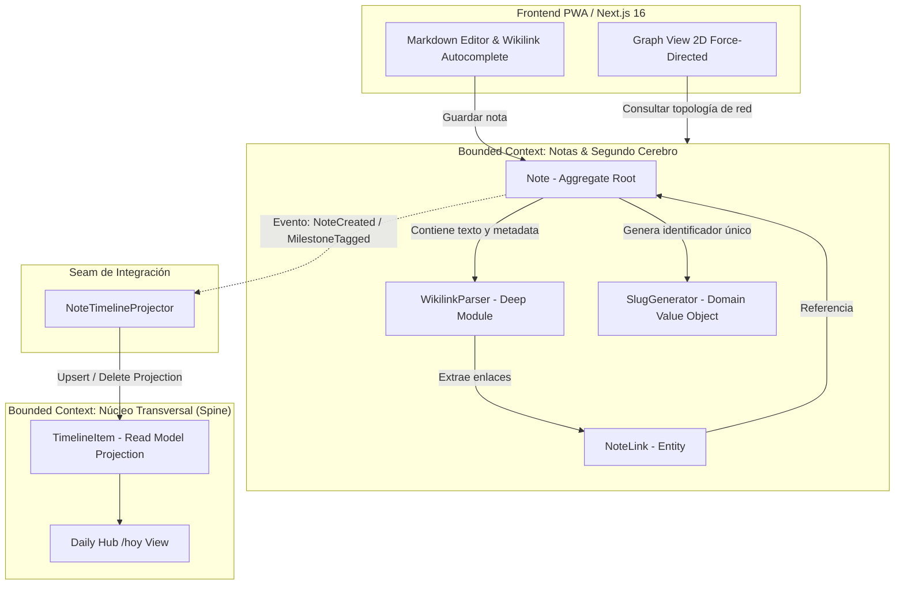

# Especificación Funcional: Fase 3 - Notas y Segundo Cerebro (Segundo Cerebro estilo Obsidian)

- **Feature**: Segundo Cerebro & Notas Interconectadas (Estilo Obsidian)
- **Ruta del Artefacto**: `.specs/03-second-brain-notes/spec.md`
- **Fase**: 3 (Segundo Cerebro y Gestión de Conocimiento)
- **Estado**: Propuesto (En espera de Puerta de Aprobación 1)
- **Fecha**: 2026-09-05
- **Autor**: System Architect (SubiKit)
- **Aprobador**: Subi

---

## 1. Resumen del Problema y Propuesta de Valor

### 1.1 Contexto y Dolor Actual
Las herramientas tradicionales de toma de notas basadas en árboles rígidos de carpetas (Word, Notion superficial o carpetas locales) introducen fricción cognitiva innecesaria: "¿En qué carpeta guardo esto?". Además, las notas quedan aisladas en silos donde mueren sin interactuar con otros conocimientos. 

El cerebro humano opera mediante asociaciones neuronales, no jerarquías de archivos. Subi requiere un entorno donde:
1. Pueda escribir notas rápidamente en **Markdown puro**, sin barreras de formato.
2. Pueda entrelazar conceptos de forma orgánica mediante enlaces bidireccionales (`[[wikilinks]]`), creando un entramado de pensamiento conectado.
3. Pueda descubrir qué notas apuntan al documento que está leyendo (**Backlinks**) sin tener que buscarlas manualmente.
4. Pueda proyectar ideas que aún no redactó mediante enlaces a notas futuras (**Stub / Ghost Notes**), visualizándolas en su red.
5. Disponga de un mapa visual (**Graph View**) en 2D interactivo para contemplar su universo de notas, identificar clusters de conocimiento y navegar fluidamente.
6. Las notas clave o reflexiones puedan proyectarse al **Daily Hub (`/hoy`)** a través del Spine transversal (`timeline_items`).

### 1.2 Propuesta de Valor
* **Flujo Fluido Obsidian-First**: Editor de Markdown interactivo con soporte de títulos, listas, tareas, bloques de código, tags `#tag` y wikilinks `[[Título]]` o `[[Título|Alias]]`.
* **Deep Module de Extracción Determinista (`WikilinkParser`)**: Procesamiento seguro en backend y frontend que resuelve enlaces ignorando bloques de código y textos escapados.
* **Integridad Relacional de Enlaces y Backlinks**: Al guardar una nota, se recalculan y sincronizan atómicamente sus `NoteLink` salientes en PostgreSQL, permitiendo consultas instantáneas de backlinks contextuales.
* **Stubs / Ghost Notes de Primera Clase**: Escribir `[[Arquitectura Hexagonal]]` antes de redactarla no arroja errores ni requiere crearla antes: el sistema registra un nodo stub que aparece en el grafo y permite materializarse con 1 click.
* **Mapa de Grafo Interactivo (Graph View 2D)**: Visualizador de red force-directed en tiempo real. Nodos con tamaño dinámico según cantidad de referencias entrantes/salientes, coloreado por tags y navegación directa al hacer click.
* **Búsqueda Ultrarrápida y Autocompletado**: Al escribir `[[` en el editor, un menú contextual sugiere notas existentes y tags con navegación por teclado. Búsqueda Full-Text en Postgres con vector indexado.
* **Proyección al Spine Transversal (`timeline_items`)**: Conexión limpia con el resto del Life Tracker sin acoplamiento de esquemas.

---

## 2. Bounded Contexts y Arquitectura de Dominio

La solución se inserta dentro del ecosistema definido en `CONTEXT.md`:



### 2.1 Principios de Diseño Aplicados
1. **Deep Module (John Ousterhout)**: `WikilinkParser` expone una interfaz pequeña y predecible:
   ```csharp
   public interface IWikilinkParser
   {
       IReadOnlyList<WikilinkMatch> ExtractLinks(string markdownContent);
       IReadOnlyList<string> ExtractTags(string markdownContent);
   }
   ```
   Oculta toda la complejidad de expresiones regulares, exclusión de bloques de código (fenced code blocks ```` ``` ```` y backticks `inline`), escapes de corchetes `\[\[...\]\]`, y división de targets y alias (`Target|Alias`).
2. **Seams (Michael Feathers)**: La sincronización entre notas y la línea de tiempo global se realiza mediante `INoteTimelineProjector`. Esto evita que la entidad `Note` o la tabla `notes` conozcan la estructura de `timeline_items`. Las reglas de proyección (ej. proyectar solo notas creadas o notas con tags de `#bitacora` o `#hito`) viven en la costura de aplicación.
3. **Invariantes de Dominio Rigurosos**:
   - **Invariante 1 (Propiedad y Privacidad RLS)**: Toda nota y enlace pertenece de forma inmutable al `user_id` autenticado.
   - **Invariante 2 (Unicidad y Estabilidad de Slugs)**: Cada nota posee un `slug` único por usuario (`user_id, slug`) generado a partir del título. Los enlaces y URLs son estables y legibles (`/notas/:slug`).
   - **Invariante 3 (Sincronización Atómica de Enlaces)**: Al actualizar el contenido de una nota, la actualización de sus `note_links` salientes es atómica. Si se elimina un enlace del texto Markdown, el `NoteLink` correspondiente se remueve sin dejar huérfanos.
   - **Invariante 4 (Soporte Resiliente de Stubs)**: Si una nota cita un título inexistente, se registra un `Note` con flag `is_stub = true`. No bloquea la persistencia ni genera errores de clave foránea. Cuando el usuario abre y guarda ese stub, pasa a `is_stub = false` automáticamente.

---

## 3. Alcance (Scope)

### 3.1 In Scope
* **Gestión de Notas (`/notas`)**:
  - Listado de notas con orden cronológico (última actualización), búsqueda en tiempo real y filtrado facetado por tags.
  - Creación de notas con título, contenido Markdown y tags.
  - Edición con guardado asistido (debounce automático o guardado explícito).
  - Eliminación segura y opción de archivado (`is_archived: true`).
  - Fijado de notas prioritarias (`pinned: true`).
* **Sintaxis de Wikilinks & Tags**:
  - `[[Título de la Nota]]`: Enlace estándar.
  - `[[Título de la Nota|Texto Alternativo]]`: Enlace con alias legible.
  - `#tag` y `#tag-compuesto`: Extracción automática de etiquetas en el cuerpo del Markdown y visualización en metadata.
* **Resolución de Enlaces y Backlinks**:
  - Extracción automática de enlaces salientes al guardar una nota.
  - Panel lateral de **Backlinks**: Muestra todas las notas que enlazan a la nota actual junto con un snippet del contexto de la oración donde fueron mencionadas.
  - Creación y resolución transparente de notas fantasma / stubs (`is_stub: true`).
* **Autocompletado en UI**:
  - Al escribir `[[` en el editor, se despliega un popover contextual que busca notas existentes en tiempo real. Al presionar `Enter` o clickear, inserta la sintaxis completa `[[Título Elegido]]`.
* **Visualización de Grafo (Graph View 2D)**:
  - Pantalla o modal dedicado para explorar la red neuronal de notas.
  - Nodos interactivos: Nodos reales (sólidos y vibrantes) y Nodos stub (atenuados con borde punteado).
  - Escala de radio de nodos basada en el grado de conectividad (número de enlaces).
  - Aristas direccionales sutiles entre notas conectadas.
  - Interacciones: Zoom, paneo (*pan*), arrastre de nodos (*drag*) y click para navegar directamente a la nota seleccionada.
* **Proyección al Timeline**:
  - Al crear una nota nueva, se genera un evento en `timeline_items` (`source_module: 'notes'`, `event_type: 'note_created'`).
  - Si la nota incluye tags de hitos o salud (ej. `#salud`, `#bitacora`, `#aprendizaje`), los tags se indexan en el metadata JSON del timeline para visualización enriquecida en `/hoy`.

### 3.2 Out of Scope
* Sincronización offline P2P compleja mediante CRDTs (Yjs/Automerge) multiusuario (la persistencia descansa directamente en Supabase Postgres con cliente API).
* Lienzo infinito libre estilo Obsidian Canvas o Miro (el foco son documentos Markdown interconectados y la vista de Grafo relacional).
* Edición colaborativa multiusuario en tiempo real al estilo Google Docs.
* Procesamiento OCR de imágenes adjuntas en el editor (reservado para la Fase de Asistente IA y Estudios Médicos).

---

## 4. Modelo de Datos y Evolución de Esquema

### 4.1 Modificaciones DDL en Supabase PostgreSQL

Se creará una nueva migración `supabase/migrations/20260907000000_second_brain_notes.sql`:

```sql
-- 1. Ampliar tabla notes con slug, estados de stub y archivado
ALTER TABLE public.notes
    ADD COLUMN IF NOT EXISTS slug TEXT,
    ADD COLUMN IF NOT EXISTS is_stub BOOLEAN DEFAULT false NOT NULL,
    ADD COLUMN IF NOT EXISTS is_archived BOOLEAN DEFAULT false NOT NULL;

-- 2. Poblar slug para notas preexistentes si hubiera
UPDATE public.notes 
SET slug = LOWER(REGEXP_REPLACE(title, '[^a-zA-Z0-9]+', '-', 'g'))
WHERE slug IS NULL;

ALTER TABLE public.notes ALTER COLUMN slug SET NOT NULL;

-- 3. Restricción de unicidad de slug por usuario
CREATE UNIQUE INDEX IF NOT EXISTS idx_notes_user_slug 
    ON public.notes(user_id, slug);

-- 4. Índice para búsqueda Full-Text en español
ALTER TABLE public.notes
    ADD COLUMN IF NOT EXISTS search_vector tsvector 
    GENERATED ALWAYS AS (
        to_tsvector('spanish', coalesce(title, '') || ' ' || coalesce(content, ''))
    ) STORED;

CREATE INDEX IF NOT EXISTS idx_notes_search_vector 
    ON public.notes USING GIN(search_vector);

-- 5. Índices de optimización para note_links (Backlinks y Grafo)
CREATE INDEX IF NOT EXISTS idx_note_links_target 
    ON public.note_links(target_note_id);

CREATE INDEX IF NOT EXISTS idx_note_links_source 
    ON public.note_links(source_note_id);
```

### 4.2 Entidades de Dominio en C# (`LifeTracker.Domain.Notes`)

```csharp
public class Note : BaseEntity
{
    public Guid UserId { get; private set; }
    public string Title { get; private set; }
    public string Slug { get; private set; }
    public string Content { get; private set; }
    public List<string> Tags { get; private set; } = new();
    public bool Pinned { get; private set; }
    public bool IsStub { get; private set; }
    public bool IsArchived { get; private set; }
    public DateTime UpdatedAt { get; private set; }

    public void UpdateContent(string title, string content, List<string> tags, string slug)
    {
        Title = title.Trim();
        Slug = slug;
        Content = content;
        Tags = tags;
        IsStub = false;
        UpdatedAt = DateTime.UtcNow;
    }

    public static Note CreateStub(Guid userId, string title, string slug)
    {
        return new Note(userId, title, slug, content: string.Empty, isStub: true);
    }
}

public class NoteLink : BaseEntity
{
    public Guid UserId { get; private set; }
    public Guid SourceNoteId { get; private set; }
    public Guid TargetNoteId { get; private set; }
    public string? LinkText { get; private set; }
}
```

---

## 5. Contratos de API (.NET RESTful)

Ruta base: `/api/notes`

### 5.1 Endpoints de Gestión de Notas

#### `GET /api/notes`
Obtiene las notas del usuario autenticado con filtros opcionales.
- **Query Params**:
  - `search`: Texto de búsqueda libre.
  - `tag`: Filtrar por etiqueta específica.
  - `includeArchived`: Booleano (default: `false`).
  - `includeStubs`: Booleano (default: `false`).
- **Respuesta (200 OK)**:
  ```json
  [
    {
      "id": "3fa85f64-5717-4562-b3fc-2c963f66afa6",
      "slug": "arquitectura-limpia-en-net",
      "title": "Arquitectura Limpia en .NET",
      "snippet": "Introducción a los conceptos de DDD, Deep Modules...",
      "tags": ["arquitectura", "dotnet", "ddd"],
      "pinned": true,
      "isStub": false,
      "outgoingLinksCount": 4,
      "backlinksCount": 2,
      "updatedAt": "2026-09-05T22:30:00Z"
    }
  ]
  ```

#### `POST /api/notes`
Crea una nueva nota. Procesa los wikilinks y tags del contenido de forma atómica.
- **Payload**:
  ```json
  {
    "title": "Arquitectura Limpia en .NET",
    "content": "Estudio sobre [[Deep Modules]] y el valor de los [[Wikilinks]]. #arquitectura #dotnet",
    "pinned": false
  }
  ```
- **Respuesta (201 Created)**: Objeto `NoteDetailDto` completo.

#### `GET /api/notes/{idOrSlug}`
Obtiene el detalle completo de una nota por su UUID o su Slug legible, incluyendo sus enlaces salientes y sus **backlinks contextuales**.
- **Respuesta (200 OK)**:
  ```json
  {
    "id": "3fa85f64-5717-4562-b3fc-2c963f66afa6",
    "slug": "arquitectura-limpia-en-net",
    "title": "Arquitectura Limpia en .NET",
    "content": "Estudio sobre [[Deep Modules]] y el valor de los [[Wikilinks|enlaces bidireccionales]]. #arquitectura",
    "tags": ["arquitectura"],
    "pinned": false,
    "isStub": false,
    "createdAt": "2026-09-05T20:00:00Z",
    "updatedAt": "2026-09-05T22:30:00Z",
    "outgoingLinks": [
      {
        "targetNoteId": "7ca85f64-...",
        "targetSlug": "deep-modules",
        "targetTitle": "Deep Modules",
        "alias": null,
        "isStub": false
      }
    ],
    "backlinks": [
      {
        "sourceNoteId": "9fa85f64-...",
        "sourceSlug": "principios-de-software",
        "sourceTitle": "Principios de Software",
        "linkText": null,
        "contextSnippet": "...como vimos detalladamente en [[Arquitectura Limpia en .NET]] para backend..."
      }
    ]
  }
  ```

#### `PUT /api/notes/{id:guid}`
Actualiza el título y contenido de una nota. Sincroniza atómicamente sus `note_links`.
- **Payload**: `{ "title": "...", "content": "...", "pinned": false }`
- **Respuesta (200 OK)**: Objeto `NoteDetailDto`.

#### `DELETE /api/notes/{id:guid}`
Archiva o elimina una nota.
- **Query Param**: `permanent`: booleano (default `false` para archivar).
- **Respuesta (204 No Content)**.

### 5.2 Endpoints de Grafo y Autocompletado

#### `GET /api/notes/graph`
Devuelve la topología completa de la red de notas para alimentar el **Graph View**.
- **Respuesta (200 OK)**:
  ```json
  {
    "nodes": [
      {
        "id": "3fa85f64-5717-4562-b3fc-2c963f66afa6",
        "slug": "arquitectura-limpia-en-net",
        "title": "Arquitectura Limpia en .NET",
        "isStub": false,
        "tags": ["arquitectura", "dotnet"],
        "connectionsCount": 6
      },
      {
        "id": "7ca85f64-5717-4562-b3fc-2c963f66afa7",
        "slug": "deep-modules",
        "title": "Deep Modules",
        "isStub": true,
        "tags": [],
        "connectionsCount": 2
      }
    ],
    "edges": [
      {
        "id": "11a85f64-...",
        "source": "3fa85f64-5717-4562-b3fc-2c963f66afa6",
        "target": "7ca85f64-5717-4562-b3fc-2c963f66afa7",
        "label": null
      }
    ]
  }
  ```

#### `GET /api/notes/autocomplete?query={term}`
Devuelve sugerencias rápidas (máximo 10) al escribir `[[` en el editor de Markdown.
- **Respuesta (200 OK)**:
  ```json
  [
    {
      "id": "3fa85f64-5717-4562-b3fc-2c963f66afa6",
      "slug": "arquitectura-limpia-en-net",
      "title": "Arquitectura Limpia en .NET",
      "tags": ["arquitectura"]
    }
  ]
  ```

---

## 6. Criterios de Aceptación (Gherkin BDD)

### Escenario 1: Creación de nota con Markdown, tags y generación de slug
```gherkin
Dado que Subi está autenticado en Life Tracker
Cuando crea una nueva nota con el título "Clean Architecture en C#" y contenido:
  """
  Exploración de DDD y capas desacopladas. #arquitectura #dotnet
  """
Entonces el sistema guarda la nota asignándole el slug "clean-architecture-en-c"
Y extrae automáticamente los tags ["arquitectura", "dotnet"]
Y el estado de la nota es "is_stub = false"
Y se genera una proyección en "timeline_items" con origen "notes" y evento "note_created"
```

### Escenario 2: Parseo y extracción atómica de wikilink hacia nota existente
```gherkin
Dado que existe la nota A con título "Deep Modules"
Y Subi crea la nota B con contenido "Un concepto central es [[Deep Modules]] según John Ousterhout."
Cuando se persiste la nota B
Entonces el sistema crea un registro en "note_links" donde "source_note_id" es nota B y "target_note_id" es nota A
Y al consultar la nota A, se incluye a la nota B en su listado de Backlinks con su respectivo snippet
```

### Escenario 3: Parseo de wikilink con Alias alternativo
```gherkin
Dado que existe la nota "Programación Orientada a Objetos"
Cuando Subi escribe en otra nota el texto "Repasando conceptos de [[Programación Orientada a Objetos|POO]] avanzada"
Entonces el parser detecta el objetivo "Programación Orientada a Objetos" y el alias "POO"
Y en "note_links" se almacena "link_text = 'POO'"
Y en la vista de lectura Markdown el enlace se muestra renderizado con el texto "POO" apuntando a la nota correcta
```

### Escenario 4: Enlace hacia nota no existente (Creación resiliente de Stub / Ghost Note)
```gherkin
Dado que no existe ninguna nota con el título "Computación Cuántica"
Cuando Subi crea una nota citando "Futura investigación sobre [[Computación Cuántica]]"
Entonces el sistema crea automáticamente un registro stub con título "Computación Cuántica", slug "computacion-cuantica" e "is_stub = true"
Y se establece la relación en "note_links" hacia dicho stub sin errores de base de datos
Y en el Graph View el nodo "Computación Cuántica" se representa visualmente con estilo de stub (atenuado)
```

### Escenario 5: Materialización de un Stub en Nota Real
```gherkin
Dado que existe un nodo stub "Computación Cuántica" con "is_stub = true"
Cuando Subi hace click en el stub y redacta contenido real guardando la nota
Entonces el flag "is_stub" se actualiza a "false"
Y los enlaces existentes hacia esta nota permanecen intactos
Y en el Graph View el nodo pasa a representarse como una nota activa completa
```

### Escenario 6: Limpieza atómica de enlaces al editar nota (Sin huérfanos)
```gherkin
Dado que la nota B tenía enlaces salientes hacia "Nota X" y "Nota Y"
Cuando Subi edita la nota B y elimina el texto que citaba a "[[Nota Y]]"
Entonces se ejecuta una transacción atómica que remueve el enlace de la nota B hacia "Nota Y" en "note_links"
Y la "Nota Y" deja de reflejar a la nota B en sus Backlinks
Y el enlace de la nota B hacia "Nota X" se conserva sin modificaciones
```

### Escenario 7: Autocompletado contextual al escribir `[[`
```gherkin
Dado que Subi está editando una nota y escribe "[[" seguido de las letras "arq"
Cuando el componente editor detecta el disparador
Entonces se despliega inmediatamente el popover sugiriendo notas cuyo título contenga "arq" (ej. "Arquitectura Limpia en .NET")
Y al presionar Enter sobre la sugerencia, el editor autocompleta con "[[Arquitectura Limpia en .NET]]" cerrando los corchetes
```

### Escenario 8: Topología de red para Graph View
```gherkin
Dado un conjunto de 5 notas interconectadas por 7 wikilinks
Cuando el frontend solicita "GET /api/notes/graph"
Entonces la API retorna una estructura con 5 objetos nodo y 7 objetos arista
Y cada nodo contiene su id, slug, título, tags, flag de stub y el conteo de conexiones para calcular su tamaño relativo
```

### Escenario 9: Búsqueda rápida por texto y filtro por tags
```gherkin
Dado que Subi tiene 50 notas almacenadas
Cuando busca el término "persistencia" con el filtro de tag "dotnet"
Entonces la consulta utiliza el índice GIN de texto y el array de tags
Y responde en menos de 50ms devolviendo únicamente las notas coincidentes con su respectivo snippet destacado
```

### Escenario 10: Aislamiento estricto de usuario (Invariante 1)
```gherkin
Dado el Usuario A y el Usuario B con notas independientes
Cuando el Usuario A realiza una búsqueda o solicita el Graph View
Entonces bajo ninguna circunstancia puede ver notas, enlaces, tags o stubs pertenecientes al Usuario B
Y todas las operaciones de inserción y consulta están protegidas por Row Level Security (RLS)
```

---

## 7. Estrategia Incremental y Trade-offs Analizados (Design It Twice)

### 7.1 Decisión 1: Resolución de Enlaces a Notas No Creadas (Stubs / Ghost Notes)
- **Opción A (Adoptada): Filas `Note` de Primera Clase con `is_stub = true`**:
  - Al citar una nota no existente, se inserta una fila en `notes` con `is_stub: true` y contenido vacío.
  - *Ventajas*: La tabla `note_links` mantiene integridad referencial estricta (`FOREIGN KEY` no nula). El endpoint del Graph View consulta directamente `notes` y `note_links` con queries de agregación sencillas sin `UNION` complejos. Cada stub ya posee un `slug` y UUID predecible para navegación inmediata `/notas/:slug`.
  - *Mitigaciones*: Para que los stubs no contaminen la lista principal de notas activas, el endpoint `GET /api/notes` filtra por defecto `is_stub = false`.
- **Opción B (Rechazada): Enlaces no normalizados (`target_note_id NULL` y `target_title TEXT`)**:
  - *Desventajas*: Obliga a que toda consulta de Backlinks o del Graph View ejecute uniones dinámicas complejas entre notas existentes y títulos textuales huérfanos. Si el usuario renombra una nota o hay variaciones de casing/tildes, la reconciliación requiere costosos scans.

### 7.2 Decisión 2: Motor de Renderizado del Graph View en Frontend
- **Opción A (Adoptada): HTML5 Canvas nativo con algoritmo Force-Directed liviano**:
  - Un componente React compacto en Next.js usando Canvas 2D y simulación de fuerzas (tipo `d3-force` o física básica de resortes/repulsión).
  - *Ventajas*: Rendimiento fluido a 60 FPS con cientos de nodos, control total del estilo visual (colores de Tailwind, soporte Dark Mode nativo, halos y bordes punteados para stubs), cero sobrecarga de bundle de librerías monstruosas.
  - *Interacciones*: Zoom con rueda/pellizco, arrastre de nodos y paneo suave.
- **Opción B (Rechazada): Librerías pesadas tipo Cytoscape.js o React Flow**:
  - *Desventajas*: React Flow está orientado a diagramas de flujo rectangulares con puertos; Cytoscape añade más de 400KB al bundle y requiere adaptadores complejos para renderizar estilos personalizados idénticos a Obsidian.

### 7.3 Decisión 3: Proyección selectiva al Timeline vs Proyección masiva
- **Decisión**: Para evitar saturar el Daily Hub (`/hoy`) con decenas de micro-ediciones, la proyección a `timeline_items` ocurre:
  1. Al **crear una nueva nota** (hito de creación con fecha del día).
  2. Si la nota contiene tags especiales (`#bitacora`, `#aprendizaje`, `#salud`), se proyecta con categorización enriquecida.
  Las modificaciones subsecuentes de texto no crean nuevos items en el Timeline, preservando la señal limpia del día.

---

## 8. Próximos Pasos (Puerta de Aprobación 1)

1. Presentar esta especificación a **Subi** para su validación formal.
2. Tras la aprobación de Subi:
   - Elaborar el **Plan Técnico** (`tech-plan.md`): contratos de DTOs, interfaces de dominio, diseño del `WikilinkParser` y configuración de EF Core.
   - Elaborar la lista de tareas atómicas (`tasks.md`) con enfoque TDD estricto y loop de feedback en VERDE.
