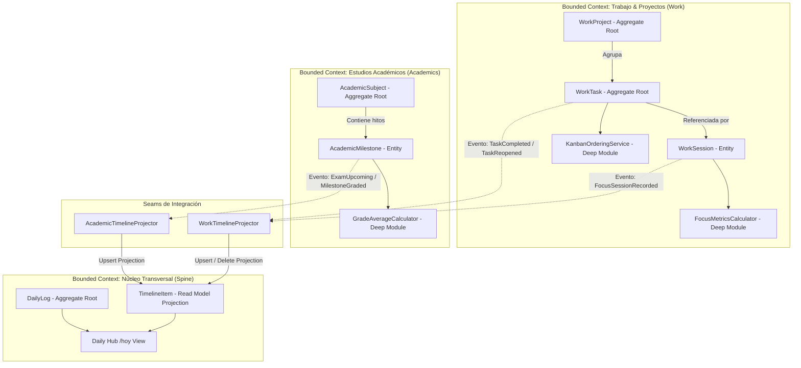

# Especificación Funcional: Fase 4 - Trabajo (Tablero Kanban & Deep Work) + Academia (Materias, Exámenes y Calificaciones)

- **Feature**: Trabajo (Kanban & Deep Work) + Academia (Materias, Exámenes y Calificaciones)
- **Ruta del Artefacto**: `.specs/04-work-and-academics/spec.md`
- **Fase**: 4 (Productividad Profesional & Formación Académica)
- **Estado**: Propuesto (En espera de Puerta de Aprobación 1)
- **Fecha**: 2026-09-05
- **Autor**: System Architect (SubiKit)
- **Aprobador**: Subi

---

## 1. Resumen del Problema y Propuesta de Valor

### 1.1 Contexto y Dolor Actual
Subi requiere unificar en un solo entorno de soberanía de datos tanto su flujo de trabajo profesional y proyectos personales como su progreso formativo y universitario. La dispersión actual en múltiples herramientas (tableros aislados tipo Trello/Notion, hojas de cálculo de notas universitarias y aplicaciones de temporizador Pomodoro externas) genera fricción constante:
1. **Pérdida de foco y dispersión de tareas**: No hay un tablero unificado donde mover tareas atómicas por proyectos y registrar cuánto tiempo real se dedicó a cada una.
2. **Desconexión entre esfuerzo y bitácora**: El tiempo de Deep Work y las tareas finalizadas no se reflejan automáticamente en el Daily Hub (`/hoy`).
3. **Incertidumbre académica**: Dificultad para calcular el promedio ponderado exacto de las cursadas universitarias, anticipar fechas límite de exámenes/entregas y conocer el estado de regularidad.

### 1.2 Propuesta de Valor
* **Módulo Trabajo (`/trabajo`)**:
  - **Tablero Kanban Visual & Ágil**: Gestión por columnas (`Backlog`, `Todo`, `InProgress`, `Done`), con prioridades (`Low`, `Medium`, `High`, `Urgent`), fechas límite opcionales y vinculación a proyectos (`Active`, `Paused`, `Completed`). Interacción fluida mediante drag-and-drop en desktop y botones de cambio de columna optimizados para móvil (zonas táctiles >= 44x44px).
  - **Sesiones de Deep Work (Foco)**: Timer interactivo integrado con modo Pomodoro (25 min trabajo / 5 min descanso) o Cronómetro libre. Guarda duración en minutos, notas de sesión y enlace opcional al proyecto o tarea.
  - **Métricas Rápidas**: Indicadores clave de rendimiento: tareas finalizadas en la semana y horas totales de foco acumuladas.
* **Módulo Academia (`/academia`)**:
  - **Gestión de Materias**: Registro curricular por período lectivo (`term`, ej. "2026-1C"), código de materia, nombre, profesor, color y estado de cursada (`EnCurso`, `Aprobada`, `Regularizada`, `Recursar`).
  - **Hitos Evaluativos**: Calendario de Parciales, Finales, Entregas de TPs y Recuperatorios con fecha programada, peso/ponderación porcentual (`weight_percentage`), calificación obtenida (`grade` de 0.00 a 10.00) y estado (`Pendiente`, `Aprobado`, `Reprobado`).
  - **Motor de Promedios**: Cálculo determinista en tiempo real de promedio ponderado por materia y promedio histórico general de la carrera.
* **Integración al Spine Transversal (`timeline_items`)**:
  - Proyección de tarea completada al pasar a `Done`.
  - Proyección de sesión de Deep Work finalizada con minutos y proyecto asociado.
  - Alerta de exámenes e hitos académicos próximos visibles en la vista Daily Hub (`/hoy`).

---

## 2. Bounded Contexts y Arquitectura de Dominio



### 2.1 Principios de Diseño Aplicados
1. **Deep Modules (John Ousterhout)**:
   - `GradeAverageCalculator`: Expone una API mínima (`CalculateSubjectAverage(milestones)` y `CalculateCareerAverage(subjectsWithMilestones)`). Oculta la complejidad de:
     * Ponderaciones parciales (si la suma de pesos de hitos calificados es menor al 100%, calcula la media ponderada sobre el peso completado).
     * Hitos sin ponderación explícita (caen a media aritmética simple).
     * Recuperatorios (regla de reemplazo de nota de parcial previo si aplica).
     * Redondeo estándar a 2 decimales.
   - `KanbanOrderingService`: Encapsula la lógica de reordenamiento de tareas dentro de una misma columna o al mover entre columnas, manteniendo índices de posición limpios sin colisiones.
   - `FocusMetricsCalculator`: Agrega sesiones de foco en ventanas semanales (lunes 00:00 a domingo 23:59 UTC/Local) calculando horas y minutos exactos.
2. **Seams (Michael Feathers)**:
   - `IWorkTimelineProjector`: Permite proyectar la finalización de tareas y sesiones de foco hacia `timeline_items` sin que las entidades `WorkTask` o `WorkSession` conozcan la persistencia del Spine.
   - `IAcademicTimelineProjector`: Permite proyectar recordatorios de exámenes e hitos académicos al timeline de manera idempotente.
3. **Invariantes de Negocio Rigurosos**:
   - **Invariante 1 (Propiedad y Privacidad RLS)**: Todo proyecto, tarea, sesión, materia e hito pertenece estrictamente al `user_id` autenticado.
   - **Invariante 2 (Consistencia de Estados)**: Las transiciones de estado de tareas (`backlog` -> `todo` -> `in_progress` -> `done`) y materias (`en_curso`, `aprobada`, `regularizada`, `recursar`) son explícitas y validadas en el dominio.
   - **Invariante 3 (Rangos Numéricos Válidos)**: Las calificaciones están restringidas estrictamente al rango [0.00, 10.00]; las ponderaciones porcentuales al rango [0.00, 100.00]%; y las sesiones de foco deben registrar duraciones estrictamente mayores a 0 minutos.
   - **Invariante 4 (Proyección Idempotente)**: Si una tarea completada se devuelve a `in_progress` o `todo`, su evento proyectado en `timeline_items` se remueve atómicamente. Si se vuelve a marcar `done`, se genera un único evento actualizado para la fecha de cumplimiento.

---

## 3. Alcance (Scope)

### 3.1 In Scope

#### Módulo Trabajo (`/trabajo`):
* **Gestión de Proyectos**:
  - Listar proyectos con estado (`Active`, `Paused`, `Completed`).
  - Crear y editar proyectos: Nombre, descripción opcional, color (paleta Tailwind/HEX) y estado.
  - Filtrado del tablero Kanban por proyecto específico o vista general "Todos los proyectos".
* **Tablero Kanban Interactivo**:
  - 4 Columnas estándar: `Backlog`, `Todo`, `InProgress`, `Done`.
  - Tarjetas de Tarea: Título, descripción opcional, badge de prioridad (`Low` en slate, `Medium` en blue, `High` en amber, `Urgent` en rose), fecha límite opcional (`due_date`) con alerta visual de vencimiento próximo, y etiqueta de proyecto.
  - Movimiento fluido: Soporte para arrastrar y soltar (*drag & drop*) en desktop y selector desplegable directo de columna en dispositivos móviles.
  - Ordenamiento secuencial (`position`) dentro de cada columna.
* **Sesiones de Deep Work (Timer)**:
  - Temporizador interactivo en la cabecera o panel lateral:
    * Modo Pomodoro: Bloque de 25 min de foco + 5 min de descanso corto (con aviso sonoro/visual opcional).
    * Modo Cronómetro Libre: Inicio, pausa, reanudación y stop manual.
  - Modal de Guardado al terminar: Duración real transcurrida en minutos, campo de notas reflexivas de la sesión y vinculación a proyecto y/o tarea.
  - Registro histórico de sesiones de foco del usuario.
* **Métricas Rápidas de Trabajo**:
  - Total de tareas completadas hoy y en la última semana.
  - Total de horas y minutos de Deep Work acumulados en los últimos 7 días.

#### Módulo Academia (`/academia`):
* **Gestión de Materias**:
  - Listado de materias agrupadas por período lectivo (`term`, ej. "2026-1C", "2025-2C").
  - Crear y editar materia: Nombre (ej. "Sistemas Operativos"), código opcional (ej. "SO-7508"), período lectivo, profesor/cátedra, color distintivo y estado (`EnCurso`, `Aprobada`, `Regularizada`, `Recursar`).
  - Tarjeta de materia con resumen visual: cantidad de hitos, promedio actual y barra de progreso de evaluaciones completadas.
* **Hitos Evaluativos (`Milestones`)**:
  - Crear, editar y eliminar hitos dentro de una materia.
  - Campos: Título (ej. "Primer Parcial Teórico"), tipo (`Parcial`, `Final`, `Entrega`, `Recuperatorio`), fecha programada (`due_date`), ponderación porcentual (`weight_percentage`, ej. 40%), calificación (`grade` de 0.00 a 10.00), notas/comentarios y estado (`Pendiente`, `Aprobado`, `Reprobado`).
  - Asignación rápida de nota con un solo click o modal compacto.
* **Cálculo de Promedios**:
  - Promedio de la materia: Promedio ponderado si existen ponderaciones configuradas; de lo contrario promedio aritmético simple de los hitos calificados.
  - Promedio general de la carrera: Calculado sobre las materias finalizadas/aprobadas.
  - Estado sugerido: Si la calificación es >= 4.00 se marca como Aprobado; si es < 4.00 se sugiere Reprobado/Recuperatorio.

#### Integración Spine & Daily Hub (`/hoy`):
* Proyección a `timeline_items`:
  - `work_task_completed`: Tarea marcada como `Done` en el día (`source_module: 'work'`).
  - `deep_work_session`: Sesión de foco guardada en el día (`source_module: 'work'`, con minutos acumulados).
* Widget de Exámenes Próximos en `/hoy`:
  - Muestra alertas de exámenes o entregas previstos para hoy o dentro de los próximos 7 días, con conteo regresivo ("Hoy", "Mañana", "En 4 días").

### 3.2 Out of Scope
* Sincronización bidireccional externa con Google Calendar / Microsoft Outlook vía OAuth (reservado para la Fase de Integraciones).
* Asignación de tareas a colaboradores externos o tableros compartidos (Life Tracker es un sistema personal mono-usuario).
* Extracción OCR automatizada de programas de estudio o certificados analíticos universitarios (reservado para la Fase de Asistente IA).

---

## 4. Modelo de Datos y Evolución de Esquema

### 4.1 Refinamiento DDL en Supabase PostgreSQL

Se creará la migración `supabase/migrations/20260908000000_work_and_academics_refinements.sql` para ajustar y enriquecer el esquema inicial:

```sql
-- ==============================================================================
-- 1. REFINAMIENTOS EN WORK & KANBAN
-- ==============================================================================

-- Agregar updated_at a work_projects si no existe
ALTER TABLE public.work_projects
    ADD COLUMN IF NOT EXISTS updated_at TIMESTAMPTZ DEFAULT timezone('utc'::text, now()) NOT NULL;

-- Vincular work_sessions a una tarea opcional (task_id) y asegurar campos de notas
ALTER TABLE public.work_sessions
    ADD COLUMN IF NOT EXISTS task_id UUID REFERENCES public.work_tasks(id) ON DELETE SET NULL;

CREATE INDEX IF NOT EXISTS idx_work_sessions_user_started 
    ON public.work_sessions(user_id, started_at DESC);

CREATE INDEX IF NOT EXISTS idx_work_tasks_project_pos 
    ON public.work_tasks(project_id, status, position);

-- ==============================================================================
-- 2. REFINAMIENTOS EN ACADEMICS
-- ==============================================================================

-- Ampliar academic_subjects con profesor y updated_at
ALTER TABLE public.academic_subjects
    ADD COLUMN IF NOT EXISTS professor TEXT,
    ADD COLUMN IF NOT EXISTS updated_at TIMESTAMPTZ DEFAULT timezone('utc'::text, now()) NOT NULL;

-- Ajustar constraint de status en academic_subjects para soportar 'en_curso', 'aprobada', 'regularizada', 'recursar'
ALTER TABLE public.academic_subjects DROP CONSTRAINT IF EXISTS academic_subjects_status_check;
ALTER TABLE public.academic_subjects ADD CONSTRAINT academic_subjects_status_check 
    CHECK (status IN ('en_curso', 'aprobada', 'regularizada', 'recursar'));

-- Ampliar academic_milestones con status y updated_at
ALTER TABLE public.academic_milestones
    ADD COLUMN IF NOT EXISTS status TEXT DEFAULT 'pendiente' NOT NULL 
    CHECK (status IN ('pendiente', 'aprobado', 'reprobado')),
    ADD COLUMN IF NOT EXISTS updated_at TIMESTAMPTZ DEFAULT timezone('utc'::text, now()) NOT NULL;

CREATE INDEX IF NOT EXISTS idx_academic_milestones_user_due 
    ON public.academic_milestones(user_id, due_date ASC);

CREATE INDEX IF NOT EXISTS idx_academic_subjects_user_term 
    ON public.academic_subjects(user_id, term);
```

### 4.2 Entidades de Dominio en C#

#### En `LifeTracker.Domain.Work`:
```csharp
namespace LifeTracker.Domain.Work;

public enum WorkProjectStatus { Active, Paused, Completed }
public enum WorkTaskStatus { Backlog, Todo, InProgress, Done }
public enum WorkTaskPriority { Low, Medium, High, Urgent }

public class WorkProject : BaseEntity
{
    public Guid UserId { get; private set; }
    public string Name { get; private set; } = string.Empty;
    public string? Description { get; private set; }
    public WorkProjectStatus Status { get; private set; } = WorkProjectStatus.Active;
    public string? Color { get; private set; }
    public DateTime CreatedAt { get; private set; } = DateTime.UtcNow;
    public DateTime UpdatedAt { get; private set; } = DateTime.UtcNow;

    public void Update(string name, string? description, WorkProjectStatus status, string? color)
    {
        Name = name.Trim();
        Description = description?.Trim();
        Status = status;
        Color = color;
        UpdatedAt = DateTime.UtcNow;
    }
}

public class WorkTask : BaseEntity
{
    public Guid? ProjectId { get; private set; }
    public Guid UserId { get; private set; }
    public string Title { get; private set; } = string.Empty;
    public string? Description { get; private set; }
    public WorkTaskStatus Status { get; private set; } = WorkTaskStatus.Todo;
    public WorkTaskPriority Priority { get; private set; } = WorkTaskPriority.Medium;
    public DateOnly? DueDate { get; private set; }
    public int Position { get; private set; }
    public DateTime CreatedAt { get; private set; } = DateTime.UtcNow;
    public DateTime UpdatedAt { get; private set; } = DateTime.UtcNow;

    public void MoveTo(WorkTaskStatus newStatus, int newPosition)
    {
        Status = newStatus;
        Position = newPosition;
        UpdatedAt = DateTime.UtcNow;
    }

    public void UpdateDetails(string title, string? description, WorkTaskPriority priority, DateOnly? dueDate, Guid? projectId)
    {
        Title = title.Trim();
        Description = description?.Trim();
        Priority = priority;
        DueDate = dueDate;
        ProjectId = projectId;
        UpdatedAt = DateTime.UtcNow;
    }
}

public class WorkSession : BaseEntity
{
    public Guid UserId { get; private set; }
    public Guid? ProjectId { get; private set; }
    public Guid? TaskId { get; private set; }
    public DateTime StartedAt { get; private set; }
    public DateTime? EndedAt { get; private set; }
    public int DurationMinutes { get; private set; }
    public string? Notes { get; private set; }
    public DateTime CreatedAt { get; private set; } = DateTime.UtcNow;

    public WorkSession(Guid userId, Guid? projectId, Guid? taskId, DateTime startedAt, DateTime endedAt, string? notes)
    {
        if (endedAt < startedAt)
            throw new ArgumentException("La fecha de fin no puede ser anterior a la de inicio.");

        UserId = userId;
        ProjectId = projectId;
        TaskId = taskId;
        StartedAt = startedAt;
        EndedAt = endedAt;
        DurationMinutes = Math.Max(1, (int)(endedAt - startedAt).TotalMinutes);
        Notes = notes?.Trim();
    }
}
```

#### En `LifeTracker.Domain.Academics`:
```csharp
namespace LifeTracker.Domain.Academics;

public enum SubjectStatus { EnCurso, Aprobada, Regularizada, Recursar }
public enum MilestoneType { Parcial, Entrega, Final, Recuperatorio }
public enum MilestoneStatus { Pendiente, Aprobado, Reprobado }

public class AcademicSubject : BaseEntity
{
    public Guid UserId { get; private set; }
    public string Name { get; private set; } = string.Empty;
    public string? Code { get; private set; }
    public string Term { get; private set; } = string.Empty; // Ej: 2026-1C
    public string? Professor { get; private set; }
    public SubjectStatus Status { get; private set; } = SubjectStatus.EnCurso;
    public string? Color { get; private set; }
    public DateTime CreatedAt { get; private set; } = DateTime.UtcNow;
    public DateTime UpdatedAt { get; private set; } = DateTime.UtcNow;

    public void Update(string name, string? code, string term, string? professor, SubjectStatus status, string? color)
    {
        Name = name.Trim();
        Code = code?.Trim();
        Term = term.Trim();
        Professor = professor?.Trim();
        Status = status;
        Color = color;
        UpdatedAt = DateTime.UtcNow;
    }
}

public class AcademicMilestone : BaseEntity
{
    public Guid SubjectId { get; private set; }
    public Guid UserId { get; private set; }
    public string Title { get; private set; } = string.Empty;
    public MilestoneType MilestoneType { get; private set; } = MilestoneType.Parcial;
    public DateOnly DueDate { get; private set; }
    public decimal? Grade { get; private set; }
    public decimal? WeightPercentage { get; private set; }
    public MilestoneStatus Status { get; private set; } = MilestoneStatus.Pendiente;
    public string? Notes { get; private set; }
    public DateTime CreatedAt { get; private set; } = DateTime.UtcNow;
    public DateTime UpdatedAt { get; private set; } = DateTime.UtcNow;

    public void AssignGrade(decimal grade)
    {
        if (grade < 0 || grade > 10)
            throw new ArgumentOutOfRangeException(nameof(grade), "La calificación debe estar entre 0 y 10.");

        Grade = grade;
        Status = grade >= 4.0m ? MilestoneStatus.Aprobado : MilestoneStatus.Reprobado;
        UpdatedAt = DateTime.UtcNow;
    }
}
```

---

## 5. Contratos de API (.NET RESTful)

### 5.1 Endpoints de Trabajo (`/api/work`)

#### `GET /api/work/projects`
Listado de proyectos del usuario con conteo de tareas activas.
- **Respuesta (200 OK)**:
  ```json
  [
    {
      "id": "a1b2c3d4-...",
      "name": "Life Tracker OS",
      "description": "Desarrollo del sistema operativo personal",
      "status": "active",
      "color": "indigo",
      "activeTasksCount": 8,
      "completedTasksCount": 14
    }
  ]
  ```

#### `POST /api/work/projects`
Crea un proyecto. Payload: `{ name, description, status, color }`.

#### `GET /api/work/tasks`
Obtiene las tareas del usuario. Filtros: `?projectId=...&status=...`.
- **Respuesta (200 OK)**:
  ```json
  [
    {
      "id": "e5f6g7h8-...",
      "projectId": "a1b2c3d4-...",
      "projectName": "Life Tracker OS",
      "title": "Diseñar vista Kanban y timer",
      "description": "Implementar drag and drop y conexión al Spine",
      "status": "in_progress",
      "priority": "high",
      "dueDate": "2026-09-10",
      "position": 0
    }
  ]
  ```

#### `POST /api/work/tasks`
Crea una nueva tarea en el tablero con posición al final de la columna.

#### `PATCH /api/work/tasks/{id}/move`
Mueve una tarea de columna y/o reordena su posición.
- **Payload**:
  ```json
  {
    "newStatus": "done",
    "newPosition": 0
  }
  ```
- **Side-effect**: Si el nuevo estado es `done`, proyecta a `timeline_items`. Si sale de `done`, remueve la proyección.

#### `POST /api/work/sessions`
Registra una sesión de Deep Work completada.
- **Payload**:
  ```json
  {
    "projectId": "a1b2c3d4-...",
    "taskId": "e5f6g7h8-...",
    "startedAt": "2026-09-05T21:00:00Z",
    "endedAt": "2026-09-05T21:50:00Z",
    "notes": "Bloque de foco en modelado de dominio DDD."
  }
  ```
- **Side-effect**: Proyecta a `timeline_items` (`event_type: 'focus_session_completed'`).

#### `GET /api/work/metrics`
Devuelve el resumen semanal:
```json
{
  "focusMinutesThisWeek": 280,
  "completedTasksThisWeek": 6,
  "sessionsCount": 7
}
```

### 5.2 Endpoints de Academia (`/api/academics`)

#### `GET /api/academics/subjects`
Listado de materias con su promedio calculado y progreso.
- **Respuesta (200 OK)**:
  ```json
  [
    {
      "id": "sub-1111-...",
      "name": "Sistemas Distribuidos",
      "code": "SD-401",
      "term": "2026-1C",
      "professor": "Dr. Martínez",
      "status": "en_curso",
      "color": "sky",
      "average": 8.50,
      "totalMilestones": 4,
      "completedMilestones": 2
    }
  ]
  ```

#### `POST /api/academics/subjects`
Crea una materia. Payload: `{ name, code, term, professor, status, color }`.

#### `GET /api/academics/subjects/{id}`
Detalle de materia con todos sus hitos evaluativos asociados.

#### `POST /api/academics/milestones`
Crea un hito evaluativo.
- **Payload**:
  ```json
  {
    "subjectId": "sub-1111-...",
    "title": "Primer Parcial",
    "milestoneType": "parcial",
    "dueDate": "2026-09-18",
    "weightPercentage": 40.0,
    "notes": "Unidades 1 a 4"
  }
  ```

#### `PATCH /api/academics/milestones/{id}/grade`
Asigna calificación y notas a un hito.
- **Payload**: `{ "grade": 9.00, "notes": "Excelente resolución" }`.
- **Side-effect**: Recalcula el promedio de la materia y proyecta calificación al timeline si corresponde.

#### `GET /api/academics/metrics`
Métricas académicas globales:
```json
{
  "careerAverage": 8.42,
  "approvedSubjectsCount": 12,
  "inProgressSubjectsCount": 3,
  "upcomingExamsCount": 2
}
```

### 5.3 Actualización de `GET /api/daily-hub/today`
Se enriquece la respuesta del Daily Hub para alimentar `/hoy`:
- `workSummary`: `{ completedTasksToday: number, focusMinutesToday: number }`
- `upcomingExams`: Lista de hitos académicos con `dueDate` entre hoy y hoy + 7 días.

---

## 6. Criterios de Aceptación (Gherkin BDD)

### Escenario 1: Creación de proyecto y tarea en el tablero Kanban
```gherkin
Dado que Subi está autenticado en Life Tracker
Cuando crea un nuevo proyecto llamado "Proyecto SaaS" con color "indigo"
Y agrega una tarea "Modelar base de datos" con prioridad "high" asignada al proyecto
Entonces la tarea aparece en la columna "todo" con posición 0
Y el proyecto refleja 1 tarea activa
```

### Escenario 2: Mover tarea en el tablero Kanban (Drag & Drop o selector)
```gherkin
Dado que Subi tiene la tarea "Modelar base de datos" en la columna "todo"
Cuando arrastra o cambia el estado de la tarea a "in_progress"
Entonces el sistema actualiza el estado a "in_progress" de forma instantánea
Y el orden de las tareas en la columna se actualiza sin colisiones de posición
```

### Escenario 3: Iniciar y guardar sesión de Deep Work con proyección al timeline
```gherkin
Dado que Subi inicia el temporizador de Deep Work asociado al proyecto "Proyecto SaaS"
Y transcurren 50 minutos de trabajo concentrado
Cuando finaliza la sesión e ingresa la nota "Esquema PostgreSQL completado"
Entonces se registra la sesión en "work_sessions" con duración de 50 minutos
Y se proyecta un evento en "timeline_items" con origen "work" y evento "focus_session_completed"
Y el total de minutos de foco del día en el Daily Hub se incrementa en 50
```

### Escenario 4: Mover tarea a 'Done' y proyección al Daily Hub
```gherkin
Dado que Subi finaliza la tarea "Modelar base de datos"
Cuando mueve la tarea a la columna "done"
Entonces se proyecta un nuevo evento en "timeline_items" con título "Tarea completada: Modelar base de datos"
Y la vista "/hoy" muestra la tarea dentro de la línea de tiempo del día
```

### Escenario 5: Revertir tarea de 'Done' remueve la proyección (Seam idempotente)
```gherkin
Dado que una tarea fue marcada como "done" y generó una proyección en el timeline
Cuando Subi devuelve la tarea a la columna "in_progress"
Entonces la costura "IWorkTimelineProjector" remueve atómicamente el evento de "timeline_items"
Y el contador de tareas completadas de hoy se reduce en 1
```

### Escenario 6: Creación de materia académica y registro de hito evaluativo
```gherkin
Dado que Subi inicia el cuatrimestre "2026-2C"
Cuando registra la materia "Algoritmos y Estructuras de Datos" con estado "en_curso"
Y añade un hito "Primer Parcial" con fecha programada para dentro de 5 días y ponderación 50%
Entonces el hito queda guardado en estado "pendiente"
Y la materia muestra 1 hito pendiente sin promedio asignado
```

### Escenario 7: Calificación de hito y recálculo automático de promedio ponderado
```gherkin
Dado que la materia "Algoritmos" tiene dos hitos ponderados:
  | Hito            | Ponderación | Calificación |
  | Primer Parcial  | 40%         | 8.00         |
Cuando Subi registra la calificación del "Segundo Parcial" (ponderación 60%) con nota 10.00
Entonces el servicio "GradeAverageCalculator" calcula el promedio como: (8.00 * 0.40) + (10.00 * 0.60) = 9.20
Y el promedio de la materia se actualiza a 9.20
```

### Escenario 8: Alerta de exámenes próximos en el Daily Hub `/hoy`
```gherkin
Dado que hoy es "2026-09-05"
Y Subi tiene un examen de "Sistemas Operativos" con fecha "2026-09-08" (en 3 días)
Cuando Subi abre la vista "/hoy"
Entonces se visualiza un badge destacado de "Próximo Examen: Sistemas Operativos en 3 días"
Y al tocarlo navega a la sección académica de la materia
```

### Escenario 9: Aislamiento estricto de usuario (Invariante 1 RLS)
```gherkin
Dado el Usuario A y el Usuario B con proyectos y materias privadas
Cuando el Usuario A consulta "/api/work/tasks" o "/api/academics/subjects"
Entonces bajo ninguna circunstancia puede visualizar o modificar tareas o materias del Usuario B
Y todas las consultas están filtradas a nivel PostgreSQL por "auth.uid() = user_id"
```

### Escenario 10: Validación de rangos numéricos de notas y ponderaciones
```gherkin
Dado que Subi intenta registrar una calificación de 11.5 o -1.0 en un hito evaluativo
Cuando se envía la solicitud a la API
Entonces el dominio rechaza la operación con un error de validación (400 Bad Request)
Y la base de datos mantiene la integridad sin modificar el promedio existente
```

---

## 7. Estrategia Incremental y Trade-offs Analizados (Design It Twice)

### 7.1 Decisión 1: Timer de Deep Work (Cliente vs Backend Activo)
- **Opción A (Adoptada): Temporizador en Cliente con Persistencia al Finalizar**:
  - El timer corre localmente en el navegador del usuario utilizando `requestAnimationFrame` y sincronizándose con `localStorage` (para tolerar recargas accidentales de página).
  - Al completar o detener el bloque de foco, se despacha una única petición `POST /api/work/sessions`.
  - *Ventajas*: Arquitectura sin estado en backend, cero latencia, no requiere servidores WebSocket dedicados ni polling persistente que consuma recursos.
- **Opción B (Rechazada): Sesión activa en base de datos con heartbeat de servidor**:
  - *Desventajas*: Saturaría la base de datos con micro-actualizaciones cada 30 segundos, complicaría la lógica ante cortes de red y requeriría workers de limpieza para sesiones abandonadas.

### 7.2 Decisión 2: Reordenamiento del Tablero Kanban (Posición Entera vs Lexorank)
- **Opción A (Adoptada): Posicionamiento entero secuencial (`position: int`) con normalización en servicio**:
  - `KanbanOrderingService` reordena las tareas de la columna en una transacción simple. Como el tablero es de uso personal (Subi tiene entre 5 y 30 tareas activas por columna), la actualización de índices es ultrarrápida (< 3ms en Postgres).
  - *Ventajas*: Facilidad de depuración, consultas SQL directas con `ORDER BY position ASC`, sin dependencias externas de librerías de strings fraccionarios.
- **Opción B (Rechazada): Algoritmo Lexorank**:
  - *Desventajas*: Complejidad innecesaria de cálculo de cadenas alfanuméricas intermedias y necesidad de rutinas de rebalanceo periódico diseñadas para sistemas masivos con miles de usuarios concurrentes.

### 7.3 Decisión 3: Cálculo de Promedio Académico (Cálculo al Vuelo vs Columna Materializada)
- **Opción A (Adoptada): Cálculo al vuelo mediante Deep Module `GradeAverageCalculator`**:
  - Las materias no guardan un campo `average` fijo en la base de datos relacional; este se calcula de forma pura en memoria durante la composición del DTO en la capa de aplicación o consulta de lectura.
  - *Ventajas*: Cero riesgo de desincronización de datos al editar, borrar o recalificar un hito; reglas de negocio (ej. recuperatorios o pesos parciales) se actualizan en un único punto del código sin requerir migraciones de datos históricos.
- **Opción B (Rechazada): Triggers en PostgreSQL o campos desnormalizados**:
  - *Desventajas*: Lógica de negocio dispersa en procedimientos almacenados de base de datos difíciles de testear con pruebas unitarias en C#.

---

## 8. Próximos Pasos (Puerta de Aprobación 1)

1. Obtener la aprobación formal de **Subi** en la **Puerta de Aprobación 1**.
2. Tras la aprobación:
   - Redactar el **Tech Plan** (`tech-plan.md`) con las firmas de DTOs, mapeadores, interfaces del Seam y diagramas de secuencia.
   - Generar el desglose de tareas atómicas (`tasks.md`) con metodología TDD estricta.
   - Ejecutar la migración SQL de Supabase y el andamiaje en .NET y Next.js.
