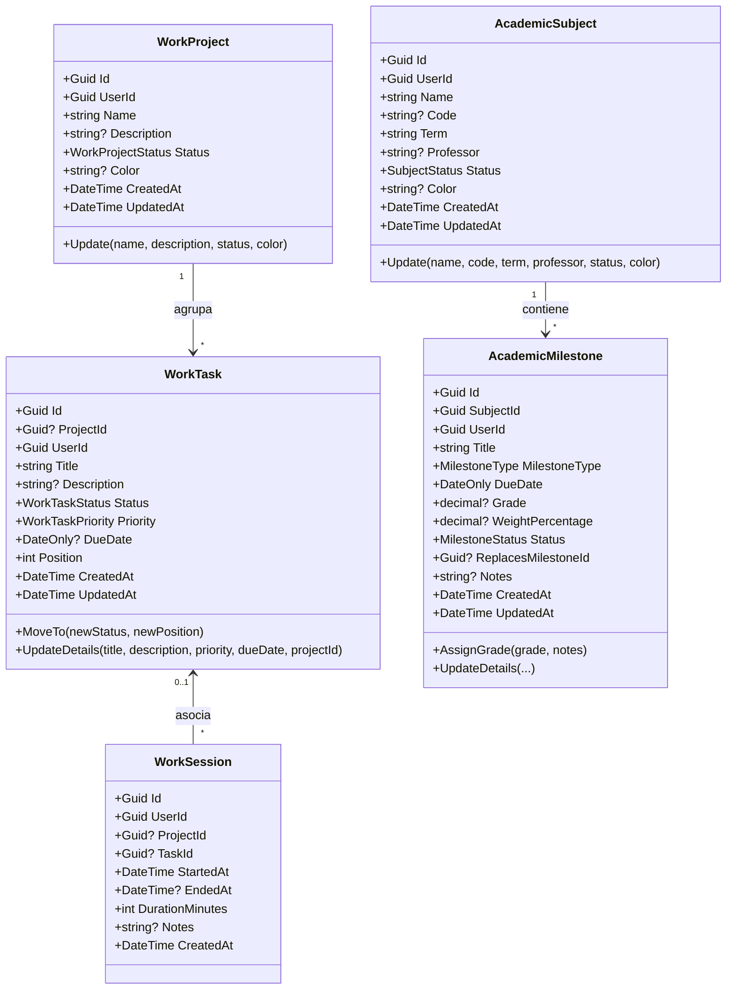
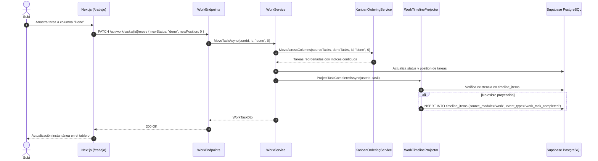
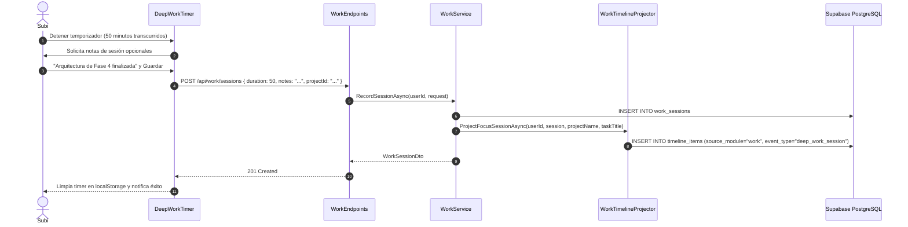
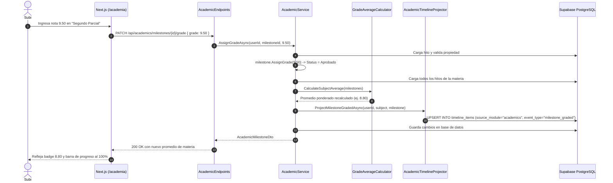

# Plan Técnico: Fase 4 - Trabajo (Tablero Kanban & Deep Work) + Academia (Materias, Exámenes y Calificaciones)

- **Ruta**: `.specs/04-work-and-academics/tech-plan.md`
- **Fase**: 4 (Tablero Kanban, Deep Work, Gestión Académica y Promedios)
- **Estado**: Propuesto (En espera de Puerta de Aprobación 2)
- **Fecha**: 2026-09-05
- **Autor**: System Architect (SubiKit)

---

## 1. Arquitectura de Dominio y Deep Modules

Siguiendo los principios de **Domain-Driven Design (DDD)** y **Deep Modules (John Ousterhout)**, los contextos de Trabajo y Academia se estructuran como agregados con interfaces simples que ocultan algoritmos no triviales.



### 1.1 Contexto de Dominio Trabajo (`LifeTracker.Domain.Work`)

1. **Enums de Dominio**:
   ```csharp
   namespace LifeTracker.Domain.Work;

   public enum WorkProjectStatus { Active, Paused, Completed }
   public enum WorkTaskStatus { Backlog, Todo, InProgress, Done }
   public enum WorkTaskPriority { Low, Medium, High, Urgent }
   ```

2. **`WorkProject` (Aggregate Root)**:
   - Identidad: `Id` (Guid), `UserId` (Guid).
   - Atributos: `Name`, `Description`, `Status`, `Color`, `CreatedAt`, `UpdatedAt`.
   - Invariantes: `Name` no puede ser vacío ni exceder 100 caracteres.

3. **`WorkTask` (Aggregate Root)**:
   - Identidad: `Id` (Guid), `UserId` (Guid), `ProjectId` (Guid?).
   - Atributos: `Title`, `Description`, `Status`, `Priority`, `DueDate`, `Position`, `CreatedAt`, `UpdatedAt`.
   - Invariantes: `Title` no puede ser vacío; `Position >= 0`.
   - Métodos:
     - `MoveTo(WorkTaskStatus newStatus, int newPosition)`: Cambia estado y posición, refrescando `UpdatedAt = DateTime.UtcNow`.
     - `UpdateDetails(...)`: Actualiza título, descripción, prioridad, vencimiento y proyecto asociado.

4. **`WorkSession` (Entity)**:
   - Identidad: `Id` (Guid), `UserId` (Guid), `ProjectId` (Guid?), `TaskId` (Guid?).
   - Atributos: `StartedAt`, `EndedAt`, `DurationMinutes`, `Notes`, `CreatedAt`.
   - Invariantes: `EndedAt >= StartedAt`. `DurationMinutes` se computa automáticamente como `Math.Max(1, (int)(endedAt - startedAt).TotalMinutes)`.

5. **Deep Module `IKanbanOrderingService` / `KanbanOrderingService`**:
   - Responsabilidad: Normalizar y recalcular los índices de posición contiguos (`0, 1, 2, ...`) evitando colisiones o índices flotantes.
   ```csharp
   namespace LifeTracker.Domain.Work;

   public interface IKanbanOrderingService
   {
       void ReorderWithinColumn(List<WorkTask> columnTasks, Guid taskId, int targetPosition);
       void MoveAcrossColumns(List<WorkTask> sourceColumnTasks, List<WorkTask> targetColumnTasks, Guid taskId, WorkTaskStatus targetStatus, int targetPosition);
   }
   ```
   - *Algoritmo de Reordenamiento*:
     1. Clampeo del índice objetivo: `clampedPos = Math.Clamp(targetPosition, 0, tasks.Count - 1)`.
     2. Extracción de la tarea objetivo de la colección en memoria.
     3. Inserción de la tarea en la posición `clampedPos`.
     4. Recorrido secuencial aplicando `task.MoveTo(status, index)` para `index = 0..N-1`.

6. **Deep Module `IFocusMetricsCalculator` / `FocusMetricsCalculator`**:
   - Responsabilidad: Extraer métricas agregadas de productividad de una lista de sesiones y tareas para una fecha de corte de referencia.
   ```csharp
   namespace LifeTracker.Domain.Work;

   public record FocusMetrics(
       int FocusMinutesThisWeek,
       int FocusMinutesToday,
       int CompletedTasksThisWeek,
       int CompletedTasksToday,
       int SessionsCountThisWeek
   );

   public interface IFocusMetricsCalculator
   {
       FocusMetrics Calculate(IEnumerable<WorkSession> sessions, IEnumerable<WorkTask> tasks, DateTime referenceUtc);
   }
   ```
   - *Regla de Ventana Semanal*:
     - Inicio de semana: Lunes 00:00:00 UTC de la semana en curso.
     - Fin de semana: Domingo 23:59:59 UTC de la semana en curso.

---

### 1.2 Contexto de Dominio Academia (`LifeTracker.Domain.Academics`)

1. **Enums de Dominio**:
   ```csharp
   namespace LifeTracker.Domain.Academics;

   public enum SubjectStatus { EnCurso, Aprobada, Regularizada, Recursar }
   public enum MilestoneType { Parcial, Entrega, Final, Recuperatorio }
   public enum MilestoneStatus { Pendiente, Aprobado, Reprobado }
   ```

2. **`AcademicSubject` (Aggregate Root)**:
   - Identidad: `Id` (Guid), `UserId` (Guid).
   - Atributos: `Name`, `Code`, `Term`, `Professor`, `Status`, `Color`, `CreatedAt`, `UpdatedAt`.
   - Invariantes: `Name` y `Term` requeridos; `Status` restringido al enum.

3. **`AcademicMilestone` (Entity)**:
   - Identidad: `Id` (Guid), `SubjectId` (Guid), `UserId` (Guid).
   - Atributos: `Title`, `MilestoneType`, `DueDate`, `Grade` (0.00 a 10.00), `WeightPercentage` (0.00 a 100.00), `Status`, `ReplacesMilestoneId` (Guid?), `Notes`, `CreatedAt`, `UpdatedAt`.
   - Métodos:
     - `AssignGrade(decimal grade, string? notes = null)`: Valida rango `[0.00, 10.00]`, asigna nota, actualiza estado a `Aprobado` (si `grade >= 4.0m`) o `Reprobado` (si `grade < 4.0m`).

4. **Deep Module `IGradeAverageCalculator` / `GradeAverageCalculator`**:
   - Responsabilidad: Calcular determinísticamente promedios de materias y promedios de carrera con resolución de reglas complejas.
   ```csharp
   namespace LifeTracker.Domain.Academics;

   public record SubjectGradeSummary(Guid SubjectId, SubjectStatus Status, decimal? FinalOrAverageGrade);

   public interface IGradeAverageCalculator
   {
       decimal? CalculateSubjectAverage(IEnumerable<AcademicMilestone> milestones);
       decimal? CalculateCareerAverage(IEnumerable<SubjectGradeSummary> subjects);
   }
   ```

#### Casos de Borde y Reglas Deterministas de Cálculo

1. **Ausencia de Calificaciones**:
   - Si no existen hitos con `Grade.HasValue`, retorna `null`.
2. **Sustitución por Recuperatorios (`ReplacesMilestoneId`)**:
   - Si un hito calificado tiene `ReplacesMilestoneId != null`, el hito referenciado original es excluido del cálculo y reemplazado por la nota del recuperatorio.
   - Si el recuperatorio no especifica `WeightPercentage`, adopta la ponderación del hito original al que reemplaza.
   - Si no tiene ID explícito pero su tipo es `Recuperatorio`, sustituye al hito reprobado (`grade < 4.0m`) más antiguo de la misma materia.
3. **Ponderación Parcial vs Total**:
   - **Caso A (Ponderación 100% Completa)**: Si todos los hitos evaluados tienen peso y la suma es 100:
     $$\text{Promedio} = \frac{\sum (\text{nota}_i \times \text{peso}_i)}{100}$$
   - **Caso B (Ponderaciones Parciales, $\sum \text{peso}_i < 100$)**:
     Si el estudiante sólo ha rendido el primer parcial (peso 40%, nota 8.0), el promedio actual sobre lo evaluado es:
     $$\text{Promedio} = \frac{\sum (\text{nota}_i \times \text{peso}_i)}{\sum \text{peso}_i} = \frac{8.0 \times 40}{40} = 8.00$$
   - **Caso C (Fallback a Media Aritmética Simple)**:
     Si ningún hito tiene `WeightPercentage` asignado (o todos son nulos o 0), el cálculo recurre a la media aritmética de notas:
     $$\text{Promedio} = \frac{\sum \text{nota}_i}{N}$$
   - **Caso D (Ponderación Mixta)**:
     Si algunos hitos tienen ponderación y otros no: los hitos sin ponderación se distribuyen equitativamente el porcentaje remanente $(100 - \sum \text{pesos\_especificados})$. Si la suma ya alcanza o supera 100, se toma la media aritmética global.
4. **Redondeo Numérico**:
   - Todos los resultados se redondean a 2 decimales usando `Math.Round(val, 2, MidpointRounding.AwayFromZero)`.
5. **Promedio de Carrera**:
   - Considera exclusivamente materias con estado `Aprobada` que cuenten con nota válida (`FinalOrAverageGrade.HasValue`).
   - Calcula la media aritmética simple de dichas materias:
     $$\text{PromedioCarrera} = \frac{\sum \text{nota\_materia}_j}{M_{\text{aprobadas}}}$$

---

## 2. Capa de Infraestructura y Persistencia (EF Core & Supabase)

### 2.1 Migración SQL en Supabase
Archivo: `supabase/migrations/20260908000000_work_and_academics_refinements.sql`

```sql
-- ==============================================================================
-- 1. REFINAMIENTOS EN TABLAS DE TRABAJO (WORK)
-- ==============================================================================

ALTER TABLE public.work_projects
    ADD COLUMN IF NOT EXISTS updated_at TIMESTAMPTZ DEFAULT timezone('utc'::text, now()) NOT NULL;

ALTER TABLE public.work_sessions
    ADD COLUMN IF NOT EXISTS task_id UUID REFERENCES public.work_tasks(id) ON DELETE SET NULL;

CREATE INDEX IF NOT EXISTS idx_work_sessions_user_started 
    ON public.work_sessions(user_id, started_at DESC);

CREATE INDEX IF NOT EXISTS idx_work_tasks_project_pos 
    ON public.work_tasks(project_id, status, position);

CREATE INDEX IF NOT EXISTS idx_work_tasks_user_status_pos 
    ON public.work_tasks(user_id, status, position);

-- ==============================================================================
-- 2. REFINAMIENTOS EN TABLAS DE ACADEMIA (ACADEMICS)
-- ==============================================================================

ALTER TABLE public.academic_subjects
    ADD COLUMN IF NOT EXISTS professor TEXT,
    ADD COLUMN IF NOT EXISTS updated_at TIMESTAMPTZ DEFAULT timezone('utc'::text, now()) NOT NULL;

-- Normalizar datos existentes si los hubiera
UPDATE public.academic_subjects SET status = 'en_curso' WHERE status = 'cursando';
UPDATE public.academic_subjects SET status = 'regularizada' WHERE status = 'final_pendiente';

ALTER TABLE public.academic_subjects DROP CONSTRAINT IF EXISTS academic_subjects_status_check;
ALTER TABLE public.academic_subjects ADD CONSTRAINT academic_subjects_status_check 
    CHECK (status IN ('en_curso', 'aprobada', 'regularizada', 'recursar'));

ALTER TABLE public.academic_milestones
    ADD COLUMN IF NOT EXISTS status TEXT DEFAULT 'pendiente' NOT NULL 
    CHECK (status IN ('pendiente', 'aprobado', 'reprobado')),
    ADD COLUMN IF NOT EXISTS replaces_milestone_id UUID REFERENCES public.academic_milestones(id) ON DELETE SET NULL,
    ADD COLUMN IF NOT EXISTS updated_at TIMESTAMPTZ DEFAULT timezone('utc'::text, now()) NOT NULL;

CREATE INDEX IF NOT EXISTS idx_academic_milestones_user_due 
    ON public.academic_milestones(user_id, due_date ASC);

CREATE INDEX IF NOT EXISTS idx_academic_subjects_user_term 
    ON public.academic_subjects(user_id, term);
```

### 2.2 Mapeos EF Core (`LifeTracker.Infrastructure.Persistence.Configurations`)

- **`WorkConfigurations.cs`**:
  - `WorkProjectConfiguration`: mapea `work_projects`, enum `Status` a minúsculas (`active`, `paused`, `completed`).
  - `WorkTaskConfiguration`: mapea `work_tasks`, enums `Status` (`backlog`, `todo`, `in_progress`, `done`) y `Priority` (`low`, `medium`, `high`, `urgent`), clave foránea opcional a `work_projects` con cascada de borrado.
  - `WorkSessionConfiguration`: mapea `work_sessions`, claves foráneas opcionales a `work_projects` y `work_tasks` (OnDelete: SetNull).
- **`AcademicConfigurations.cs`**:
  - `AcademicSubjectConfiguration`: mapea `academic_subjects`, enum `Status` a minúsculas (`en_curso`, `aprobada`, `regularizada`, `recursar`).
  - `AcademicMilestoneConfiguration`: mapea `academic_milestones`, enums `MilestoneType` (`parcial`, `entrega`, `final`, `recuperatorio`) y `Status` (`pendiente`, `aprobado`, `reprobado`), relación con `AcademicSubject` y autoreferencia `ReplacesMilestoneId`.

### 2.3 Actualización de Contexto e Interfaces
- En `ILifeTrackerDbContext`:
  ```csharp
  DbSet<WorkProject> WorkProjects { get; }
  DbSet<WorkTask> WorkTasks { get; }
  DbSet<WorkSession> WorkSessions { get; }
  DbSet<AcademicSubject> AcademicSubjects { get; }
  DbSet<AcademicMilestone> AcademicMilestones { get; }
  ```
- En `LifeTrackerDbContext`: Implementación de los 5 `DbSet`.
- En `DependencyInjection.cs`:
  ```csharp
  // Domain Services & Deep Modules
  services.AddSingleton<IKanbanOrderingService, KanbanOrderingService>();
  services.AddSingleton<IFocusMetricsCalculator, FocusMetricsCalculator>();
  services.AddSingleton<IGradeAverageCalculator, GradeAverageCalculator>();

  // Seams
  services.AddScoped<IWorkTimelineProjector, WorkTimelineProjector>();
  services.AddScoped<IAcademicTimelineProjector, AcademicTimelineProjector>();

  // Application Services
  services.AddScoped<IWorkService, WorkService>();
  services.AddScoped<IAcademicService, AcademicService>();
  ```

---

## 3. Seams de Integración y Spine Transversal

### 3.1 `IWorkTimelineProjector` & `WorkTimelineProjector`
Ubicación: `LifeTracker.Application.Work.Services`

```csharp
public interface IWorkTimelineProjector
{
    Task ProjectTaskCompletedAsync(Guid userId, WorkTask task, CancellationToken ct = default);
    Task RemoveTaskProjectionAsync(Guid userId, Guid taskId, CancellationToken ct = default);
    Task ProjectFocusSessionAsync(Guid userId, WorkSession session, string? projectName, string? taskTitle, CancellationToken ct = default);
}
```
- **Proyección de Tarea `Done`**:
  - `sourceModule`: `"work"`, `sourceId`: `task.Id`, `eventType`: `"work_task_completed"`.
  - `title`: `$"Tarea completada: {task.Title}"`, `summary`: `task.Description`.
  - Idempotente: Si ya existe el registro, no duplica.
- **Reversión de Tarea**: Al mover una tarea fuera de `Done` o borrarla, `RemoveTaskProjectionAsync` elimina el ítem correspondiente de `timeline_items`.
- **Proyección de Deep Work**:
  - `sourceModule`: `"work"`, `sourceId`: `session.Id`, `eventType`: `"deep_work_session"`.
  - `title`: `$"Sesión de Foco: {session.DurationMinutes} min"`.
  - `summary`: Nota ingresada por el usuario o vínculo al proyecto.

### 3.2 `IAcademicTimelineProjector` & `AcademicTimelineProjector`
Ubicación: `LifeTracker.Application.Academics.Services`

```csharp
public interface IAcademicTimelineProjector
{
    Task ProjectMilestoneGradedAsync(Guid userId, AcademicSubject subject, AcademicMilestone milestone, CancellationToken ct = default);
    Task RemoveMilestoneProjectionAsync(Guid userId, Guid milestoneId, CancellationToken ct = default);
}
```
- Proyecta eventos `milestone_graded` cuando un hito recibe nota, permitiendo ver en el Daily Hub del día rendido: `"Nota en {Materia}: {Hito} ({Nota:0.00})"`.

### 3.3 Enriquecimiento del Daily Hub (`DailyHubService`)
Se actualiza `DailyHubDto` en `LifeTracker.Application.Timeline.Dtos`:

```csharp
public record WorkSummaryDto(int CompletedTasksToday, int FocusMinutesToday);

public record UpcomingExamDto(
    Guid MilestoneId,
    Guid SubjectId,
    string SubjectName,
    string? SubjectColor,
    string MilestoneTitle,
    string MilestoneType,
    DateOnly DueDate,
    int DaysRemaining
);

public record DailyHubDto(
    DateOnly Date,
    DailyLogDto? DailyLog,
    List<TodayHabitItemDto> Habits,
    int CompletionPercentage,
    List<TodayTimelineItemDto> TodayTimeline,
    WorkSummaryDto? WorkSummary = null,
    List<UpcomingExamDto>? UpcomingExams = null
);
```

En `DailyHubService.GetTodayHubAsync`:
1. Consulta tareas con `Status == Done` modificadas hoy para `CompletedTasksToday`.
2. Suma minutos de `WorkSession` cuya fecha sea `today` para `FocusMinutesToday`.
3. Consulta hitos académicos en estado `Pendiente` con fecha entre `today` y `today.AddDays(7)`, ordenados por `DueDate ASC`.

---

## 4. Capa de Aplicación (`LifeTracker.Application`)

### 4.1 Data Transfer Objects (DTOs)

#### Módulo Work (`LifeTracker.Application.Work.Dtos`):
- `WorkProjectDto(Guid Id, string Name, string? Description, string Status, string? Color, int ActiveTasksCount, int CompletedTasksCount, DateTime CreatedAt)`
- `CreateWorkProjectRequest(string Name, string? Description, string Status = "active", string? Color = null)`
- `UpdateWorkProjectRequest(string Name, string? Description, string Status, string? Color)`
- `WorkTaskDto(Guid Id, Guid? ProjectId, string? ProjectName, string? ProjectColor, string Title, string? Description, string Status, string Priority, DateOnly? DueDate, int Position, DateTime CreatedAt, DateTime UpdatedAt)`
- `CreateWorkTaskRequest(Guid? ProjectId, string Title, string? Description, string Status = "todo", string Priority = "medium", DateOnly? DueDate = null)`
- `UpdateWorkTaskRequest(Guid? ProjectId, string Title, string? Description, string Priority, DateOnly? DueDate)`
- `MoveWorkTaskRequest(string NewStatus, int NewPosition)`
- `WorkSessionDto(Guid Id, Guid? ProjectId, string? ProjectName, Guid? TaskId, string? TaskTitle, DateTime StartedAt, DateTime? EndedAt, int DurationMinutes, string? Notes, DateTime CreatedAt)`
- `RecordWorkSessionRequest(Guid? ProjectId, Guid? TaskId, DateTime StartedAt, DateTime EndedAt, string? Notes)`
- `WorkMetricsDto(int FocusMinutesThisWeek, int FocusMinutesToday, int CompletedTasksThisWeek, int CompletedTasksToday, int SessionsCountThisWeek)`

#### Módulo Academics (`LifeTracker.Application.Academics.Dtos`):
- `AcademicSubjectDto(Guid Id, string Name, string? Code, string Term, string? Professor, string Status, string? Color, decimal? Average, int TotalMilestones, int CompletedMilestones)`
- `AcademicMilestoneDto(Guid Id, Guid SubjectId, string Title, string MilestoneType, DateOnly DueDate, decimal? Grade, decimal? WeightPercentage, string Status, Guid? ReplacesMilestoneId, string? Notes)`
- `AcademicSubjectDetailDto(Guid Id, string Name, string? Code, string Term, string? Professor, string Status, string? Color, decimal? Average, List<AcademicMilestoneDto> Milestones)`
- `CreateAcademicSubjectRequest(string Name, string? Code, string Term, string? Professor, string Status = "en_curso", string? Color = null)`
- `UpdateAcademicSubjectRequest(string Name, string? Code, string Term, string? Professor, string Status, string? Color)`
- `CreateAcademicMilestoneRequest(Guid SubjectId, string Title, string MilestoneType, DateOnly DueDate, decimal? WeightPercentage, Guid? ReplacesMilestoneId, string? Notes)`
- `UpdateAcademicMilestoneRequest(string Title, string MilestoneType, DateOnly DueDate, decimal? WeightPercentage, Guid? ReplacesMilestoneId, string? Notes)`
- `AssignGradeRequest(decimal Grade, string? Notes)`
- `AcademicMetricsDto(decimal? CareerAverage, int ApprovedSubjectsCount, int InProgressSubjectsCount, int UpcomingExamsCount)`

### 4.2 Interfaces de Servicios
- `IWorkService`:
  ```csharp
  public interface IWorkService
  {
      Task<List<WorkProjectDto>> GetProjectsAsync(Guid userId, CancellationToken ct = default);
      Task<WorkProjectDto> CreateProjectAsync(Guid userId, CreateWorkProjectRequest req, CancellationToken ct = default);
      Task<WorkProjectDto?> UpdateProjectAsync(Guid userId, Guid id, UpdateWorkProjectRequest req, CancellationToken ct = default);
      Task<bool> DeleteProjectAsync(Guid userId, Guid id, CancellationToken ct = default);

      Task<List<WorkTaskDto>> GetTasksAsync(Guid userId, Guid? projectId, string? status, CancellationToken ct = default);
      Task<WorkTaskDto> CreateTaskAsync(Guid userId, CreateWorkTaskRequest req, CancellationToken ct = default);
      Task<WorkTaskDto?> UpdateTaskAsync(Guid userId, Guid id, UpdateWorkTaskRequest req, CancellationToken ct = default);
      Task<WorkTaskDto?> MoveTaskAsync(Guid userId, Guid id, MoveWorkTaskRequest req, CancellationToken ct = default);
      Task<bool> DeleteTaskAsync(Guid userId, Guid id, CancellationToken ct = default);

      Task<WorkSessionDto> RecordSessionAsync(Guid userId, RecordWorkSessionRequest req, CancellationToken ct = default);
      Task<List<WorkSessionDto>> GetSessionsAsync(Guid userId, int limit = 20, CancellationToken ct = default);
      Task<WorkMetricsDto> GetMetricsAsync(Guid userId, CancellationToken ct = default);
  }
  ```
- `IAcademicService`:
  ```csharp
  public interface IAcademicService
  {
      Task<List<AcademicSubjectDto>> GetSubjectsAsync(Guid userId, string? term, CancellationToken ct = default);
      Task<AcademicSubjectDetailDto?> GetSubjectDetailAsync(Guid userId, Guid id, CancellationToken ct = default);
      Task<AcademicSubjectDto> CreateSubjectAsync(Guid userId, CreateAcademicSubjectRequest req, CancellationToken ct = default);
      Task<AcademicSubjectDto?> UpdateSubjectAsync(Guid userId, Guid id, UpdateAcademicSubjectRequest req, CancellationToken ct = default);
      Task<bool> DeleteSubjectAsync(Guid userId, Guid id, CancellationToken ct = default);

      Task<AcademicMilestoneDto> CreateMilestoneAsync(Guid userId, CreateAcademicMilestoneRequest req, CancellationToken ct = default);
      Task<AcademicMilestoneDto?> UpdateMilestoneAsync(Guid userId, Guid id, UpdateAcademicMilestoneRequest req, CancellationToken ct = default);
      Task<AcademicMilestoneDto?> AssignGradeAsync(Guid userId, Guid id, AssignGradeRequest req, CancellationToken ct = default);
      Task<bool> DeleteMilestoneAsync(Guid userId, Guid id, CancellationToken ct = default);

      Task<AcademicMetricsDto> GetMetricsAsync(Guid userId, CancellationToken ct = default);
  }
  ```

---

## 5. Endpoints de API (.NET RESTful)

### 5.1 Endpoints de Trabajo (`/api/work`)
Mapeados en `LifeTracker.Api/Endpoints/WorkEndpoints.cs`:
- `GET /api/work/projects`: Listado de proyectos con conteo de tareas activas y finalizadas.
- `POST /api/work/projects`: Crear proyecto.
- `PUT /api/work/projects/{id}`: Editar proyecto.
- `DELETE /api/work/projects/{id}`: Eliminar proyecto.
- `GET /api/work/tasks?projectId=&status=`: Listar tareas filtradas ordenadas por `position ASC`.
- `POST /api/work/tasks`: Crear tarea (se asigna `position = max + 1` en la columna destino).
- `PUT /api/work/tasks/{id}`: Actualizar metadatos de tarea.
- `PATCH /api/work/tasks/{id}/move`: Mover de columna o reordenar posición (dispara `IWorkTimelineProjector`).
- `DELETE /api/work/tasks/{id}`: Eliminar tarea (remueve proyección si estaba `Done`).
- `POST /api/work/sessions`: Registrar bloque de Deep Work finalizado (dispara proyección al timeline).
- `GET /api/work/sessions`: Historial reciente de sesiones de foco.
- `GET /api/work/metrics`: Métricas de la semana actual.

### 5.2 Endpoints de Academia (`/api/academics`)
Mapeados en `LifeTracker.Api/Endpoints/AcademicEndpoints.cs`:
- `GET /api/academics/subjects?term=`: Listado de materias con promedio calculado al vuelo y progreso.
- `POST /api/academics/subjects`: Crear materia.
- `GET /api/academics/subjects/{id}`: Detalle de materia con lista de hitos.
- `PUT /api/academics/subjects/{id}`: Editar materia.
- `DELETE /api/academics/subjects/{id}`: Eliminar materia.
- `POST /api/academics/milestones`: Crear hito evaluativo.
- `PUT /api/academics/milestones/{id}`: Editar hito evaluativo.
- `PATCH /api/academics/milestones/{id}/grade`: Asignar nota y notas (dispara recálculo y proyección al timeline).
- `DELETE /api/academics/milestones/{id}`: Eliminar hito.
- `GET /api/academics/metrics`: Métricas generales (promedio de carrera, materias aprobadas, cursadas activas, exámenes próximos).

---

## 6. Arquitectura Frontend Next.js PWA

### 6.1 Extensión de `api-client.ts`
Se incorporan las interfaces de Work y Academics descritas y los métodos:
- `getProjects()`, `createProject()`, `updateProject()`, `deleteProject()`
- `getTasks()`, `createTask()`, `updateTask()`, `moveTask()`, `deleteTask()`
- `recordWorkSession()`, `getWorkSessions()`, `getWorkMetrics()`
- `getSubjects()`, `getSubjectDetail()`, `createSubject()`, `updateSubject()`, `deleteSubject()`
- `createMilestone()`, `updateMilestone()`, `assignGrade()`, `deleteMilestone()`
- `getAcademicMetrics()`

### 6.2 Componentes del Tablero Kanban y Deep Work (`web/src/components/work/`)
1. **`KanbanBoard.tsx`**: Tablero con 4 columnas (`Backlog`, `Todo`, `InProgress`, `Done`).
   - Drag and Drop en desktop mediante listeners HTML5 drag o pointer events con clases de dropzone reactivas.
   - En móvil: botones selectores directos en cada tarjeta para mover a columna anterior/siguiente con área táctil >= 44x44px.
2. **`TaskCard.tsx`**: Renderiza título, proyecto asociado con badge en color distintivo, prioridad (`Low` slate, `Medium` blue, `High` amber, `Urgent` rose), badge de vencimiento con alerta roja si vence hoy o está vencida.
3. **`DeepWorkTimer.tsx`**:
   - Barra superior / widget flotante con selector de modo: **Pomodoro** (25 min trabajo / 5 min descanso con sonido de alerta) o **Cronómetro Libre**.
   - Sincronización continua en `localStorage` (`lt_timer_state`: { mode, elapsed, isRunning, startedTimestamp, projectId, taskId }).
   - Al detener la sesión, despliega el modal de guardado para escribir notas y persistir con `recordWorkSession`.
4. **`ProjectManagerModal.tsx`**: Modal para crear y editar proyectos con selector de color HEX/Tailwind.

### 6.3 Componentes de Academia (`web/src/components/academics/`)
1. **`SubjectCard.tsx`**: Tarjeta de materia con color de acento, código, profesor, estado en badge, promedio actual destacado y barra de progreso de hitos evaluados.
2. **`MilestonesList.tsx`**: Lista ordenada por fecha con íconos de tipo de hito (Parcial, Final, Entrega, Recuperatorio), badge de ponderación %, badge de nota y botón de calificación rápida.
3. **`MilestoneGradeModal.tsx`**: Popover o modal compacto con input numérico [0.00, 10.00] y campo de notas para calificar en un click.
4. **`CareerSummaryCard.tsx`**: Hero card superior con promedio histórico de carrera, contador de materias aprobadas y exámenes pendientes.

### 6.4 Integración en Daily Hub (`/hoy`)
1. **`WorkFocusWidget.tsx`**: Resumen de productividad del día en `/hoy`: tareas completadas hoy y minutos acumulados de foco.
2. **`UpcomingExamsWidget.tsx`**: Tarjeta destacada con exámenes o entregas de los próximos 7 días, con badge de cuenta regresiva ("Hoy", "Mañana", "En 3 días") y click que navega a `/academia`.

---

## 7. Diagramas de Secuencia e Interacción

### Flujo 1: Mover Tarea a 'Done' y Proyección Idempotente al Daily Hub



### Flujo 2: Finalizar Bloque de Deep Work



### Flujo 3: Calificar Hito Académico y Recalcular Promedio Ponderado



---

## 8. Estrategia de Pruebas TDD y Verificación

### Pruebas Unitarias de Dominio (`LifeTracker.Domain.Tests`)
1. **`GradeAverageCalculatorTests.cs`**:
   - `SubjectWithoutMilestones_ShouldReturnNull()`
   - `SubjectWithUnweightedMilestones_ShouldReturnArithmeticAverage()`
   - `SubjectWithFullyWeightedMilestones_ShouldReturnWeightedAverage()`
   - `SubjectWithPartialWeights_ShouldNormalizeToCompletedWeight()`
   - `SubjectWithRecuperatorioReplacingParcial_ShouldUseRecuperatorioGrade()`
   - `SubjectWithMixedWeights_ShouldDistributeRemainingWeightEqually()`
   - `GradeRounding_ShouldRoundToTwoDecimalsWithMidpointAwayFromZero()`
   - `CareerAverage_ShouldOnlyIncludeApprovedSubjectsWithGrades()`
2. **`WorkDomainTests.cs`**:
   - `KanbanOrdering_ReorderWithinColumn_ShouldMaintainContiguousZeroBasedPositions()`
   - `KanbanOrdering_MoveAcrossColumns_ShouldUpdateStatusAndReindexBothColumns()`
   - `WorkSession_EndedAtBeforeStartedAt_ShouldThrowArgumentException()`
   - `FocusMetricsCalculator_CalculatesWeeklyAndDailyMinutesCorrectly()`
   - `AcademicMilestone_AssignGradeOutOfBounds_ShouldThrowException()`

### Verificación de Compilación y Calidad
- Suite backend: `dotnet test api/LifeTracker.slnx` con 100% de tests en verde.
- Suite frontend: `npm run build` en `web/` con verificación estricta de tipos TypeScript y prerenderizado sin errores.
