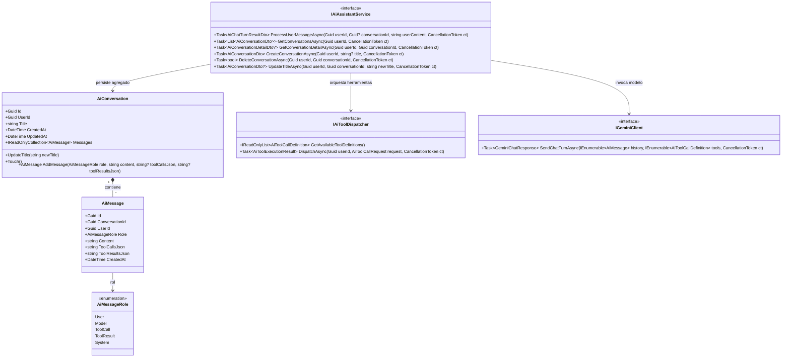
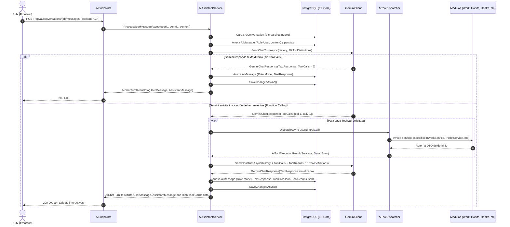

# Plan Técnico: Fase 5 - Inteligencia Holística (Asistente IA Transversal con Google Gemini 2.5 Flash)

- **Ruta**: `.specs/05-ai-assistant/tech-plan.md`
- **Fase**: 5 (Inteligencia Unificadora & Copiloto Personal)
- **Estado**: Propuesto (En espera de Puerta de Aprobación 2)
- **Fecha**: 2026-09-06
- **Autor**: System Architect (SubiKit)

---

## 1. Arquitectura de Dominio y Deep Modules

Siguiendo los principios de **Domain-Driven Design (DDD)**, **Deep Modules (John Ousterhout)** y **Seams (Michael Feathers)**, el Asistente IA se modela como un Bounded Context autónomo (`LifeTracker.Domain.Ai` y `LifeTracker.Application.Ai`), desacoplado de las implementaciones concretas de cada pilar mediante interfaces estables y el patrón Seam para el cliente de Google Gemini.



### 1.1 Entidades del Dominio (`LifeTracker.Domain.Ai`)

1. **`AiEnums.cs`**:
   ```csharp
   namespace LifeTracker.Domain.Ai;

   public enum AiMessageRole
   {
       User,
       Model,
       ToolCall,
       ToolResult,
       System
   }
   ```

2. **`AiConversation.cs` (Aggregate Root)**:
   - Encapsula el historial completo de mensajes y el ciclo de vida de la conversación.
   - Invariantes:
     - `UserId` obligatorio (`Guid.Empty` lanza `ArgumentException`).
     - `Title` normalizado (no nulo, recorta espacios en blanco; por defecto "Nueva conversación").
     - `UpdatedAt` actualizado automáticamente con cada nuevo mensaje agregado o mutación de título.
     - Colección `_messages` inmutable hacia el exterior (`IReadOnlyCollection<AiMessage>`).
   - Métodos de dominio:
     - `UpdateTitle(string newTitle)`: Valida no vacío y refresca `UpdatedAt`.
     - `Touch()`: Actualiza `UpdatedAt = DateTime.UtcNow`.
     - `AddMessage(AiMessageRole role, string content, string? toolCallsJson, string? toolResultsJson)`: Instancia la entidad `AiMessage`, la anexa a la colección y toca la conversación.

3. **`AiMessage.cs` (Entity)**:
   - Representa un turno o evento dentro de la conversación.
   - Atributos: `Id`, `ConversationId`, `UserId`, `Role`, `Content`, `ToolCallsJson`, `ToolResultsJson`, `CreatedAt`.
   - Invariantes: `ToolCallsJson` y `ToolResultsJson` garantizan almacenar al menos `"[]"` para consistencia JSONB en PostgreSQL.

### 1.2 Modelos de Valor y Contratos (`LifeTracker.Domain.Ai`)

```csharp
namespace LifeTracker.Domain.Ai;

public record AiToolCallDefinition(
    string Name,
    string Description,
    object ParametersSchema
);

public record AiToolCallRequest(
    string CallId,
    string ToolName,
    Dictionary<string, object?> Arguments
);

public record AiToolExecutionResult(
    string CallId,
    string ToolName,
    bool Success,
    object? Data,
    string? ErrorMessage
);

public record GeminiChatResponse(
    string? TextResponse,
    IReadOnlyList<AiToolCallRequest> ToolCalls,
    int PromptTokens,
    int CompletionTokens
);
```

### 1.3 Deep Module: `AiToolDispatcher`

Siguiendo el principio de John Ousterhout (*interfaz estrecha, funcionalidad profunda*), `AiToolDispatcher` expone una única interfaz de ejecución:

```csharp
namespace LifeTracker.Application.Ai.Services;

public interface IAiToolDispatcher
{
    IReadOnlyList<AiToolCallDefinition> GetAvailableToolDefinitions();
    Task<AiToolExecutionResult> DispatchAsync(Guid userId, AiToolCallRequest request, CancellationToken ct = default);
}
```

**Responsabilidades Internas Encapsuladas**:
- Registro y compilación de esquemas OpenAPI para las 10 herramientas soportadas.
- Enrutamiento por nombre de herramienta hacia los servicios de dominio de los 5 pilares (`IHealthService`, `IHabitService`, `INoteService`, `IWorkService`, `IAcademicService`, `IDailyHubService`).
- Parsing y validación semántica de argumentos JSON (conversión segura de tipos, manejo de fechas `DateOnly`, defaults de enumeraciones).
- Inyección obligatoria y no sobreescribible de `userId` autenticado en cada consulta o comando.
- Normalización de fallos: captura de excepciones de negocio (`ArgumentException`, `InvalidOperationException`, `KeyNotFoundException`) transformándolas en `AiToolExecutionResult(Success = false, ErrorMessage = "...")` para que Gemini pueda explicar el error en lenguaje amigable sin abortar el flujo del usuario.

### 1.4 Deep Module: `GeminiPromptComposer`

Responsable de aislar las peculiaridades del formato REST de Google GenAI v1beta:
- **System Instruction**: Inyecta el perfil personal de Subi, zona horaria (`America/Argentina/Buenos_Aires`, UTC-3), reglas de formateo en Markdown con emojis pertinentes, directivas de concisión y reglas taxativas de privacidad y límites de mutación.
- **Multipart Conversation Mapper**: Mapea el historial de `AiMessage` a la estructura `contents` de Gemini:
  - Roles soportados por la API: `user` y `model`.
  - Los mensajes con llamadas a herramientas se transforman en parts de tipo `functionCall`.
  - Las respuestas de las herramientas se envían en el siguiente turno como parts de tipo `functionResponse` bajo el rol `user` o `tool` según especificación REST de Gemini.
- **Herramientas**: Convierte las definiciones de `AiToolCallDefinition` al formato de `tools.function_declarations`.

### 1.5 Deep Module: `AiContextCompressor`

Evita el agotamiento de contexto y costos innecesarios de tokens:
- Aplica una **ventana deslizante de memoria** de los últimos 20 mensajes de la conversación activa.
- Para mensajes antiguos con `ToolResultsJson` voluminosos (como listados extensos de notas o métricas de laboratorio), preserva la síntesis en lenguaje natural y compacta el payload de datos crudos a un resumen de cardinalidad (ej: `{"totalResults": 15, "summary": "15 notas encontradas..."}`).

---

## 2. Catálogo de Esquemas OpenAPI y Contratos JSON (10 Herramientas)

Todas las herramientas se definen bajo la especificación de esquemas OpenAPI v3 requerida por Gemini 2.5 Flash:

### 2.1 Herramienta 1: `get_health_summary`
- **Descripción**: "Consulta estudios clínicos de laboratorio, fechas, instituciones y parámetros médicos históricos del usuario."
- **Parámetros OpenAPI**:
  ```json
  {
    "type": "OBJECT",
    "properties": {
      "metricName": {
        "type": "STRING",
        "description": "Nombre de la métrica o parámetro de laboratorio a buscar (ej: 'Colesterol', 'Glucosa', 'Triglicéridos')."
      },
      "year": {
        "type": "INTEGER",
        "description": "Año calendario para filtrar los estudios (ej: 2025)."
      }
    }
  }
  ```
- **Integración Backend**:
  - Si `metricName` tiene valor: invoca `IHealthService.CompareMetricHistoryAsync(userId, metricName, ct)`.
  - Si `metricName` es nulo: invoca `IHealthService.GetUserStudiesAsync(userId, year, ct)`.
- **Salida JSON esperada**:
  ```json
  {
    "metricName": "Glucosa",
    "unit": "mg/dL",
    "history": [
      { "studyDate": "2025-03-10", "value": "92", "numericValue": 92.0, "isAbnormal": false }
    ]
  }
  ```

### 2.2 Herramienta 2: `get_habits_status`
- **Descripción**: "Consulta el listado de hábitos activos, porcentaje de cumplimiento para una fecha y rachas actuales e históricas."
- **Parámetros OpenAPI**:
  ```json
  {
    "type": "OBJECT",
    "properties": {
      "date": {
        "type": "STRING",
        "description": "Fecha a consultar en formato YYYY-MM-DD. Si no se indica, utiliza la fecha de hoy."
      }
    }
  }
  ```
- **Integración Backend**:
  - Invoca `IDailyHubService.GetTodayHubAsync(userId, ct)` (si es hoy) o combina `IHabitService.GetHabitsAsync(userId, ct)` evaluando el log de la fecha solicitada.
- **Salida JSON esperada**:
  ```json
  {
    "date": "2026-09-06",
    "completionPercentage": 66,
    "habits": [
      { "id": "uuid", "name": "Tomar 2L de Agua", "isCompletedToday": true, "currentStreak": 5, "longestStreak": 14 }
    ]
  }
  ```

### 2.3 Herramienta 3: `search_notes`
- **Descripción**: "Busca notas en el Segundo Cerebro por palabras clave en título/contenido o por etiqueta conceptual."
- **Parámetros OpenAPI**:
  ```json
  {
    "type": "OBJECT",
    "properties": {
      "query": {
        "type": "STRING",
        "description": "Texto o término de búsqueda en títulos o contenido de notas."
      },
      "tag": {
        "type": "STRING",
        "description": "Etiqueta para filtrar notas (ej: 'arquitectura', 'ideas', 'facultad')."
      }
    },
    "required": ["query"]
  }
  ```
- **Integración Backend**:
  - Invoca `INoteService.GetNotesAsync(userId, query, tag, includeArchived: false, includeStubs: false, ct)`.
- **Salida JSON esperada**:
  ```json
  {
    "totalMatches": 2,
    "notes": [
      { "id": "uuid", "title": "Patrón Saga", "slug": "patron-saga", "snippet": "Transacciones distribuidas...", "tags": ["arquitectura"] }
    ]
  }
  ```

### 2.4 Herramienta 4: `get_work_tasks`
- **Descripción**: "Obtiene tareas del tablero Kanban de trabajo y las métricas agregadas de foco acumuladas."
- **Parámetros OpenAPI**:
  ```json
  {
    "type": "OBJECT",
    "properties": {
      "projectId": {
        "type": "STRING",
        "description": "UUID opcional del proyecto para filtrar tareas."
      },
      "status": {
        "type": "STRING",
        "enum": ["backlog", "todo", "in_progress", "done"],
        "description": "Columna del tablero Kanban."
      }
    }
  }
  ```
- **Integración Backend**:
  - Invoca en paralelo `IWorkService.GetTasksAsync(userId, projectId, status, ct)` y `IWorkService.GetMetricsAsync(userId, ct)`.
- **Salida JSON esperada**:
  ```json
  {
    "metrics": { "focusMinutesThisWeek": 280, "completedTasksThisWeek": 8 },
    "tasks": [
      { "id": "uuid", "title": "Implementar cliente Gemini", "status": "in_progress", "priority": "high", "dueDate": "2026-09-08" }
    ]
  }
  ```

### 2.5 Herramienta 5: `get_academic_status`
- **Descripción**: "Consulta materias cursadas, promedio de calificaciones actual y próximos exámenes e hitos evaluativos programados."
- **Parámetros OpenAPI**:
  ```json
  {
    "type": "OBJECT",
    "properties": {}
  }
  ```
- **Integración Backend**:
  - Invoca `IAcademicService.GetSubjectsAsync(userId, term: null, ct)` y `IAcademicService.GetMetricsAsync(userId, ct)`.
- **Salida JSON esperada**:
  ```json
  {
    "careerAverage": 8.45,
    "subjectsCount": 6,
    "subjects": [
      { "name": "Sistemas Distribuidos", "term": "2026-2C", "status": "en_curso", "averageGrade": 8.0 }
    ],
    "upcomingExams": [
      { "subjectName": "Sistemas Distribuidos", "milestoneTitle": "Primer Parcial", "dueDate": "2026-09-12", "daysRemaining": 6 }
    ]
  }
  ```

### 2.6 Herramienta 6: `get_timeline_feed`
- **Descripción**: "Consulta la línea de tiempo unificada (Spine) entre dos fechas, consolidando eventos de salud, hábitos, notas, trabajo y exámenes."
- **Parámetros OpenAPI**:
  ```json
  {
    "type": "OBJECT",
    "properties": {
      "startDate": {
        "type": "STRING",
        "description": "Fecha inicial en formato YYYY-MM-DD."
      },
      "endDate": {
        "type": "STRING",
        "description": "Fecha final en formato YYYY-MM-DD."
      }
    },
    "required": ["startDate", "endDate"]
  }
  ```
- **Integración Backend**:
  - Consulta `ILifeTrackerDbContext.TimelineItems` filtrando `UserId == userId && Date >= start && Date <= end` ordenados por `Timestamp DESC`.
- **Salida JSON esperada**:
  ```json
  {
    "startDate": "2026-09-01",
    "endDate": "2026-09-06",
    "events": [
      { "id": "uuid", "sourceModule": "work", "eventType": "task_completed", "title": "Diseño de API de IA", "timestamp": "2026-09-06T12:00:00Z" }
    ]
  }
  ```

### 2.7 Herramienta 7: `toggle_habit`
- **Descripción**: "Marca o desmarca el cumplimiento de un hábito para la fecha indicada (por defecto hoy), recalculando rachas."
- **Parámetros OpenAPI**:
  ```json
  {
    "type": "OBJECT",
    "properties": {
      "habitId": {
        "type": "STRING",
        "description": "UUID del hábito a alternar."
      },
      "date": {
        "type": "STRING",
        "description": "Fecha del log en formato YYYY-MM-DD (opcional, hoy por defecto)."
      }
    },
    "required": ["habitId"]
  }
  ```
- **Integración Backend**:
  - Invoca `IHabitService.ToggleHabitCompletionAsync(userId, habitId, new ToggleHabitRequest(date), ct)`.
- **Salida JSON esperada**:
  ```json
  {
    "habitId": "uuid",
    "isCompletedToday": true,
    "currentStreak": 6,
    "longestStreak": 14,
    "message": "Hábito marcado como completado exitosamente."
  }
  ```

### 2.8 Herramienta 8: `create_work_task`
- **Descripción**: "Crea una nueva tarea en el tablero Kanban de Trabajo con prioridad, fecha límite y proyecto opcional."
- **Parámetros OpenAPI**:
  ```json
  {
    "type": "OBJECT",
    "properties": {
      "title": {
        "type": "STRING",
        "description": "Título descriptivo de la tarea."
      },
      "description": {
        "type": "STRING",
        "description": "Detalles o criterios de aceptación."
      },
      "priority": {
        "type": "STRING",
        "enum": ["low", "medium", "high", "urgent"],
        "description": "Nivel de prioridad (por defecto 'medium')."
      },
      "dueDate": {
        "type": "STRING",
        "description": "Fecha límite de entrega en formato YYYY-MM-DD."
      },
      "projectId": {
        "type": "STRING",
        "description": "UUID opcional del proyecto al que pertenece la tarea."
      }
    },
    "required": ["title"]
  }
  ```
- **Integración Backend**:
  - Invoca `IWorkService.CreateTaskAsync(userId, request, ct)`.
- **Salida JSON esperada**:
  ```json
  {
    "id": "uuid",
    "title": "Repasar Capítulos 3 y 4",
    "status": "todo",
    "priority": "urgent",
    "dueDate": "2026-09-07",
    "position": 0
  }
  ```

### 2.9 Herramienta 9: `create_quick_note`
- **Descripción**: "Crea instantáneamente una nota en el Segundo Cerebro con soporte para Markdown, wikilinks [[Nota]] y etiquetas."
- **Parámetros OpenAPI**:
  ```json
  {
    "type": "OBJECT",
    "properties": {
      "title": {
        "type": "STRING",
        "description": "Título único de la nota."
      },
      "content": {
        "type": "STRING",
        "description": "Cuerpo en formato Markdown. Puede contener [[Wikilinks]]."
      },
      "tags": {
        "type": "ARRAY",
        "items": { "type": "STRING" },
        "description": "Etiquetas temáticas asociadas."
      }
    },
    "required": ["title", "content"]
  }
  ```
- **Integración Backend**:
  - Invoca `INoteService.CreateNoteAsync(userId, new CreateNoteRequest(title, content, tags, false), ct)`.
- **Salida JSON esperada**:
  ```json
  {
    "id": "uuid",
    "title": "Patrón Saga",
    "slug": "patron-saga",
    "tags": ["arquitectura"],
    "linkedNotesCount": 1
  }
  ```

### 2.10 Herramienta 10: `create_academic_milestone`
- **Descripción**: "Registra un nuevo examen, parcial o entrega dentro de una materia universitaria."
- **Parámetros OpenAPI**:
  ```json
  {
    "type": "OBJECT",
    "properties": {
      "subjectId": {
        "type": "STRING",
        "description": "UUID de la materia a la que pertenece el examen."
      },
      "title": {
        "type": "STRING",
        "description": "Título de la evaluación (ej: 'Primer Parcial')."
      },
      "milestoneType": {
        "type": "STRING",
        "enum": ["parcial", "entrega", "final", "recuperatorio"],
        "description": "Tipo de evaluación."
      },
      "dueDate": {
        "type": "STRING",
        "description": "Fecha del examen en formato YYYY-MM-DD."
      },
      "weightPercentage": {
        "type": "NUMBER",
        "description": "Ponderación porcentual opcional sobre la nota final (ej: 40.0)."
      }
    },
    "required": ["subjectId", "title", "milestoneType", "dueDate"]
  }
  ```
- **Integración Backend**:
  - Invoca `IAcademicService.CreateMilestoneAsync(userId, request, ct)`.
- **Salida JSON esperada**:
  ```json
  {
    "id": "uuid",
    "subjectId": "uuid",
    "title": "Primer Parcial",
    "milestoneType": "parcial",
    "dueDate": "2026-09-15",
    "status": "pendiente"
  }
  ```

---

## 3. Especificación del Cliente HTTP `GeminiClient`

### 3.1 Contrato del Seam `IGeminiClient`

```csharp
namespace LifeTracker.Application.Ai.Common;

public interface IGeminiClient
{
    Task<GeminiChatResponse> SendChatTurnAsync(
        IEnumerable<AiMessage> conversationHistory,
        IEnumerable<AiToolCallDefinition> availableTools,
        CancellationToken cancellationToken = default);
}
```

### 3.2 Implementación `GeminiClient` (`LifeTracker.Infrastructure.Ai`)
- **Configuración Endpoint**:
  - URL Base: `https://generativelanguage.googleapis.com/v1beta/models/gemini-2.5-flash:generateContent?key={apiKey}`
  - Clave obtenida de `builder.Configuration["Gemini:ApiKey"]` o variable de entorno `GEMINI_API_KEY`.
- **Estructura del Payload REST**:
  ```json
  {
    "system_instruction": {
      "parts": [{ "text": "...System prompt con contexto holístico..." }]
    },
    "contents": [
      {
        "role": "user",
        "parts": [{ "text": "¿Qué tareas tengo pendientes y qué exámenes hay esta semana?" }]
      },
      {
        "role": "model",
        "parts": [
          {
            "functionCall": {
              "name": "get_work_tasks",
              "args": { "status": "todo" }
            }
          }
        ]
      },
      {
        "role": "user",
        "parts": [
          {
            "functionResponse": {
              "name": "get_work_tasks",
              "response": { "tasks": [...] }
            }
          }
        ]
      }
    ],
    "tools": [
      {
        "function_declarations": [
          {
            "name": "get_work_tasks",
            "description": "...",
            "parameters": { ...OpenAPI Schema... }
          }
        ]
      }
    ],
    "generationConfig": {
      "temperature": 0.2,
      "topK": 40,
      "topP": 0.95
    }
  }
  ```
- **Modo Demostración / Fallback Offline**:
  - Si `apiKey` no está configurada o es `"your-google-gemini-api-key"`, `GeminiClient` conmuta sin arrojar error a un mock determinista inteligente: detecta patrones de texto en el mensaje (ej: "tarea", "hábito", "estudio", "resumen") y simula respuestas de Function Calling e interpretaciones sintéticas, garantizando que el entorno de desarrollo local y las pruebas funcionen al 100% sin depender de conectividad a Google.
- **Resiliencia HTTP**:
  - Manejo de códigos 429 (Too Many Requests) con reintentos exponenciales cortos.
  - Logging estructurado con `ILogger<GeminiClient>`.

---

## 4. Mapeo EF Core y Migración Supabase PostgreSQL

### 4.1 Script de Migración SQL (`supabase/migrations/20260909000000_ai_assistant_refinements.sql`)

```sql
-- ==============================================================================
-- REFINAMIENTO DE TABLAS DEL ASISTENTE IA (FASE 5)
-- ==============================================================================

-- 1. Actualizar ai_conversations con updated_at e índices
ALTER TABLE public.ai_conversations
    ADD COLUMN IF NOT EXISTS updated_at TIMESTAMPTZ DEFAULT timezone('utc'::text, now()) NOT NULL;

CREATE INDEX IF NOT EXISTS idx_ai_conversations_user_updated 
    ON public.ai_conversations(user_id, updated_at DESC);

-- 2. Ampliar ai_messages para soportar roles de herramientas y almacenamiento JSONB
ALTER TABLE public.ai_messages DROP CONSTRAINT IF EXISTS ai_messages_role_check;

ALTER TABLE public.ai_messages 
    ADD CONSTRAINT ai_messages_role_check 
    CHECK (role IN ('user', 'model', 'tool_call', 'tool_result', 'system'));

ALTER TABLE public.ai_messages
    ADD COLUMN IF NOT EXISTS tool_calls JSONB DEFAULT '[]'::jsonb NOT NULL,
    ADD COLUMN IF NOT EXISTS tool_results JSONB DEFAULT '[]'::jsonb NOT NULL;

CREATE INDEX IF NOT EXISTS idx_ai_messages_conv_created 
    ON public.ai_messages(conversation_id, created_at ASC);

-- 3. Trigger para actualizar automáticamente updated_at en ai_conversations al insertar mensaje
CREATE OR REPLACE FUNCTION public.update_ai_conversation_timestamp()
RETURNS TRIGGER AS $$
BEGIN
    UPDATE public.ai_conversations
    SET updated_at = timezone('utc'::text, now())
    WHERE id = NEW.conversation_id;
    RETURN NEW;
END;
$$ LANGUAGE plpgsql;

DROP TRIGGER IF EXISTS trg_update_ai_conversation_timestamp ON public.ai_messages;
CREATE TRIGGER trg_update_ai_conversation_timestamp
    AFTER INSERT ON public.ai_messages
    FOR EACH ROW
    EXECUTE FUNCTION public.update_ai_conversation_timestamp();

-- 4. Verificación de Políticas Row Level Security
ALTER TABLE public.ai_conversations ENABLE ROW LEVEL SECURITY;
DROP POLICY IF EXISTS "ai_conversations_all_own" ON public.ai_conversations;
CREATE POLICY "ai_conversations_all_own" 
    ON public.ai_conversations FOR ALL 
    USING (auth.uid() = user_id)
    WITH CHECK (auth.uid() = user_id);

ALTER TABLE public.ai_messages ENABLE ROW LEVEL SECURITY;
DROP POLICY IF EXISTS "ai_messages_all_own" ON public.ai_messages;
CREATE POLICY "ai_messages_all_own" 
    ON public.ai_messages FOR ALL 
    USING (auth.uid() = user_id)
    WITH CHECK (auth.uid() = user_id);
```

### 4.2 Configuraciones EF Core (`LifeTracker.Infrastructure.Persistence.Configurations.AiConfigurations`)

```csharp
namespace LifeTracker.Infrastructure.Persistence.Configurations;

using Microsoft.EntityFrameworkCore;
using Microsoft.EntityFrameworkCore.Metadata.Builders;
using LifeTracker.Domain.Ai;

public class AiConversationConfiguration : IEntityTypeConfiguration<AiConversation>
{
    public void Configure(EntityTypeBuilder<AiConversation> builder)
    {
        builder.ToTable("ai_conversations");

        builder.HasKey(c => c.Id);
        builder.Property(c => c.Id).HasColumnName("id");
        builder.Property(c => c.UserId).HasColumnName("user_id").IsRequired();
        builder.Property(c => c.Title).HasColumnName("title").HasMaxLength(250).IsRequired();
        builder.Property(c => c.CreatedAt).HasColumnName("created_at").IsRequired();
        builder.Property(c => c.UpdatedAt).HasColumnName("updated_at").IsRequired();

        builder.HasMany(c => c.Messages)
            .WithOne()
            .HasForeignKey(m => m.ConversationId)
            .OnDelete(DeleteBehavior.Cascade);

        builder.HasIndex(c => new { c.UserId, c.UpdatedAt });
    }
}

public class AiMessageConfiguration : IEntityTypeConfiguration<AiMessage>
{
    public void Configure(EntityTypeBuilder<AiMessage> builder)
    {
        builder.ToTable("ai_messages");

        builder.HasKey(m => m.Id);
        builder.Property(m => m.Id).HasColumnName("id");
        builder.Property(m => m.ConversationId).HasColumnName("conversation_id").IsRequired();
        builder.Property(m => m.UserId).HasColumnName("user_id").IsRequired();
        
        builder.Property(m => m.Role)
            .HasColumnName("role")
            .HasConversion(
                v => v.ToString().ToLowerInvariant(),
                v => ParseRole(v)
            )
            .IsRequired();

        builder.Property(m => m.Content).HasColumnName("content").IsRequired();
        builder.Property(m => m.ToolCallsJson).HasColumnName("tool_calls").HasColumnType("jsonb").IsRequired();
        builder.Property(m => m.ToolResultsJson).HasColumnName("tool_results").HasColumnType("jsonb").IsRequired();
        builder.Property(m => m.CreatedAt).HasColumnName("created_at").IsRequired();

        builder.HasIndex(m => new { m.ConversationId, m.CreatedAt });
    }

    private static AiMessageRole ParseRole(string role) => role switch
    {
        "user" => AiMessageRole.User,
        "model" => AiMessageRole.Model,
        "tool_call" => AiMessageRole.ToolCall,
        "tool_result" => AiMessageRole.ToolResult,
        "system" => AiMessageRole.System,
        _ => AiMessageRole.User
    };
}
```

---

## 5. Bucle de Orquestación Transaccional (`AiAssistantService`)

El bucle cerrado asegura que el cliente solo realice 1 invocación HTTP al backend, y el backend orqueste el diálogo iterativo con Gemini y el motor interno de herramientas:



### 5.1 Regla de Auto-titulación Inteligente
Si la conversación se crea a partir del primer mensaje del usuario y su título es `"Nueva conversación"` o está vacía, el servicio extrae los primeros 40 caracteres del mensaje del usuario y actualiza `AiConversation.UpdateTitle(...)` para que aparezca legible en la barra lateral sin requerir una llamada extra a la IA.

---

## 6. Arquitectura Frontend en Next.js (web/)

### 6.1 Estructura de Componentes en `/asistente`

```
web/src/
├── app/
│   └── (dashboard)/
│       └── asistente/
│           └── page.tsx           # Orquestador del estado de la conversación activa
├── components/
│   └── ai/
│       ├── AiSidebar.tsx          # Panel lateral: historial agrupado, nueva conv, eliminar
│       ├── ChatMessage.tsx        # Burbuja de mensaje con renderizado Markdown
│       ├── ChatInput.tsx          # Textarea expandible con atajos y loader animado
│       ├── EmptyStatePrompts.tsx  # Hero card con 4 preguntas holísticas de 1-click
│       └── RichToolCards.tsx      # Dispatcher de tarjetas interactivas por toolName:
│           ├── HealthToolCard.tsx
│           ├── HabitsToolCard.tsx
│           ├── WorkTaskToolCard.tsx
│           ├── AcademicMilestoneToolCard.tsx
│           ├── NoteToolCard.tsx
│           └── TimelineFeedToolCard.tsx
└── lib/
    └── api-client.ts              # Métodos y contratos de cliente para Ai
```

### 6.2 Renderizador Ligero de Markdown con Copiado de Código
Aprovecha el patrón robusto sin dependencias externas pesadas ya validado en `MarkdownEditor.tsx`:
- Detecta bloques de código cercados con ```` ```lang ```` y provee botón interactivo `Copiar` con estado copiado (icono `Check` de Lucide).
- Títulos `#`, `##`, `###` estilizados en la escala de grises de Tailwind.
- Citas `>` con borde púrpura / índigo.
- Negrita `**`, cursiva `*`, listas no ordenadas `-` y listas ordenadas `1.`.
- Tablas en formato GFM y enlaces con apertura segura en pestaña nueva.

### 6.3 Rich Tool Cards Visuales
Cada tarjeta se renderiza dentro del mensaje del asistente inmediatamente por debajo de la respuesta de texto sintetizada:
- **`HealthToolCard`**: Insignia con nombre del parámetro, valor actual, unidad de medida y badge verde ("Normal") o rojo ("Alerta clínica").
- **`HabitsToolCard`**: Checkbox de estado, nombre del hábito y llama naranja con los días de racha actual (`Flame` icon).
- **`WorkTaskToolCard`**: Título de la tarea creada, badge de prioridad ("Alta", "Urgente"), fecha límite y botón de enlace directo a `/trabajo`.
- **`AcademicMilestoneToolCard`**: Título del parcial o entrega, nombre de la materia, badge de tipo y enlace a `/academia`.
- **`NoteToolCard`**: Título de la nota creada, slug, lista de tags en píldoras y enlaces salientes detectados.

---

## 7. Trade-offs y Decisiones de Diseño (Design It Twice)

| Decisión Arquitectónica | Opción A (Adoptada) | Opción B (Descartada) | Justificación del Trade-off |
| :--- | :--- | :--- | :--- |
| **Bucle de Orquestación** | **Backend .NET Transaccional** | Bucle en el navegador cliente | Evita filtrar claves o exponer servicios internos; latencia de red PostgreSQL < 2ms vs 4 roundtrips móviles; transaccionalidad atómica. |
| **Almacenamiento de Tool Calls** | **Columnas JSONB (`tool_calls`, `tool_results`)** | Tablas relacionales normalizadas | Permite acoplamiento nulo al evolucionar los schemas de herramientas sin migraciones continuas; lectura de historial en 1 solo query. |
| **Simulación Offline / Mock** | **Fallback transparente en `GeminiClient`** | Fallo duro si no hay API Key | Permite desarrollar localmente, ejecutar el build y correr los tests sin incurrir en costos ni requerir conexión a internet activa. |
| **Markdown en Chat** | **Renderizador nativo modular** | `react-markdown` / `remark` externos | Cero dependencias adicionales que comprometan el SSR de Next.js 16 ni eleven el tamaño del bundle del frontend. |