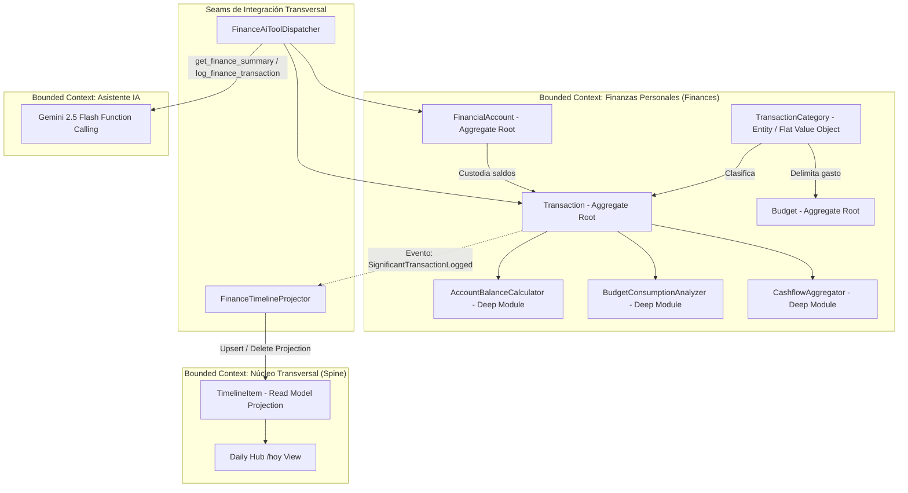

# Especificación Funcional: Fase 6 - Finanzas Personales (Cuentas, Transacciones, Presupuestos y Cashflow)

- **Feature**: Módulo de Finanzas Personales (`/finanzas`)
- **Ruta del Artefacto**: `.specs/06-finances/spec.md`
- **Fase**: 6 (Soberanía Financiera y Control de Liquidez)
- **Estado**: Aprobado (Puerta de Aprobación 1 superada)
- **Fecha**: 2026-09-09
- **Autor**: System Architect (SubiKit)
- **Aprobador**: Subi

---

## 1. Resumen del Problema y Propuesta de Valor

### 1.1 Contexto y Dolor Actual
El control de las finanzas personales suele fracasar por fricción operativa, interfaces sobrecargadas y mal manejo de contextos bimonetarios:
1. **Fricción extrema de registro**: Registrar un gasto en apps tradicionales exige 6 a 8 pasos manuales, lo que causa abandono inmediato ("gastos hormiga" no contabilizados).
2. **Contexto bimonetario desordenado**: En economías con doble divisa cotidiana (ARS y USD), las apps fuerzan conversiones automáticas erróneas que distorsionan el balance patrimonial real.
3. **Falta de visibilidad de liquidez inmediata**: Dificultad para conocer en tiempo real cuánto dinero líquido exacto hay disponible entre efectivo, cuentas bancarias y billeteras virtuales (ej. Mercado Pago).
4. **Desconexión del sistema de vida**: Los gastos en salud, hábitos o proyectos no se correlacionan con la bitácora diaria ni con el Asistente IA de Soma.

### 1.2 Propuesta de Valor Aprobada por Subi
* **Operate Mode Ultrarrápido (< 5 segundos)**: Acceso directo con modal optimizado, teclado numérico táctil, categorías planas frecuentes a un solo toque y guardado optimista.
* **Segregación Bimonetaria Estricta (ARS / USD)**: Totales de liquidez netamente separados sin conversiones opacas. Cuentas y transacciones operan en su moneda nativa, con soporte para transferencias bimonetarias con tipo de cambio explícito.
* **Enfoque en Liquidez Real**: Gestión de efectivo, bancos y billeteras virtuales para control certero del dinero disponible.
* **Control Preventivo de Presupuestos**: Semaforización mensual por categoría (verde < 75%, ámbar 75-99%, rojo >= 100%).
* **Modo Privacidad Instantáneo ("Privacy Eye")**: Ofusca cifras monetarias con `••••••` de inmediato sin saltos de diseño (zero layout shift).
* **Integración al Spine Transversal (`timeline_items`)**: Proyección selectiva de movimientos significativos (> $50.000 ARS o ingresos de sueldo) en la vista `/hoy`.
* **Asistente IA Bidireccional**: Herramientas nativas para consultar saldos y registrar transacciones mediante lenguaje natural.

---

## 2. Bounded Contexts y Arquitectura de Dominio



### 2.1 Principios de Diseño Aplicados
1. **Deep Modules (John Ousterhout)**:
   - `AccountBalanceCalculator`: Encapsula la actualización atómica de saldos de cuentas ante inserción, modificación o eliminación de transacciones dentro de una transacción de base de datos única.
   - `BudgetConsumptionAnalyzer`: Computa la ejecución del gasto devengado por categoría y mes, determinando umbrales de alerta (`Normal`, `Warning` >= 80%, `Exceeded` >= 100%).
   - `CashflowAggregator`: Genera resúmenes periódicos de ingresos, egresos y tasa de ahorro mensual `(Ingresos - Gastos) / Ingresos` segregados por divisa (`ARS` y `USD`).
2. **Seams (Michael Feathers)**:
   - `IFinanceTimelineProjector`: Desacopla la persistencia de transacciones de la tabla `timeline_items`.
   - `IFinanceAiToolDispatcher`: Expone interfaces fuertemente tipadas para que el asistente IA ejecute consultas y registros sin acceder a repositorios internos.
3. **Invariantes de Negocio Rigurosos**:
   - **Invariante 1 (Propiedad RLS)**: Todo registro pertenece inequívocamente al `user_id` autenticado.
   - **Invariante 5 (Consistencia Atómica de Saldos)**: Saldo determinista y auditable mediante transacciones SQL atómicas.
   - **Invariante 6 (Inmutabilidad y Precisión Decimal)**: Tipo de dato `numeric(14,2)` en BD y `decimal` en .NET.
   - **Invariante 7 (Segregación Monetaria Explícita)**: ARS y USD no se combinan sin tasa declarada.

---

## 3. Alcance (Scope)

### 3.1 In Scope (MVP Finanzas)
* **Cuentas y Billeteras (`/finanzas`)**:
  - CRUD de cuentas: Nombre, Tipo (`cash`, `bank`, `digital_wallet`, `crypto`), Divisa (`ARS`, `USD`), Saldo Inicial y Color/Ícono.
  - Indicador de saldo actual actualizado automáticamente.
  - Archivo lógico de cuentas.
* **Transacciones y Movimientos**:
  - Tipos: `expense` (Gasto), `income` (Ingreso), `transfer` (Transferencia interna).
  - Transferencias bimonetarias: Tasa de cambio o importe de destino explícito.
  - Modal de Carga Rápida (*Quick Transaction Drawer*): Optimizado para Operate Mode (< 5s), teclado numérico táctil y categorías frecuentes a un solo toque.
  - Edición y eliminación con reversión atómica de saldos.
* **Categorías Planas y Rápidas**:
  - Catálogo presembrado: Alimentación, Transporte, Servicios, Ocio, Salud, Educación, Vivienda, Sueldo, Rendimientos.
  - Creación y edición con íconos Lucide y paleta temática.
* **Presupuestos Mensuales**:
  - Límites de gasto por mes/año para categorías clave o global.
  - Barras de progreso de ejecución con alerta visual.
* **Dashboard y Métricas (`/finanzas`)**:
  - Tarjetas de liquidez segregada: Total ARS y Total USD independientes.
  - Flujo de caja del mes: Ingresos, Gastos, Balance Neto y Tasa de Ahorro.
  - Gráfico de distribución de gastos por categoría (Donut Chart).
  - Modo Privacidad (*Privacy Eye Toggle*): Ofuscación de montos con `••••••`.
* **Integración Spine Transversal & IA**:
  - Proyección de movimientos > $50.000 ARS o sueldo a `timeline_items` (`/hoy`).
  - Herramientas de IA para consultar saldo y registrar transacciones mediante lenguaje natural.

### 3.2 Out of Scope (Fases Posteriores)
* Conexión Open Banking / Scraping bancario directo.
* Liquidación de resúmenes de tarjetas de crédito en múltiples cuotas futuras (Fase 6.2).
* Portafolio bursátil con cotizaciones automáticas de bonos/acciones/CEDEARs.
* Escaneo OCR de tickets de compra.

---

## 4. Criterios de Aceptación (Gherkin BDD)

### Escenario 1: Registro rápido de gasto y deducción atómica de saldo
```gherkin
Dado que Subi tiene una cuenta "Mercado Pago" con divisa "ARS" y saldo de $50.000,00
Cuando registra un gasto rápido de $4.500,00 con categoría "Alimentación" y detalle "Almuerzo rápido"
Entonces la transacción se guarda con estado "cleared"
Y el saldo actual de "Mercado Pago" pasa exactamente a $45.500,00
Y el consumo del presupuesto de "Alimentación" se incrementa en $4.500,00
```

### Escenario 2: Transferencia entre cuentas de la misma divisa
```gherkin
Dado que Subi tiene la cuenta "Banco Galicia" con saldo $120.000,00 ARS
Y la cuenta "Efectivo" con saldo $10.000,00 ARS
Cuando registra una transferencia de $20.000,00 ARS desde "Banco Galicia" hacia "Efectivo"
Entonces el saldo de "Banco Galicia" pasa a $100.000,00 ARS
Y el saldo de "Efectivo" pasa a $30.000,00 ARS
Y el total neto patrimonial en ARS permanece inalterado
```

### Escenario 3: Transferencia bimonetaria con tipo de cambio explícito
```gherkin
Dado que Subi tiene la cuenta "Banco Galicia ARS" con saldo $1.500.000,00 ARS
Y la cuenta "Caja de Ahorro USD" con saldo $500,00 USD
Cuando registra una transferencia de $1.200.000,00 ARS hacia "Caja de Ahorro USD" con tipo de cambio 1200.0000 y destino de $1.000,00 USD
Entonces el saldo de "Banco Galicia ARS" disminuye a $300.000,00 ARS
Y el saldo de "Caja de Ahorro USD" se incrementa a $1.500,00 USD
Y la transacción guarda trazabilidad de ambos importes y el tipo de cambio pactado
```

### Escenario 4: Proyección selectiva al Timeline diario
```gherkin
Dado que el umbral de transacciones relevantes está configurado en $50.000,00 ARS
Cuando Subi registra un gasto de $65.000,00 ARS en categoría "Servicios"
Entonces se inserta un evento en "timeline_items" con módulo "finances" y tipo "significant_expense"
Y el evento se visualiza en la línea de tiempo de "/hoy"
```

### Escenario 5: No proyección de gastos cotidianos menores al umbral
```gherkin
Dado que el umbral de transacciones relevantes está configurado en $50.000,00 ARS
Cuando Subi registra un gasto de $3.200,00 ARS en categoría "Alimentación"
Entonces el gasto se asienta en "transactions" y actualiza la cuenta
Y no se genera ningún registro en "timeline_items"
```

### Escenario 6: Anulación de transacción y reversión exacta de saldo
```gherkin
Dado que Subi registró un gasto de $15.000,00 ARS en "Efectivo"
Y el saldo actual de "Efectivo" es $25.000,00 ARS
Cuando Subi elimina la transacción
Entonces el saldo de "Efectivo" se restaura atómicamente a $40.000,00 ARS
Y cualquier proyección asociada en "timeline_items" es eliminada
```

### Escenario 7: Activación de Modo Privacidad en Operate Mode
```gherkin
Dado que Subi está en la vista "/finanzas"
Cuando presiona el botón de Modo Privacidad
Entonces todas las cifras de saldos y montos se muestran como "••••••"
Y ningún layout shift ocurre en la interfaz
```

### Escenario 8: Registro de gasto vía Asistente IA
```gherkin
Dado que Subi conversa con el Asistente IA
Cuando solicita: "Anotá un gasto de 4500 pesos en almuerzo con Mercado Pago"
Entonces el Asistente ejecuta la herramienta "log_finance_transaction"
Y la transacción se crea en la cuenta "Mercado Pago" por $4.500,00 ARS
Y el Asistente responde confirmando el nuevo saldo de la cuenta
```
