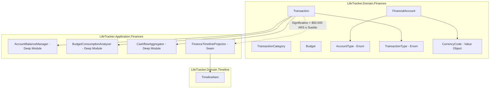

# Plan Técnico: Fase 6 - Finanzas Personales (Cuentas, Transacciones, Presupuestos y Cashflow)

- **Ruta**: `.specs/06-finances/tech-plan.md`
- **Fase**: 3 (Plan Técnico y Arquitectura)
- **Estado**: Propuesto (En espera de Puerta de Aprobación 3)
- **Fecha**: 2026-09-09
- **Autor**: Tech Lead & Architect (SubiKit)
- **Aprobador**: Subi

---

## 1. Decisiones de Arquitectura & Design It Twice

### 1.1 Evaluación de Alternativas: Mantenimiento de Saldos de Cuentas

| Criterio | Opción A: Triggers SQL en PostgreSQL | Opción B (Seleccionada): Deep Module `AccountBalanceManager` en Application |
| :--- | :--- | :--- |
| **Ubicación de Lógica** | Procedural en base de datos (`PL/pgSQL`). | C# fuertemente tipado en capa Application/Domain. |
| **Testabilidad** | Requiere base de datos PostgreSQL activa para cualquier prueba. | 100% testeable en memoria mediante pruebas unitarias puras (`xUnit`). |
| **Sincronización EF Core** | EF Core desconoce las mutaciones de saldo tras `SaveChangesAsync` salvo que se use `ReloadAsync` explícito. | Transparente para el Change Tracker; las entidades mutadas se guardan atómicamente en la misma transacción. |
| **Transferencias Bimonetarias** | Compleja lógica condicional de tipo de cambio y cuentas múltiples en SQL. | Manejo limpio en C# con Value Objects y validaciones de invariantes de negocio. |
| **Transaccionalidad** | Implícita en la sentencia. | Explícita mediante `IDbContextTransaction` (Unit of Work). |

**Decisión**: Se selecciona la **Opción B**. El módulo `AccountBalanceManager` encapsula todo el recálculo y mutación de saldos garantizando atomicidad mediante transacciones de EF Core, manteniendo la lógica en el dominio testeable y libre de efectos colaterales ocultos en BD.

---

## 2. Arquitectura de Dominio y Deep Modules

### 2.1 Entidades del Dominio (`LifeTracker.Domain/Finances`)
1. `FinancialAccount`:
   - Propiedades: `Id`, `UserId`, `Name`, `AccountType` (`Cash`, `Bank`, `DigitalWallet`, `Crypto`, `Other`), `Currency` (`ARS`, `USD`), `InitialBalance`, `CurrentBalance`, `Color`, `Icon`, `IsArchived`, `CreatedAt`, `UpdatedAt`.
   - Métodos de Dominio: `ApplyBalanceDelta(decimal delta)`, `UpdateMetadata(name, color, icon)`, `Archive()`, `Unarchive()`.
2. `TransactionCategory`:
   - Propiedades: `Id`, `UserId`, `Name`, `Type` (`Expense`, `Income`, `Both`), `Color`, `Icon`, `IsSystem`, `DisplayOrder`, `CreatedAt`.
3. `Transaction`:
   - Propiedades: `Id`, `UserId`, `AccountId`, `DestinationAccountId` (nullable), `CategoryId` (nullable), `Type` (`Expense`, `Income`, `Transfer`), `Amount`, `DestinationAmount` (nullable, para bimonetario), `ExchangeRate` (nullable), `Date` (`DateOnly`), `Timestamp` (`DateTimeOffset`), `Description`, `Notes`, `Tags` (`List<string>`), `IsCleared`, `CreatedAt`, `UpdatedAt`.
4. `Budget`:
   - Propiedades: `Id`, `UserId`, `CategoryId` (nullable para global), `Month`, `Year`, `LimitAmount`, `Currency`, `CreatedAt`, `UpdatedAt`.

### 2.2 Deep Modules en Application Layer (`LifeTracker.Application/Finances`)
* **`IAccountBalanceManager`**:
  - API concisa:
    - `Task ApplyTransactionAsync(Transaction tx, CancellationToken ct)`
    - `Task RevertTransactionAsync(Transaction tx, CancellationToken ct)`
    - `Task UpdateTransactionAsync(Transaction oldTx, Transaction newTx, CancellationToken ct)`
  - Encapsula: Débitos, créditos, transferencias entre cuentas y transferencias bimonetarias con validación de saldos dentro de la transacción activa de base de datos.
* **`IBudgetConsumptionAnalyzer`**:
  - API: `BudgetStatusDto Analyze(Budget budget, IReadOnlyList<Transaction> transactions)`
  - Devuelve: `SpentAmount`, `RemainingAmount`, `PercentageConsumed`, `Status` (`Normal` < 75%, `Warning` 75-99%, `Exceeded` >= 100%).
* **`ICashflowAggregator`**:
  - API: `MonthlyCashflowDto Aggregate(IReadOnlyList<Transaction> transactions, string currency, int month, int year)`
  - Devuelve: `TotalIncome`, `TotalExpense`, `NetSavings`, `SavingsRate` (%), y desglose por categorías.

### 2.3 Seam de Integración: `IFinanceTimelineProjector`
* Contrato: `Task ProjectSignificantTransactionAsync(Transaction tx, FinancialAccount account, CancellationToken ct)`
* Regla de activación:
  - Movimientos con `Amount >= 50,000.00m` (configurable) en ARS o `>= 50.00m` en USD.
  - Ingresos categorizados como "Sueldo" o "Salario".
* Acción:
  - Upsert en `timeline_items` con `source_module: 'finances'`, `source_id: tx.Id`, `event_type: 'significant_expense'` o `'income_logged'`.
  - Reversión/Delete idempotente al eliminar la transacción.

### 2.4 Asistente IA Seam: `FinanceAiTools`
* Métodos registrados en `AiToolDispatcher`:
  - `get_finance_summary(string currency, int? month, int? year)`: Devuelve saldos de cuentas activas, total de liquidez en la divisa solicitada, y estado del flujo del mes.
  - `log_finance_transaction(string accountName, decimal amount, string type, string categoryName, string description, string? date)`: Encuentra la cuenta y categoría por coincidencia difusa, asienta la transacción y actualiza saldos devolviendo el resultado en lenguaje natural.

---

## 3. Capa de Persistencia (PostgreSQL & EF Core)

### 3.1 Migración SQL (`supabase/migrations/20260911000000_finances_schema.sql`)
1. Modificación de restricción `timeline_items_source_module_check` para agregar `'finances'`.
2. Tablas: `financial_accounts`, `transaction_categories`, `transactions`, `budgets`.
3. RLS Policies activadas para todas las tablas (`USING (auth.uid() = user_id)`).
4. Índices para consultas de alta velocidad:
   - `idx_fin_accounts_user` en `financial_accounts(user_id)`.
   - `idx_fin_tx_user_date` en `transactions(user_id, date DESC)`.
   - `idx_fin_tx_account` en `transactions(account_id)`.
   - `idx_fin_budgets_user_period` en `budgets(user_id, year, month)`.
5. Pre-sembrado de categorías por defecto para nuevos usuarios (o para el usuario actual) mediante script seguro idempotente.

### 3.2 Fluent API en `LifeTracker.Infrastructure`
- Mapeos en `LifeTrackerDbContext`:
  - `FinancialAccountConfiguration`
  - `TransactionCategoryConfiguration`
  - `TransactionConfiguration` (precisión `HasPrecision(14, 2)`)
  - `BudgetConfiguration`

---

## 4. Endpoints RESTful (.NET Web API)

Controlador: `LifeTracker.Api/Controllers/FinancesController.cs` (Ruta base: `/api/finances`):
- `GET /accounts`: Lista de cuentas con saldos consolidables.
- `POST /accounts`: Creación de cuenta.
- `PUT /accounts/{id}`: Edición de metadatos.
- `DELETE /accounts/{id}`: Archivo lógico de cuenta.
- `GET /categories`: Lista de categorías activas.
- `POST /categories`: Creación de categoría personalizada.
- `GET /transactions`: Consulta paginada con filtros (`accountId`, `categoryId`, `month`, `year`, `type`).
- `POST /transactions`: Creación de transacción con recálculo atómico de saldo.
- `PUT /transactions/{id}`: Modificación de transacción.
- `DELETE /transactions/{id}`: Eliminación y reversión de saldo.
- `GET /summary`: Métricas de flujo de caja y balances segregados por divisa (`ARS` y `USD`).
- `GET /budgets`: Lista de presupuestos del mes con consumo analizado.
- `POST /budgets`: Configuración de presupuesto.

---

## 5. Frontend Next.js 16 (Operate Mode)

### 5.1 Estructura de Rutas y Componentes
- `web/src/app/(dashboard)/finanzas/page.tsx`:
  - Barra de liquidez segregada: Widget ARS (esmeralda) y Widget USD (cian/azul) independientes.
  - Botón de privacidad ("Privacy Eye Toggle"): reemplaza montos por `••••••` en todo el dashboard mediante contexto React global/local (`usePrivacyMode`).
  - Botones de acción rápida: `+ Gasto`, `+ Ingreso`, `⇄ Transferir`.
  - Carrusel / Grid de cuentas con saldo y estado.
  - Visualizador de flujo de caja del mes y gráfico Donut de distribución.
  - Feed de transacciones recientes con filtros y paginación.
- `web/src/components/finances/QuickTransactionModal.tsx`:
  - Apertura con atajo de teclado (`N` o botón flotante en móvil).
  - Teclado numérico táctil de alta densidad.
  - Selección rápida de cuenta y chips de categorías frecuentes.
  - Guardado optimista y cierre automático en menos de 5 segundos.
- `web/src/lib/api-client.ts`:
  - Extensión con métodos fuertemente tipados para todas las llamadas a `/api/finances/*`.
- `web/src/app/page.tsx`:
  - Incorporación de `Finanzas` en el menú principal `pillarsNav` con ícono `Wallet`.

---

## 6. Estrategia de Testing (Feedback Loop)

1. **Pruebas Unitarias de Dominio (`LifeTracker.Domain.UnitTests`)**:
   - `AccountBalanceManagerTests`:
     - Deducción de saldo en gasto simple.
     - Acreditación de saldo en ingreso.
     - Transferencia entre cuentas de misma divisa (suma cero en patrimonio neto).
     - Transferencia bimonetaria con tipo de cambio (ARS debita X, USD acredita Y).
     - Reversión exacta de saldos al borrar transacciones.
   - `BudgetConsumptionAnalyzerTests`:
     - Cálculo exacto de porcentajes y alertas de umbrales (75% y 100%).
2. **Pruebas de Integración (`LifeTracker.Api.IntegrationTests`)**:
   - Endpoints de creación y consulta de transacciones con autenticación mock de Supabase.
   - Verificación de aislamiento RLS.
3. **Frontend Build & Linter**:
   - Compilación estricta con `npm run build` en `web/` sin errores de tipos TypeScript.
