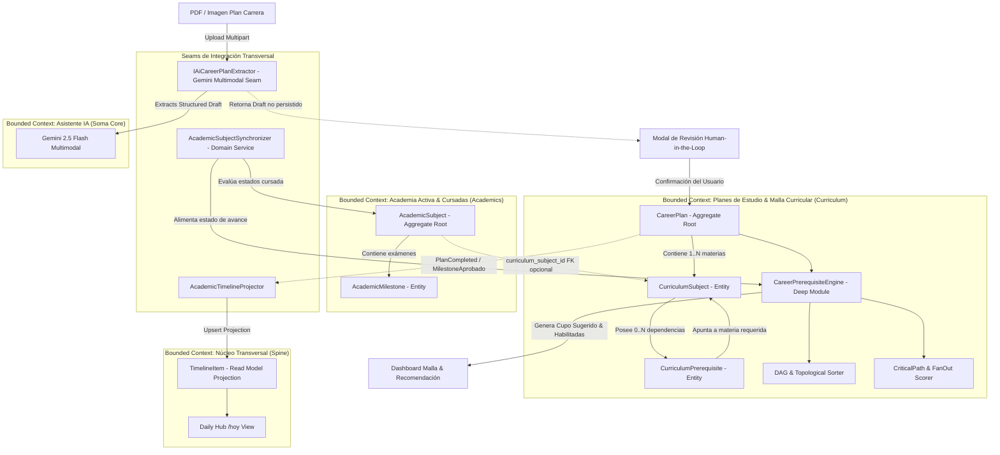

# Especificación Funcional: Plan de Carrera, Malla Curricular, Correlatividades y Recomendación Inteligente

- **Feature**: Plan de Carrera, Malla Curricular, Correlatividades y Recomendación Inteligente (`/academia/plan`)
- **Ruta del Artefacto**: `.specs/07-career-plan-and-prerequisites/spec.md`
- **Fase**: 1 SDD (Especificación Funcional y Arquitectura de Dominio)
- **Estado**: Propuesto (En espera de Puerta de Aprobación 1)
- **Fecha**: 2026-09-10
- **Autor**: System Architect & Domain Specialist (SubiKit)
- **Aprobador**: Subi

---

## 1. Resumen del Problema y Propuesta de Valor

### 1.1 Contexto y Dolor Actual
En el transcurso de una carrera universitaria o terciaria, los estudiantes enfrentan un desafío estratégico fundamental cada semestre: **planificar qué materias cursar para optimizar su tiempo de graduación**. La falta de herramientas dedicadas y la desconexión del ecosistema formativo generan fricciones severas:

1. **La "Deuda Técnica Académica" e Incertidumbre de Inscripción**:
   El estudiante elige materias basándose en afinidad momentánea, comodidad de horarios o intuición, sin visibilidad del impacto real en su avance. Cursar una materia secundaria o electiva en lugar de una materia "llave" (cuello de botella) bloquea cuatrimestres futuros enteros, retrasando la graduación entre 6 meses y 1 año.
2. **Complejidad del Régimen de Correlatividades Latinoamericano/Argentino**:
   En el sistema universitario regional (ej. UBA, UTN, UNLP, UADE), las correlatividades **no son binarias**. Existen dos tipos de exigencias distintas:
   - Materias que exigen que la previa esté **Regularizada** (cursada aprobada / firma de libreta) para poder inscribirse a cursar.
   - Materias que exigen que la previa esté **Aprobada** (examen final rendido o promoción cerrada) para poder cursar o rendir.
   Las hojas de cálculo convencionales no soportan esta semántica dual, induciendo a errores de cálculo en la habilitación de materias.
3. **Fricción Extrema de Carga Inicial**:
   Tipear a mano una malla curricular completa de 40 a 60 materias, con códigos de cátedra, carga horaria, año/cuatrimestre sugerido y decenas de correlatividades cruzadas, exige horas de trabajo monótono y provoca abandono de la herramienta.
4. **Desacoplamiento entre Plan Maestro y Cursada Activa**:
   Las herramientas existentes o bien modelan una malla abstracta que no refleja las notas reales de los parciales y finales del período, o bien registran exámenes aislados (como el módulo `/academia` básico de la Fase 4) sin vincularlos a la estructura del título ni advertir qué correlativas faltan para el ciclo siguiente.

### 1.2 Propuesta de Valor Aprobada por Subi

* **Extracción Multimodal con IA + Revisión Humana (Human-in-the-Loop)**:
  - Subida directa del plan de estudios oficial en formato PDF o imagen (captura del plan de estudios de la facultad).
  - Extracción automatizada y estructurada mediante Google Gemini 2.5 Flash (`IAiCareerPlanExtractor`), infiriendo materias, códigos, año/cuatrimestre y correlatividades explícitas.
  - **Revisión Humana Obligatoria previa a la persistencia**: Pantalla y modal interactivo donde el usuario visualiza la malla parseada, ajusta nombres o códigos erróneos, edita dependencias y valida la consistencia del grafo antes de guardar en base de datos.
* **Modelo Profesional de Correlatividades (Opción A Confirmada)**:
  - Soporte nativo para los dos requerimientos de la educación superior:
    * `RequiereRegularizada`: Exige que la materia previa esté al menos en estado `Regularizada` o `Aprobada` para habilitar el cursado.
    * `RequiereAprobada`: Exige que la materia previa esté en estado `Aprobada` (con final acreditado) para habilitar el cursado o examen final.
* **Motor de Priorización y Cupo Sugerido para el Siguiente Cuatrimestre (`CareerPrerequisiteEngine`)**:
  - Detección determinista de materias Habilitadas sobre un Grafo Dirigido Acíclico (DAG).
  - Cálculo de un **Score de Prioridad de Avance** basado en:
    * **Camino Crítico & Desbloqueo Futuro (Fan-Out)**: Cuántas materias posteriores dependen directa o transitivamente de ella.
    * **Orden Curricular Recomendado**: Ponderación correctiva para evitar arrastrar materias de años anteriores.
  - Generación de un **Cupo Sugerido (Top 3 a 5 materias recomendadas, configurable por el estudiante)**, acompañado de una justificación explicativa clara (ej: *"Desbloquea 5 materias de 3° y 4° año; es cuello de botella en el Camino Crítico"*).
* **Desacoplamiento Arquitectónico Limpio**:
  - El plan maestro (`CareerPlan`, `CurriculumSubject`, `CurriculumPrerequisite`) permanece inmutable y desacoplado de las vicisitudes del calendario.
  - Se vincula limpiamente con las instancias de cursada (`AcademicSubject`) y sus hitos de evaluación (`AcademicMilestone`), permitiendo sincronizar el progreso histórico sin corromper la malla canónica.
* **Soporte Multi-carrera con Contexto Activo**:
  - Un estudiante puede tener múltiples planes cargados (ej. cambio de plan de estudios, carrera de grado simultánea con tecnicatura), seleccionando un plan activo (`is_active = true`) que alimenta la experiencia unificada en `/academia`.

---

## 2. Bounded Contexts y Arquitectura de Dominio



### 2.1 Principios de Diseño Aplicados

1. **Deep Modules (John Ousterhout)**:
   - `CareerPrerequisiteEngine`:
     * **Interfaz Estrecha**: Expone métodos concisos:
       - `ValidateAcyclicGraph(subjects, prerequisites) -> GraphValidationResult`
       - `EvaluateEligibility(subjects, prerequisites, studentSubjectStatuses) -> IReadOnlyList<SubjectEligibilityResult>`
       - `GenerateNextTermRecommendations(plan, studentSubjectStatuses, quotaLimit = 4) -> CareerRecommendationResult`
     * **Implementación Profunda**: Oculta la complejidad de grafos:
       - Detección de ciclos mediante algoritmo de Tarjan / Kahn (Topological Sorting).
       - Cálculo de longitud de camino crítico hacia nodos terminales (*Critical Path Depth*).
       - Cálculo de grado de salida transitivo (*Transitive Fan-Out* / número de asignaturas desbloqueables directa e indirectamente).
       - Distinción de semántica de correlatividad (`RequiereRegularizada` vs `RequiereAprobada`) cruzando el estado académico del alumno.
   - `CareerPlanExtractorService`:
     * Encapsula la orquestación con la API multimodal de Gemini: construcción del prompt estructurado con schema JSON estricto, manejo de timeouts, normalización de acentos/códigos y saneamiento de referencias antes de entregar el borrador preliminar a la UI.

2. **Seams (Michael Feathers)**:
   - `IAiCareerPlanExtractor`: Define el contrato para la extracción multimodal de documentos. Permite ejecutar pruebas unitarias con fakes deterministas sin invocar a Google Gemini ni gastar tokens de cuota en CI/CD.
   - `IAcademicSubjectSynchronizer`: Desacopla la lógica de vinculación entre las cursadas del período lectivo (`academic_subjects`) y las materias del plan curricular (`curriculum_subjects`).
   - `IAcademicTimelineProjector`: Proyecta eventos clave (ej. completitud del plan de carrera o aprobación de hitos de materias clave) al Spine transversal sin ensuciar el modelo de dominio.

3. **Invariantes del Negocio Rigurosos**:
   - **Invariante 1 (Propiedad y Privacidad RLS)**: Todo plan de carrera, materia curricular y correlatividad pertenece estrictamente al `user_id` autenticado.
   - **Invariante 2 (Grafo Dirigido Acíclico - Sin Dependencias Cíclicas ni Auto-referencias)**:
     El grafo de correlatividades no puede contener ciclos (ej. Materia A requiere B, y B requiere A). Tampoco se permite que una materia sea correlativa de sí misma (`subject_id != required_subject_id`). Toda modificación al grafo es validada atómicamente por `CareerPrerequisiteEngine` antes de persistirse.
   - **Invariante 3 (Semántica Dual Estricta de Correlatividades)**:
     - Si la relación es `RequiereRegularizada`, la materia previa debe encontrarse en estado `Regularizada` o `Aprobada`.
     - Si la relación es `RequiereAprobada`, la materia previa debe encontrarse indefectiblemente en estado `Aprobada`. Si solo está `Regularizada`, la materia destino permanece en estado `Bloqueada`.
   - **Invariante 4 (Human-in-the-Loop Obligatorio para Extracciones IA)**:
     Ningún plan de carrera extraído por IA se persiste directamente en la base de datos de producción de forma desatendida. La extracción genera un DTO efímero (`CareerPlanDraftDto`) que exige la validación, ajuste y confirmación explícita del usuario en el cliente web.
   - **Invariante 5 (Unicidad de Plan Activo por Usuario)**:
     Un usuario puede almacenar múltiples planes de carrera en el sistema, pero exactamente uno (o ninguno) puede poseer la bandera `is_active = true` a la vez. Al marcar un plan como activo, cualquier otro plan previo del usuario pasa automáticamente a inactivo.
   - **Invariante 6 (Desacoplamiento e Inmutabilidad del Plan Maestro)**:
     La eliminación o modificación de una cursada de período en `academic_subjects` jamás elimina ni altera la materia correspondiente en `curriculum_subjects`. La malla curricular es un catálogo maestro inmutable frente al historial operativo.

---

## 3. Alcance (Scope)

### 3.1 In Scope

#### Extracción Multimodal y Carga de Planes:
* Carga de planes de carrera en formato PDF o imágenes (PNG, JPG, WebP) de hasta 10 MB.
* Procesamiento estructurado mediante Gemini 2.5 Flash con extracción de:
  - Nombre de carrera, institución / facultad, carga horaria o créditos totales.
  - Listado de asignaturas con código oficial, nombre, año sugerido (1 a 6) y cuatrimestre/período (1 o 2).
  - Matriz de correlativas con distinción explícita de requisito (`RequiereRegularizada` vs `RequiereAprobada`).
* Pantalla / Modal interactivo de previsualización **Human-in-the-Loop**:
  - Tabla editable con edición rápida in-line de nombres, códigos, año y cuatrimestre.
  - Selector de correlativas con badges visuales distintivos.
  - Validación sintáctica en vivo y alerta de ciclos antes de confirmar la importación.
* Formulario de creación manual paso a paso de planes y materias para usuarios que prefieran ingresar su plan sin documento.

#### Gestión y Visualización de Malla Curricular (`/academia/plan`):
* **Vista en Malla / Grilla Curricular**:
  - Agrupación por Año lectivo (1°, 2°, 3°, etc.) y Cuatrimestre (1C, 2C).
  - Tarjetas de materia con código, nombre, créditos y badge de estado de avance:
    * `Aprobada` (verde esmeralda)
    * `Regularizada` (azul cielo)
    * `EnCurso` (ámbar)
    * `Habilitada` (violeta índigo - lista para cursar)
    * `Bloqueada` (gris pizarra con candado y tooltip de correlativas adeudadas)
* **Vista de Grafo de Dependencias Interactivo**:
  - Nodos representando materias y aristas dirigidas representando correlatividades.
  - Código cromático de aristas: línea punteada para `RequiereRegularizada`, línea continua para `RequiereAprobada`.
  - Resaltado de ruta (*Path Highlighting*) al pasar el cursor o hacer click sobre una materia: muestra hacia atrás qué materias la desbloquean y hacia adelante qué materias habilita.

#### Motor de Priorización y Recomendación del Siguiente Cuatrimestre:
* Detección automática del universo de materias `HabilitadasParaCursar`.
* Algoritmo de scoring multivariable:
  - **Factor Camino Crítico**: Profundidad del subgrafo dependiente hasta la titulación.
  - **Factor Desbloqueo (Fan-Out)**: Cantidad total de materias posteriores que se desbloquean directa e indirectamente.
  - **Factor Retraso Curricular**: Penalización a materias de años tempranos aún pendientes para prevenir cuellos de botella tardíos.
* **Widget de Cupo Sugerido (Next Term Recommendation)**:
  - Presenta las Top N asignaturas prioritarias (selector de cupo: 3, 4, 5 o 6 materias).
  - Cada recomendación incluye una etiqueta de impacto y una explicación humana clara:
    * *"Prioridad Crítica: Desbloquea 6 materias de 3° y 4° año (Camino Crítico: 4 semestres restantes)"*.
    * *"Prioridad Alta: Regularidad de 2° año adeudada; destraba la rama troncal de Software"*.
* Botón de acción rápida: *"Abrir cursada en el cuatrimestre actual"*, que crea atómicamente el `AcademicSubject` correspondiente en `/academia` con estado `en_curso`.

#### Soporte Multi-carrera:
* Listado y conmutador rápido de planes creados por el estudiante.
* Acción de "Establecer como carrera activa", guardando la preferencia del usuario.

### 3.2 Out of Scope
* Sincronización mediante scraping o credenciales universitarias automatizadas con sistemas de gestión académica externos (ej. SIU Guaraní, Banner, Moodle).
* Simulación estocástica Monte Carlo de graduación basada en probabilidades de aprobación.
* Correlatividades condicionadas exclusivamente a créditos globales acumulados (ej. "Tener 120 créditos para cursar Ética") en esta versión MVP v1; se modelan las correlatividades directas entre asignaturas.
* Exportación de la malla en formatos CAD/SVG vectoriales para imprenta (se soportará visualización web responsiva nativa con HTML/Canvas/SVG).

---

## 4. Modelo de Datos y Evolución de Esquema

### 4.1 Migración DDL en Supabase PostgreSQL

Se creará la migración:
`supabase/migrations/20260910100000_career_plans_and_prerequisites.sql`

```sql
-- ==============================================================================
-- 1. ENUMS DEL DOMINIO DE PLANES DE CARRERA
-- ==============================================================================

DO $$ BEGIN
    CREATE TYPE public.prerequisite_requirement_type AS ENUM (
        'requiere_regularizada',
        'requiere_aprobada'
    );
EXCEPTION
    WHEN duplicate_object THEN null;
END $$;

-- ==============================================================================
-- 2. TABLA: career_plans (Planes de Carrera / Mallas Curriculares Maestras)
-- ==============================================================================

CREATE TABLE IF NOT EXISTS public.career_plans (
    id UUID PRIMARY KEY DEFAULT gen_random_uuid(),
    user_id UUID NOT NULL REFERENCES auth.users(id) ON DELETE CASCADE,
    name TEXT NOT NULL,
    university TEXT,
    total_subjects INTEGER DEFAULT 0 NOT NULL,
    total_credits INTEGER,
    is_active BOOLEAN DEFAULT false NOT NULL,
    created_at TIMESTAMPTZ DEFAULT timezone('utc'::text, now()) NOT NULL,
    updated_at TIMESTAMPTZ DEFAULT timezone('utc'::text, now()) NOT NULL,
    CONSTRAINT career_plans_name_not_empty CHECK (char_length(trim(name)) > 0)
);

CREATE INDEX IF NOT EXISTS idx_career_plans_user_active 
    ON public.career_plans(user_id, is_active);

-- ==============================================================================
-- 3. TABLA: curriculum_subjects (Asignaturas del Plan de Estudios)
-- ==============================================================================

CREATE TABLE IF NOT EXISTS public.curriculum_subjects (
    id UUID PRIMARY KEY DEFAULT gen_random_uuid(),
    career_plan_id UUID NOT NULL REFERENCES public.career_plans(id) ON DELETE CASCADE,
    user_id UUID NOT NULL REFERENCES auth.users(id) ON DELETE CASCADE,
    code TEXT,
    name TEXT NOT NULL,
    year_level INTEGER NOT NULL,            -- 1 = 1er año, 2 = 2do año, etc.
    period_number INTEGER NOT NULL,         -- 1 = 1er cuatrimestre, 2 = 2do cuatrimestre
    credits INTEGER,
    is_optional BOOLEAN DEFAULT false NOT NULL,
    order_index INTEGER DEFAULT 0 NOT NULL,
    created_at TIMESTAMPTZ DEFAULT timezone('utc'::text, now()) NOT NULL,
    updated_at TIMESTAMPTZ DEFAULT timezone('utc'::text, now()) NOT NULL,
    CONSTRAINT curriculum_subjects_name_not_empty CHECK (char_length(trim(name)) > 0),
    CONSTRAINT curriculum_subjects_year_positive CHECK (year_level >= 1 AND year_level <= 10),
    CONSTRAINT curriculum_subjects_period_valid CHECK (period_number >= 1 AND period_number <= 4)
);

CREATE INDEX IF NOT EXISTS idx_curriculum_subjects_plan 
    ON public.curriculum_subjects(career_plan_id, year_level, period_number);

CREATE INDEX IF NOT EXISTS idx_curriculum_subjects_user 
    ON public.curriculum_subjects(user_id);

-- ==============================================================================
-- 4. TABLA: curriculum_prerequisites (Grafo de Correlatividades)
-- ==============================================================================

CREATE TABLE IF NOT EXISTS public.curriculum_prerequisites (
    id UUID PRIMARY KEY DEFAULT gen_random_uuid(),
    career_plan_id UUID NOT NULL REFERENCES public.career_plans(id) ON DELETE CASCADE,
    user_id UUID NOT NULL REFERENCES auth.users(id) ON DELETE CASCADE,
    subject_id UUID NOT NULL REFERENCES public.curriculum_subjects(id) ON DELETE CASCADE,
    required_subject_id UUID NOT NULL REFERENCES public.curriculum_subjects(id) ON DELETE CASCADE,
    requirement_type public.prerequisite_requirement_type NOT NULL,
    created_at TIMESTAMPTZ DEFAULT timezone('utc'::text, now()) NOT NULL,
    CONSTRAINT chk_no_self_prerequisite CHECK (subject_id <> required_subject_id),
    CONSTRAINT uq_subject_prerequisite UNIQUE (subject_id, required_subject_id)
);

CREATE INDEX IF NOT EXISTS idx_curriculum_prerequisites_subject 
    ON public.curriculum_prerequisites(subject_id);

CREATE INDEX IF NOT EXISTS idx_curriculum_prerequisites_required 
    ON public.curriculum_prerequisites(required_subject_id);

-- ==============================================================================
-- 5. REFINAMIENTO EN academic_subjects (VINCULACIÓN CURSADA <-> MALLA)
-- ==============================================================================

ALTER TABLE public.academic_subjects
    ADD COLUMN IF NOT EXISTS curriculum_subject_id UUID REFERENCES public.curriculum_subjects(id) ON DELETE SET NULL;

CREATE INDEX IF NOT EXISTS idx_academic_subjects_curriculum_id 
    ON public.academic_subjects(curriculum_subject_id);

-- ==============================================================================
-- 6. POLÍTICAS DE SEGURIDAD ROW LEVEL SECURITY (RLS)
-- ==============================================================================

ALTER TABLE public.career_plans ENABLE ROW LEVEL SECURITY;
ALTER TABLE public.curriculum_subjects ENABLE ROW LEVEL SECURITY;
ALTER TABLE public.curriculum_prerequisites ENABLE ROW LEVEL SECURITY;

-- career_plans
CREATE POLICY "Users can view own career plans"
    ON public.career_plans FOR SELECT
    USING (auth.uid() = user_id);

CREATE POLICY "Users can insert own career plans"
    ON public.career_plans FOR INSERT
    WITH CHECK (auth.uid() = user_id);

CREATE POLICY "Users can update own career plans"
    ON public.career_plans FOR UPDATE
    USING (auth.uid() = user_id)
    WITH CHECK (auth.uid() = user_id);

CREATE POLICY "Users can delete own career plans"
    ON public.career_plans FOR DELETE
    USING (auth.uid() = user_id);

-- curriculum_subjects
CREATE POLICY "Users can view own curriculum subjects"
    ON public.curriculum_subjects FOR SELECT
    USING (auth.uid() = user_id);

CREATE POLICY "Users can insert own curriculum subjects"
    ON public.curriculum_subjects FOR INSERT
    WITH CHECK (auth.uid() = user_id);

CREATE POLICY "Users can update own curriculum subjects"
    ON public.curriculum_subjects FOR UPDATE
    USING (auth.uid() = user_id)
    WITH CHECK (auth.uid() = user_id);

CREATE POLICY "Users can delete own curriculum subjects"
    ON public.curriculum_subjects FOR DELETE
    USING (auth.uid() = user_id);

-- curriculum_prerequisites
CREATE POLICY "Users can view own curriculum prerequisites"
    ON public.curriculum_prerequisites FOR SELECT
    USING (auth.uid() = user_id);

CREATE POLICY "Users can insert own curriculum prerequisites"
    ON public.curriculum_prerequisites FOR INSERT
    WITH CHECK (auth.uid() = user_id);

CREATE POLICY "Users can update own curriculum prerequisites"
    ON public.curriculum_prerequisites FOR UPDATE
    USING (auth.uid() = user_id)
    WITH CHECK (auth.uid() = user_id);

CREATE POLICY "Users can delete own curriculum prerequisites"
    ON public.curriculum_prerequisites FOR DELETE
    USING (auth.uid() = user_id);
```

---

### 4.2 Entidades de Dominio en C#

Ubicación: `api/src/LifeTracker.Domain/Academics/`

```csharp
namespace LifeTracker.Domain.Academics;

/// <summary>
/// Tipo de correlatividad según el régimen académico superior.
/// </summary>
public enum PrerequisiteRequirementType
{
    /// <summary>
    /// La materia previa debe estar al menos Regularizada o Aprobada.
    /// </summary>
    RequiereRegularizada = 1,

    /// <summary>
    /// La materia previa debe estar indefectiblemente Aprobada (con final/promoción).
    /// </summary>
    RequiereAprobada = 2
}

/// <summary>
/// Estado de avance y disponibilidad de una materia en el plan curricular.
/// </summary>
public enum CurriculumSubjectStatus
{
    Bloqueada,
    Habilitada,
    EnCurso,
    Regularizada,
    Aprobada
}

public class CareerPlan : BaseEntity
{
    public Guid UserId { get; private set; }
    public string Name { get; private set; } = string.Empty;
    public string? University { get; private set; }
    public int TotalSubjects { get; private set; }
    public int? TotalCredits { get; private set; }
    public bool IsActive { get; private set; }
    public DateTime CreatedAt { get; private set; } = DateTime.UtcNow;
    public DateTime UpdatedAt { get; private set; } = DateTime.UtcNow;

    private readonly List<CurriculumSubject> _subjects = new();
    public IReadOnlyCollection<CurriculumSubject> Subjects => _subjects.AsReadOnly();

    private CareerPlan() { }

    public CareerPlan(Guid userId, string name, string? university = null, int? totalCredits = null, bool isActive = false)
    {
        if (userId == Guid.Empty) throw new ArgumentException("El usuario es requerido.", nameof(userId));
        if (string.IsNullOrWhiteSpace(name)) throw new ArgumentException("El nombre del plan no puede estar vacío.", nameof(name));

        UserId = userId;
        Name = name.Trim();
        University = university?.Trim();
        TotalCredits = totalCredits;
        IsActive = isActive;
        TotalSubjects = 0;
        CreatedAt = DateTime.UtcNow;
        UpdatedAt = DateTime.UtcNow;
    }

    public void UpdateDetails(string name, string? university, int? totalCredits)
    {
        if (string.IsNullOrWhiteSpace(name)) throw new ArgumentException("El nombre no puede estar vacío.", nameof(name));
        Name = name.Trim();
        University = university?.Trim();
        TotalCredits = totalCredits;
        UpdatedAt = DateTime.UtcNow;
    }

    public void SetActive(bool isActive)
    {
        IsActive = isActive;
        UpdatedAt = DateTime.UtcNow;
    }

    public void UpdateTotalSubjectsCount(int count)
    {
        TotalSubjects = Math.Max(0, count);
        UpdatedAt = DateTime.UtcNow;
    }
}

public class CurriculumSubject : BaseEntity
{
    public Guid CareerPlanId { get; private set; }
    public Guid UserId { get; private set; }
    public string? Code { get; private set; }
    public string Name { get; private set; } = string.Empty;
    public int YearLevel { get; private set; }
    public int PeriodNumber { get; private set; }
    public int? Credits { get; private set; }
    public bool IsOptional { get; private set; }
    public int OrderIndex { get; private set; }
    public DateTime CreatedAt { get; private set; } = DateTime.UtcNow;
    public DateTime UpdatedAt { get; private set; } = DateTime.UtcNow;

    private readonly List<CurriculumPrerequisite> _prerequisites = new();
    public IReadOnlyCollection<CurriculumPrerequisite> Prerequisites => _prerequisites.AsReadOnly();

    private CurriculumSubject() { }

    public CurriculumSubject(
        Guid careerPlanId,
        Guid userId,
        string name,
        int yearLevel,
        int periodNumber,
        string? code = null,
        int? credits = null,
        bool isOptional = false,
        int orderIndex = 0)
    {
        if (careerPlanId == Guid.Empty) throw new ArgumentException("Plan requerido.", nameof(careerPlanId));
        if (userId == Guid.Empty) throw new ArgumentException("Usuario requerido.", nameof(userId));
        if (string.IsNullOrWhiteSpace(name)) throw new ArgumentException("Nombre requerido.", nameof(name));
        if (yearLevel < 1 || yearLevel > 10) throw new ArgumentOutOfRangeException(nameof(yearLevel), "El año debe estar entre 1 y 10.");
        if (periodNumber < 1 || periodNumber > 4) throw new ArgumentOutOfRangeException(nameof(periodNumber), "El período debe ser válido.");

        CareerPlanId = careerPlanId;
        UserId = userId;
        Name = name.Trim();
        Code = code?.Trim();
        YearLevel = yearLevel;
        PeriodNumber = periodNumber;
        Credits = credits;
        IsOptional = isOptional;
        OrderIndex = orderIndex;
        CreatedAt = DateTime.UtcNow;
        UpdatedAt = DateTime.UtcNow;
    }

    public void Update(string name, string? code, int yearLevel, int periodNumber, int? credits, bool isOptional, int orderIndex)
    {
        if (string.IsNullOrWhiteSpace(name)) throw new ArgumentException("Nombre requerido.", nameof(name));
        Name = name.Trim();
        Code = code?.Trim();
        YearLevel = yearLevel;
        PeriodNumber = periodNumber;
        Credits = credits;
        IsOptional = isOptional;
        OrderIndex = orderIndex;
        UpdatedAt = DateTime.UtcNow;
    }
}

public class CurriculumPrerequisite : BaseEntity
{
    public Guid CareerPlanId { get; private set; }
    public Guid UserId { get; private set; }
    public Guid SubjectId { get; private set; }
    public Guid RequiredSubjectId { get; private set; }
    public PrerequisiteRequirementType RequirementType { get; private set; }
    public DateTime CreatedAt { get; private set; } = DateTime.UtcNow;

    private CurriculumPrerequisite() { }

    public CurriculumPrerequisite(
        Guid careerPlanId,
        Guid userId,
        Guid subjectId,
        Guid requiredSubjectId,
        PrerequisiteRequirementType requirementType)
    {
        if (careerPlanId == Guid.Empty) throw new ArgumentException("Plan requerido.", nameof(careerPlanId));
        if (userId == Guid.Empty) throw new ArgumentException("Usuario requerido.", nameof(userId));
        if (subjectId == Guid.Empty) throw new ArgumentException("Materia requerida.", nameof(subjectId));
        if (requiredSubjectId == Guid.Empty) throw new ArgumentException("Materia correlativa requerida.", nameof(requiredSubjectId));
        if (subjectId == requiredSubjectId) throw new ArgumentException("Una materia no puede ser correlativa de sí misma.");

        CareerPlanId = careerPlanId;
        UserId = userId;
        SubjectId = subjectId;
        RequiredSubjectId = requiredSubjectId;
        RequirementType = requirementType;
        CreatedAt = DateTime.UtcNow;
    }
}
```

---

## 5. Contratos de API (.NET RESTful)

### 5.1 Endpoints de Planes de Carrera (`/api/academics/career-plans`)

#### `POST /api/academics/career-plans/extract`
Extrae de manera multimodal la malla curricular a partir de un archivo PDF o imagen sin persistir en base de datos.
- **Content-Type**: `multipart/form-data`
- **Body**: `file` (PDF, PNG, JPEG, max 10MB)
- **Respuesta (200 OK - Borrador para Human-in-the-Loop)**:
  ```json
  {
    "suggestedPlanName": "Ingeniería en Informática (Plan 2023)",
    "suggestedUniversity": "Universidad de Buenos Aires",
    "subjects": [
      {
        "tempId": "temp-1",
        "code": "CBC-01",
        "name": "Análisis Matemático I",
        "yearLevel": 1,
        "periodNumber": 1,
        "credits": 8,
        "prerequisites": []
      },
      {
        "tempId": "temp-2",
        "code": "CBC-02",
        "name": "Álgebra Lineal",
        "yearLevel": 1,
        "periodNumber": 1,
        "credits": 8,
        "prerequisites": []
      },
      {
        "tempId": "temp-3",
        "code": "INF-101",
        "name": "Algoritmos y Programación I",
        "yearLevel": 1,
        "periodNumber": 2,
        "credits": 6,
        "prerequisites": [
          {
            "requiredSubjectCode": "CBC-02",
            "requirementType": "requiere_regularizada"
          }
        ]
      },
      {
        "tempId": "temp-4",
        "code": "INF-201",
        "name": "Algoritmos y Programación II",
        "yearLevel": 2,
        "periodNumber": 1,
        "credits": 6,
        "prerequisites": [
          {
            "requiredSubjectCode": "INF-101",
            "requirementType": "requiere_aprobada"
          }
        ]
      }
    ],
    "extractionConfidence": 0.94,
    "warnings": []
  }
  ```

#### `POST /api/academics/career-plans`
Persiste atómicamente el plan de carrera, sus materias y el grafo de correlatividades tras la confirmación de la revisión humana.
- **Payload**:
  ```json
  {
    "name": "Ingeniería en Informática",
    "university": "UBA",
    "isActive": true,
    "subjects": [
      {
        "code": "CBC-01",
        "name": "Análisis Matemático I",
        "yearLevel": 1,
        "periodNumber": 1,
        "credits": 8,
        "isOptional": false,
        "prerequisiteCodes": []
      },
      {
        "code": "INF-101",
        "name": "Algoritmos y Programación I",
        "yearLevel": 1,
        "periodNumber": 2,
        "credits": 6,
        "isOptional": false,
        "prerequisiteCodes": [
          {
            "code": "CBC-02",
            "requirementType": "requiere_regularizada"
          }
        ]
      }
    ]
  }
  ```
- **Respuesta (201 Created)**: Retorna el plan creado con su `id` y conteo de materias.

#### `GET /api/academics/career-plans`
Lista todos los planes de carrera del usuario autenticado indicando cuál es el plan activo.
- **Respuesta (200 OK)**:
  ```json
  [
    {
      "id": "7b0a7cb2-...",
      "name": "Ingeniería en Informática",
      "university": "UBA",
      "totalSubjects": 48,
      "isActive": true,
      "approvedSubjectsCount": 14,
      "progressPercentage": 29.16
    }
  ]
  ```

#### `GET /api/academics/career-plans/{id}`
Obtiene la estructura completa de la malla: materias con su estado actual calculado, aristas de correlatividades y estadísticas.
- **Respuesta (200 OK)**:
  ```json
  {
    "id": "7b0a7cb2-...",
    "name": "Ingeniería en Informática",
    "university": "UBA",
    "isActive": true,
    "totalSubjects": 48,
    "subjects": [
      {
        "id": "sub-1111-...",
        "code": "INF-101",
        "name": "Algoritmos y Programación I",
        "yearLevel": 1,
        "periodNumber": 2,
        "credits": 6,
        "status": "aprobada",
        "prerequisites": [
          {
            "prerequisiteId": "prereq-001",
            "requiredSubjectId": "sub-0002-...",
            "requiredSubjectCode": "CBC-02",
            "requiredSubjectName": "Álgebra Lineal",
            "requirementType": "requiere_regularizada",
            "isSatisfied": true
          }
        ]
      }
    ]
  }
  ```

#### `PATCH /api/academics/career-plans/{id}/set-active`
Establece el plan como el activo para el estudiante, desactivando concurrentemente cualquier otro plan previo.
- **Respuesta (200 OK)**: `{ "success": true, "activePlanId": "7b0a7cb2-..." }`

#### `GET /api/academics/career-plans/{id}/recommendations`
Ejecuta el `CareerPrerequisiteEngine` y retorna el análisis de materias habilitadas y el Cupo Sugerido para el siguiente cuatrimestre.
- **Query Params**: `?quota=4` (entero entre 1 y 8, default 4)
- **Respuesta (200 OK)**:
  ```json
  {
    "careerPlanId": "7b0a7cb2-...",
    "eligibleSubjectsCount": 7,
    "suggestedQuota": 4,
    "recommendations": [
      {
        "subjectId": "sub-3333-...",
        "code": "INF-201",
        "name": "Algoritmos y Programación II",
        "yearLevel": 2,
        "periodNumber": 1,
        "priorityScore": 96.5,
        "criticalPathDepth": 4,
        "unlockedFutureSubjectsCount": 9,
        "recommendationBadge": "Camino Crítico",
        "justification": "Materia clave de 2° año: desbloquea 9 asignaturas troncales (incluyendo Sistemas Operativos y Redes).",
        "missingPrerequisites": []
      },
      {
        "subjectId": "sub-4444-...",
        "code": "MAT-201",
        "name": "Probabilidad y Estadística",
        "yearLevel": 2,
        "periodNumber": 1,
        "priorityScore": 81.0,
        "criticalPathDepth": 3,
        "unlockedFutureSubjectsCount": 4,
        "recommendationBadge": "Desbloqueo Alto",
        "justification": "Desbloquea 4 materias avanzadas de 3° año.",
        "missingPrerequisites": []
      }
    ],
    "otherEligibleSubjects": [
      {
        "subjectId": "sub-5555-...",
        "code": "HUM-101",
        "name": "Legislación y Ejercicio Profesional",
        "yearLevel": 3,
        "periodNumber": 1,
        "priorityScore": 42.0,
        "criticalPathDepth": 1,
        "unlockedFutureSubjectsCount": 0,
        "recommendationBadge": "Materia Terminal",
        "justification": "Habilitada, pero no desbloquea correlativas posteriores."
      }
    ],
    "blockedSubjects": [
      {
        "subjectId": "sub-6666-...",
        "code": "INF-301",
        "name": "Sistemas Operativos",
        "missingPrerequisites": [
          {
            "code": "INF-201",
            "name": "Algoritmos y Programación II",
            "requiredStatus": "Aprobada",
            "currentStatus": "Pendiente"
          }
        ]
      }
    ]
  }
  ```

#### `POST /api/academics/career-plans/{id}/enroll-suggested`
Crea de manera atómica una o más cursadas en `academic_subjects` para el término indicado a partir de las materias sugeridas.
- **Payload**:
  ```json
  {
    "term": "2026-2C",
    "curriculumSubjectIds": ["sub-3333-...", "sub-4444-..."]
  }
  ```
- **Respuesta (200 OK)**: Retorna la lista de `AcademicSubject` creadas listas para gestionar hitos en `/academia`.

---

## 6. Algoritmo de Priorización y Camino Crítico (`CareerPrerequisiteEngine`)

### 6.1 Modelo del Grafo de Correlatividades
El plan de carrera se modela como un Grafo Dirigido $G = (V, E)$, donde:
- $V$: Conjunto de vértices que representan a las asignaturas de la malla (`CurriculumSubject`).
- $E$: Conjunto de aristas dirigidas $(u, v)$ donde la asignatura $u$ es correlativa requerida para cursar la asignatura $v$.
- Cada arista posee un atributo $w \in \{\text{RequiereRegularizada}, \text{RequiereAprobada}\}$.

### 6.2 Reglas de Habilitación Determinista
Para una materia $v \in V$ con estado actual $\text{Pendiente}$ o $\text{Recursar}$:
1. $v$ está **HabilitadaParaCursar** si y solo si para todo $(u, v) \in E$:
   - Si $w(u, v) = \text{RequiereRegularizada} \implies \text{Estado}(u) \in \{\text{Regularizada}, \text{Aprobada}\}$.
   - Si $w(u, v) = \text{RequiereAprobada} \implies \text{Estado}(u) = \text{Aprobada}$.
2. Si existe al menos un $u$ que incumpla la condición, $v$ se clasifica como **Bloqueada**.

### 6.3 Cálculo del Score de Prioridad
Para cada materia $v \in V_{\text{Habilitadas}}$, el motor computa su puntaje normalizado $[0, 100]$:

$$\text{PriorityScore}(v) = \alpha \cdot \text{CriticalPathScore}(v) + \beta \cdot \text{FanOutScore}(v) + \gamma \cdot \text{CurricularDelayBoost}(v)$$

Donde:
1. **CriticalPathScore** ($\alpha = 0.45$):
   Longitud del camino más largo desde $v$ hasta cualquier materia terminal u hoja del grafo:
   $$\text{Depth}(v) = 1 + \max_{(v, z) \in E} \text{Depth}(z)$$
   Normalizado respecto a la profundidad máxima de la carrera.
2. **FanOutScore** ($\beta = 0.35$):
   Cantidad total de materias alcanzables en la clausura transitiva hacia adelante (todas las asignaturas que dependen directa o indirectamente de la aprobación de $v$).
3. **CurricularDelayBoost** ($\gamma = 0.20$):
   Bonificación inversamente proporcional al año/cuatrimestre oficial de la materia:
   $$\text{DelayBoost}(v) = \max\left(0, \frac{\text{CurrentYearLevel} - \text{SubjectYearLevel}(v)}{5}\right)$$
   Evita que materias troncales tempranas (ej. Matemática de 1° año) queden relegadas frente a materias avanzadas recién habilitadas.

---

## 7. Criterios de Aceptación (Gherkin BDD)

### Escenario 1: Extracción multimodal con IA retorna borrador para revisión sin persistencia
```gherkin
Dado que Subi tiene el PDF del plan de estudios de "Ingeniería en Informática"
Cuando envía el archivo al endpoint "/api/academics/career-plans/extract"
Entonces el servicio "IAiCareerPlanExtractor" procesa el documento con Gemini 2.5 Flash
Y la API retorna un "CareerPlanDraftDto" con código HTTP 200 conteniendo las asignaturas inferidas
Y la base de datos no contiene ningún nuevo registro en "career_plans" (persistencia cero)
```

### Escenario 2: Revisión humana (Human-in-the-Loop) edita datos y confirma importación atómica
```gherkin
Dado que Subi visualiza el borrador del plan extraído en el modal de revisión
Cuando corrige el código de la materia "Algoritmos I" a "75.07" y añade la correlativa "Álgebra Lineal"
Y pulsa el botón "Confirmar e Importar Malla Curricular"
Entonces el sistema persiste el "CareerPlan" con sus materias y correlatividades en una única transacción atómica
Y el plan queda disponible con su estructura validada en "/academia/plan"
```

### Escenario 3: Prevención y rechazo de ciclos en el grafo (Invariante 2 DAG)
```gherkin
Dado un plan de carrera donde la materia "A" tiene como correlativa a la materia "B"
Cuando Subi o la IA intentan establecer que la materia "B" tenga como correlativa a la materia "A"
Entonces el "CareerPrerequisiteEngine" detecta un ciclo dirigido prohibido (A -> B -> A)
Y el sistema rechaza la operación con código 400 Bad Request indicando "El plan contiene dependencias circulares"
Y el estado del grafo en la base de datos permanece inalterado
```

### Escenario 4: Evaluación de correlatividad tipo 'RequiereRegularizada'
```gherkin
Dado que la materia "Física II" tiene como correlativa a "Física I" con tipo "requiere_regularizada"
Y Subi tiene la materia "Física I" con estado de cursada "Regularizada"
Cuando el "CareerPrerequisiteEngine" evalúa la elegibilidad de materias
Entonces "Física II" se clasifica como "Habilitada" para cursar
```

### Escenario 5: Evaluación de correlatividad tipo 'RequiereAprobada'
```gherkin
Dado que la materia "Sistemas Distribuidos" tiene como correlativa a "Redes" con tipo "requiere_aprobada"
Y Subi aprobó los parciales de "Redes" alcanzando la condición de "Regularizada" pero aún no rindió el examen Final
Cuando el "CareerPrerequisiteEngine" evalúa la elegibilidad de materias
Entonces "Sistemas Distribuidos" se clasifica como "Bloqueada"
Y el detalle de correlativas faltantes especifica que "Redes" requiere examen final aprobado
```

### Escenario 6: Cálculo de score de prioridad por Camino Crítico y Desbloqueo Futuro (Fan-Out)
```gherkin
Dado que Subi tiene dos materias habilitadas:
  | Materia                    | Fan-Out Transitivo | Profundidad Camino Crítico | Año Curricular |
  | Algoritmos y Prog. II      | 12 materias        | 4 niveles                  | 2° Año         |
  | Taller de Ética Profesional| 0 materias         | 1 nivel                    | 2° Año         |
Cuando se solicita la recomendación del siguiente cuatrimestre
Entonces "Algoritmos y Prog. II" obtiene un "priorityScore" significativamente superior a "Taller de Ética"
Y "Algoritmos y Prog. II" encabeza la lista con el badge "Camino Crítico"
```

### Escenario 7: Generación de Cupo Sugerido configurable con justificación explicable
```gherkin
Dado que Subi tiene 8 materias habilitadas para el próximo cuatrimestre
Y configura su cupo deseado de cursada en 4 materias
Cuando consulta el recomendador inteligente
Entonces el sistema retorna exactamente 4 materias en el arreglo "recommendations"
Y cada materia incluye una justificación humana clara de desbloqueo futuro
Y las 4 materias restantes se listan en "otherEligibleSubjects" como alternativas secundarias
```

### Escenario 8: Desacoplamiento limpio entre plan maestro y cursadas activas
```gherkin
Dado que Subi tiene vinculada la materia curricular "Sistemas Operativos" a su cursada de "2026-1C"
Cuando Subi recursa la materia o elimina el registro de la cursada en "academic_subjects"
Entonces la materia curricular "Sistemas Operativos" en "curriculum_subjects" permanece intacta en el plan maestro
Y sus relaciones de correlatividades en el grafo no sufren alteración
```

### Escenario 9: Soporte multi-carrera y alternancia de plan activo
```gherkin
Dado que Subi tiene cargados dos planes: "Plan Informática 2014" y "Plan Informática 2023"
Y el plan activo actual es el "Plan Informática 2014"
Cuando Subi ejecuta "PATCH /api/academics/career-plans/{idPlan2023}/set-active"
Entonces el "Plan Informática 2023" pasa a tener "is_active = true"
Y el "Plan Informática 2014" pasa automáticamente a tener "is_active = false"
Y la vista principal de "/academia" adopta de inmediato la malla del nuevo plan activo
```

### Escenario 10: Aislamiento estricto de usuario (Invariante 1 RLS)
```gherkin
Dado que el Usuario A tiene cargado su plan de estudios universitario
Cuando el Usuario B intenta consultar o modificar materias o correlativas de dicho plan
Entonces Supabase PostgreSQL rechaza la consulta con 0 filas devueltas (RLS auth.uid() = user_id)
Y bajo ningún concepto es posible filtrar o inyectar correlativas pertenecientes a otro estudiante
```

---

## 8. Estrategia Incremental y Trade-offs Analizados (Design It Twice)

### 8.1 Decisión 1: Modelo de Correlatividades (Opción A vs Opción B)
- **Opción A (Adoptada): Exigencia Dual Explícita (`RequiereRegularizada` vs `RequiereAprobada`)**:
  - Refleja con precisión matemática el sistema universitario real de Argentina y Latinoamérica.
  - *Ventajas*: Elimina la ambigüedad que sufren apps como Notion o Excel; evita que un estudiante asuma erróneamente que puede cursar una materia cuando en realidad le faltaba el examen final.
- **Opción B (Rechazada): Requisito Booleano Simple ("Aprobada Si/No")**:
  - *Desventajas*: Falla completamente en el contexto académico real, obligando al usuario a inventar artificios manuales para recordar qué materias solo requieren firma de trabajos prácticos.

### 8.2 Decisión 2: Ingesta de Planes (IA Multimodal con Human-in-the-Loop vs Ingesta Directa)
- **Opción A (Adoptada): IA Multimodal + Pantalla Intermedia de Revisión (Human-in-the-Loop)**:
  - Gemini procesa el PDF/imagen y genera un borrador en memoria (`CareerPlanDraftDto`). La UI presenta una grilla editable antes de disparar la persistencia en base de datos.
  - *Ventajas*: Máxima conveniencia (se ahorra el 95% del tipeo) con 100% de confiabilidad (el usuario supervisa y corrige cualquier alucinación o código borroso antes de consolidar el grafo).
- **Opción B (Rechazada): Persistencia Directa Desatendida**:
  - *Desventajas*: Si el OCR comete un error en un código de correlativa, el grafo de la carrera queda roto en base de datos con dependencias faltantes o ciclos fantasmas difíciles de depurar.

### 8.3 Decisión 3: Algoritmo de Priorización (Camino Crítico & Fan-Out Determinista vs Heurística Opaca)
- **Opción A (Adoptada): Algoritmo Determinista sobre DAG con Scoring Ponderado Explicable**:
  - Ejecución en memoria en C# (.NET 9) en menos de 5 ms para grafos de hasta 100 nodos.
  - *Ventajas*: Resultados 100% reproducibles y explicables ("Esta materia tiene score 95 porque desbloquea 8 materias en 4 niveles"). Cero costo de inferencia de IA para el cálculo diario.
- **Opción B (Rechazada): Consultar a un LLM cada vez para pedir recomendaciones de cursada**:
  - *Desventajas*: Latencia de 2 a 4 segundos, costo recurrente de tokens, respuestas no deterministas y riesgo de recomendar materias que en realidad están bloqueadas.

### 8.4 Decisión 4: Desacoplamiento Malla vs Cursada
- **Opción A (Adoptada): Entidades Separadas vinculadas mediante Foreign Key Opcional**:
  - `CurriculumSubject` representa el catálogo canónico del plan. `AcademicSubject` representa la cursada real de un período lectivo ("2026-1C").
  - *Ventajas*: Permite recursar materias múltiples veces o cambiar de plan de estudios sin duplicar ni corromper las notas históricas de los parciales y finales.
- **Opción B (Rechazada): Una sola entidad con campos combinados**:
  - *Desventajas*: Imposibilidad de modelar recursadas limpiamente (¿qué fecha o qué nota de parcial queda grabada si la cursé dos veces?) y acoplamiento severo entre la estructura del título y el día a día académico.

---

## 9. Glosario y Definiciones para `CONTEXT.md`

Las siguientes definiciones deben integrarse en `CONTEXT.md` bajo la sección **Estudios Académicos (Academics)** e **Invariantes del Negocio**:

### Términos a incorporar en Glosario:
- **Plan de Carrera (Career Plan)**: Estructura formal y canónica del plan de estudios de un título académico (`CareerPlan`). Contiene el catálogo completo de asignaturas requeridas para la graduación y soporta estado activo (`is_active`).
- **Materia Curricular (Curriculum Subject)**: Asignatura perteneciente a la malla formal de un plan de carrera (`CurriculumSubject`). Modela código oficial, nombre, año y cuatrimestre sugerido, créditos y condición de optativa.
- **Correlatividad Curricular (Curriculum Prerequisite)**: Arista dirigida del grafo de dependencias académicas (`CurriculumPrerequisite`). Vincula una materia con su requisito previo, tipificado de forma explícita mediante `RequirementType`.
- **Tipo de Requisito de Correlatividad (Requirement Type)**: Exigencia formal para habilitar el cursado de una materia:
  * `RequiereRegularizada`: Exige condición de cursada aprobada o regularidad en la asignatura previa.
  * `RequiereAprobada`: Exige acreditación definitiva (examen final rendido o promoción) en la asignatura previa.
- **Motor de Correlatividades y Priorización (Career Prerequisite Engine)**: Módulo profundo (`CareerPrerequisiteEngine`) encargado de validar la aciclicidad del plan (DAG), evaluar la elegibilidad de materias según el estado del alumno y calcular el Score de Avance basado en Camino Crítico y Fan-Out.
- **Borrador de Plan Curricular (Career Plan Draft)**: Estructura efímera generada por el extractor multimodal de IA para alimentar el flujo de revisión humana (*Human-in-the-Loop*) antes de la persistencia definitiva.
- **Cupo Sugerido (Suggested Quota)**: Conjunto priorizado de materias recomendadas para cursar en el período lectivo inmediato, optimizado para destrabar cuellos de botella y maximizar el progreso curricular.

### Invariantes a incorporar en `CONTEXT.md`:
- **Invariante 12 (Aciclicidad del Plan de Carrera - DAG)**: El grafo de correlatividades no puede contener ciclos dirigidos ni auto-referencias. Toda mutación al grafo debe ser validada algorítmicamente antes de persistirse.
- **Invariante 13 (Semántica Dual de Correlatividad)**: La evaluación de correlatividades distingue estrictamente entre regularidad y aprobación final; ninguna materia con requisito de aprobación final puede ser habilitada únicamente con la regularidad de su correlativa.
- **Invariante 14 (Human-in-the-Loop en Extracción Curricular)**: La ingesta de planes de carrera vía IA requiere obligatoriamente revisión y confirmación interactiva por parte del usuario, prohibiendo la persistencia desatendida directa.

---

## 10. Próximos Pasos (Puerta de Aprobación 1)

1. Presentar esta especificación a **Subi** para su revisión y confirmación en la **Puerta de Aprobación 1**.
2. Tras la aprobación formal:
   - Redactar el **Tech Plan** (`tech-plan.md`) con las firmas de DTOs, interfaces de Seam (`IAiCareerPlanExtractor`), mapeos Entity Framework Core / Supabase y diagrama de clases detallado.
   - Redactar el desglose atómico de tareas (`tasks.md`) con enfoque TDD estricto.
   - Implementar la migración DDL en Supabase y el andamiaje en .NET y Next.js.
