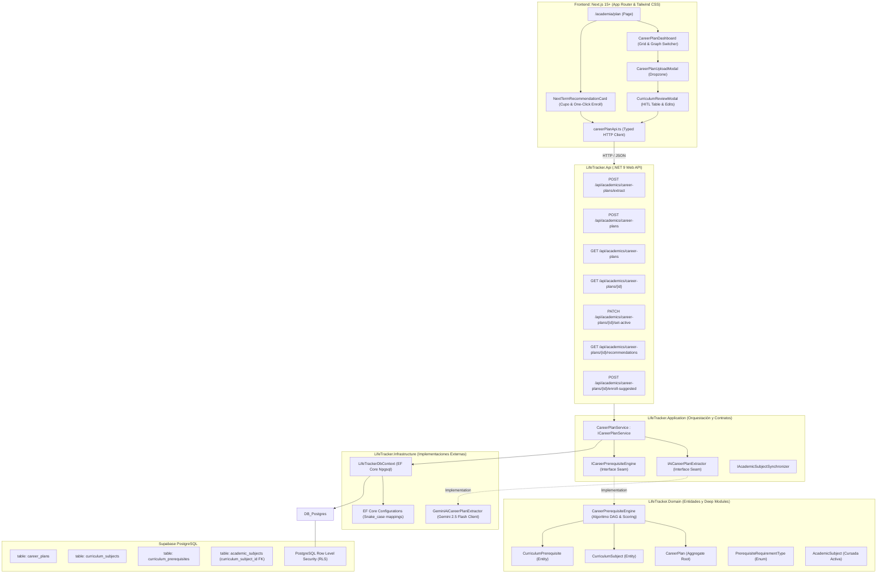

# Plan Técnico y Arquitectura: Plan de Carrera, Extracción IA y Motor de Correlativas DAG

- **Feature**: Plan de Carrera, Malla Curricular, Correlatividades y Recomendación Inteligente (`07-career-plan-and-prerequisites`)
- **Ruta del Artefacto**: `.specs/07-career-plan-and-prerequisites/tech-plan.md`
- **Fase**: 3 SDD (Plan Técnico y Arquitectura Detallada)
- **Estado**: Aprobado para Implementación
- **Fecha**: 2026-09-10
- **Autor**: System Architect & Domain Specialist (SubiKit)
- **Aprobador**: Subi
- **ADR Relacionado**: [docs/adr/0002-career-plan-dag-engine-and-prerequisites.md](../../docs/adr/0002-career-plan-dag-engine-and-prerequisites.md)

---

## 1. Resumen Ejecutivo y Objetivos de Ingeniería

El presente documento define la arquitectura técnica detallada para implementar el módulo de **Plan de Carrera Universitario, Malla Curricular y Motor de Correlativas** en LifeTracker (Soma).

### Metas Técnicas Clave
1. **Deep Module Matemático (`CareerPrerequisiteEngine`)**:
   - Validación determinista de aciclicidad (Grafo Dirigido Acíclico - DAG) en tiempo $O(V + E)$ usando el algoritmo de Kahn y DFS para diagnóstico exacto de ciclos.
   - Evaluación semántica dual de correlatividades (`RequiereRegularizada` vs `RequiereAprobada`) en memoria en $< 2\text{ ms}$ para mallas típicas (40-80 materias).
   - Cálculo de *Transitive Fan-Out* y *Critical Path Depth* con programación dinámica sobre el grafo topológicamente ordenado.
   - Scoring multivariable normalizado $[0, 100]$ y sugerencia de cupo cuatrimestral con explicabilidad humana.
2. **Seam de Extracción IA con Gemini 2.5 Flash (`IAiCareerPlanExtractor`)**:
   - Ingesta de planes oficiales (PDF, PNG, JPG, WebP hasta 10 MB) con Structured JSON Schema de Google Gemini.
   - Flujo de **Human-in-the-Loop (HITL) obligatorio**: respuesta de un DTO de borrador efímero en memoria, sin persistencia en base de datos hasta que el usuario revise y confirme en la UI.
   - Fallback determinista seguro para ambientes locales o de test sin credenciales de API.
3. **Desacoplamiento Estricto de Bounded Contexts**:
   - Malla canónica inmutable (`career_plans`, `curriculum_subjects`, `curriculum_prerequisites`) desacoplada de las cursadas activas (`academic_subjects`).
   - Soporte nativo de recursadas múltiples y cambios de plan de carrera sin duplicación de materias ni corrupción de notas históricas.
4. **Seguridad y Aislamiento Multitenant**:
   - Políticas PostgreSQL Row Level Security (RLS) intransigentes (`auth.uid() = user_id`) en todas las tablas maestras y aristas del grafo.
   - Restricción de exactamente un plan activo por usuario en simultáneo mediante transacciones atómicas.

---

## 2. Mapa Arquitectónico y Diagrama de Capas



---

## 3. Capa de Dominio (Domain Layer)

Ubicación: `api/src/LifeTracker.Domain/Academics/`

### 3.1 Enums del Dominio

```csharp
namespace LifeTracker.Domain.Academics;

/// <summary>
/// Define el tipo de exigencia de una correlativa en el régimen universitario.
/// </summary>
public enum PrerequisiteRequirementType
{
    /// <summary>
    /// Exige tener cursada aprobada / regularidad en la correlativa previa.
    /// </summary>
    RequiereRegularizada = 1,

    /// <summary>
    /// Exige tener examen final aprobado o promoción cerrada en la correlativa previa.
    /// </summary>
    RequiereAprobada = 2
}

/// <summary>
/// Estado calculado de una materia curricular en el contexto del progreso del estudiante.
/// </summary>
public enum CurriculumSubjectStatus
{
    Bloqueada,
    Habilitada,
    EnCurso,
    Regularizada,
    Aprobada
}
```

### 3.2 Entidad `CareerPlan` (Aggregate Root)

```csharp
using LifeTracker.Domain.Common;

namespace LifeTracker.Domain.Academics;

public class CareerPlan : BaseEntity
{
    public Guid UserId { get; private set; }
    public string Name { get; private set; } = string.Empty;
    public string? University { get; private set; }
    public int TotalSubjects { get; private set; }
    public int? TotalCredits { get; private set; }
    public bool IsActive { get; private set; }
    public DateTime CreatedAt { get; private set; } = DateTime.UtcNow;
    public DateTime UpdatedAt { get; private set; } = DateTime.UtcNow;

    private readonly List<CurriculumSubject> _subjects = new();
    public IReadOnlyCollection<CurriculumSubject> Subjects => _subjects.AsReadOnly();

    private CareerPlan() { }

    public CareerPlan(
        Guid userId, 
        string name, 
        string? university = null, 
        int? totalCredits = null, 
        bool isActive = false)
    {
        if (userId == Guid.Empty) 
            throw new ArgumentException("El ID de usuario no puede estar vacío.", nameof(userId));
        if (string.IsNullOrWhiteSpace(name)) 
            throw new ArgumentException("El nombre del plan no puede estar vacío.", nameof(name));

        UserId = userId;
        Name = name.Trim();
        University = university?.Trim();
        TotalCredits = totalCredits;
        IsActive = isActive;
        TotalSubjects = 0;
        CreatedAt = DateTime.UtcNow;
        UpdatedAt = DateTime.UtcNow;
    }

    public void UpdateDetails(string name, string? university, int? totalCredits)
    {
        if (string.IsNullOrWhiteSpace(name)) 
            throw new ArgumentException("El nombre del plan no puede estar vacío.", nameof(name));

        Name = name.Trim();
        University = university?.Trim();
        TotalCredits = totalCredits;
        UpdatedAt = DateTime.UtcNow;
    }

    public void SetActive(bool isActive)
    {
        IsActive = isActive;
        UpdatedAt = DateTime.UtcNow;
    }

    public void UpdateTotalSubjectsCount(int count)
    {
        TotalSubjects = Math.Max(0, count);
        UpdatedAt = DateTime.UtcNow;
    }
}
```

### 3.3 Entidad `CurriculumSubject`

```csharp
using LifeTracker.Domain.Common;

namespace LifeTracker.Domain.Academics;

public class CurriculumSubject : BaseEntity
{
    public Guid CareerPlanId { get; private set; }
    public Guid UserId { get; private set; }
    public string? Code { get; private set; }
    public string Name { get; private set; } = string.Empty;
    public int YearLevel { get; private set; }
    public int PeriodNumber { get; private set; }
    public int? Credits { get; private set; }
    public bool IsOptional { get; private set; }
    public int OrderIndex { get; private set; }
    public DateTime CreatedAt { get; private set; } = DateTime.UtcNow;
    public DateTime UpdatedAt { get; private set; } = DateTime.UtcNow;

    private readonly List<CurriculumPrerequisite> _prerequisites = new();
    public IReadOnlyCollection<CurriculumPrerequisite> Prerequisites => _prerequisites.AsReadOnly();

    private CurriculumSubject() { }

    public CurriculumSubject(
        Guid careerPlanId,
        Guid userId,
        string name,
        int yearLevel,
        int periodNumber,
        string? code = null,
        int? credits = null,
        bool isOptional = false,
        int orderIndex = 0)
    {
        if (careerPlanId == Guid.Empty) 
            throw new ArgumentException("El plan de carrera es requerido.", nameof(careerPlanId));
        if (userId == Guid.Empty) 
            throw new ArgumentException("El usuario es requerido.", nameof(userId));
        if (string.IsNullOrWhiteSpace(name)) 
            throw new ArgumentException("El nombre de la materia es requerido.", nameof(name));
        if (yearLevel < 1 || yearLevel > 10) 
            throw new ArgumentOutOfRangeException(nameof(yearLevel), "El nivel del año debe situarse entre 1 y 10.");
        if (periodNumber < 1 || periodNumber > 4) 
            throw new ArgumentOutOfRangeException(nameof(periodNumber), "El período cuatrimestral debe situarse entre 1 y 4.");

        CareerPlanId = careerPlanId;
        UserId = userId;
        Name = name.Trim();
        Code = code?.Trim();
        YearLevel = yearLevel;
        PeriodNumber = periodNumber;
        Credits = credits;
        IsOptional = isOptional;
        OrderIndex = orderIndex;
        CreatedAt = DateTime.UtcNow;
        UpdatedAt = DateTime.UtcNow;
    }

    public void Update(
        string name, 
        string? code, 
        int yearLevel, 
        int periodNumber, 
        int? credits, 
        bool isOptional, 
        int orderIndex)
    {
        if (string.IsNullOrWhiteSpace(name)) 
            throw new ArgumentException("El nombre de la materia es requerido.", nameof(name));
        if (yearLevel < 1 || yearLevel > 10) 
            throw new ArgumentOutOfRangeException(nameof(yearLevel), "El año debe estar entre 1 y 10.");
        if (periodNumber < 1 || periodNumber > 4) 
            throw new ArgumentOutOfRangeException(nameof(periodNumber), "El período debe estar entre 1 y 4.");

        Name = name.Trim();
        Code = code?.Trim();
        YearLevel = yearLevel;
        PeriodNumber = periodNumber;
        Credits = credits;
        IsOptional = isOptional;
        OrderIndex = orderIndex;
        UpdatedAt = DateTime.UtcNow;
    }
}
```

### 3.4 Entidad `CurriculumPrerequisite`

```csharp
using LifeTracker.Domain.Common;

namespace LifeTracker.Domain.Academics;

public class CurriculumPrerequisite : BaseEntity
{
    public Guid CareerPlanId { get; private set; }
    public Guid UserId { get; private set; }
    public Guid SubjectId { get; private set; }
    public Guid RequiredSubjectId { get; private set; }
    public PrerequisiteRequirementType RequirementType { get; private set; }
    public DateTime CreatedAt { get; private set; } = DateTime.UtcNow;

    private CurriculumPrerequisite() { }

    public CurriculumPrerequisite(
        Guid careerPlanId,
        Guid userId,
        Guid subjectId,
        Guid requiredSubjectId,
        PrerequisiteRequirementType requirementType)
    {
        if (careerPlanId == Guid.Empty) 
            throw new ArgumentException("El ID del plan no puede estar vacío.", nameof(careerPlanId));
        if (userId == Guid.Empty) 
            throw new ArgumentException("El ID de usuario no puede estar vacío.", nameof(userId));
        if (subjectId == Guid.Empty) 
            throw new ArgumentException("El ID de la materia no puede estar vacío.", nameof(subjectId));
        if (requiredSubjectId == Guid.Empty) 
            throw new ArgumentException("El ID de la correlativa no puede estar vacío.", nameof(requiredSubjectId));
        if (subjectId == requiredSubjectId) 
            throw new InvalidOperationException("Una materia no puede tenerse a sí misma como correlativa.");

        CareerPlanId = careerPlanId;
        UserId = userId;
        SubjectId = subjectId;
        RequiredSubjectId = requiredSubjectId;
        RequirementType = requirementType;
        CreatedAt = DateTime.UtcNow;
    }
}
```

### 3.5 Extensión a `AcademicSubject` (Vinculación Malla <-> Cursada)

En `LifeTracker.Domain.Academics.AcademicSubject`:
- Agregar propiedad: `public Guid? CurriculumSubjectId { get; private set; }`
- Agregar método de dominio:
  ```csharp
  public void LinkCurriculumSubject(Guid? curriculumSubjectId)
  {
      CurriculumSubjectId = curriculumSubjectId;
      UpdatedAt = DateTime.UtcNow;
  }
  ```

---

## 4. Deep Module: `CareerPrerequisiteEngine` (Matemática y Algoritmos)

Ubicación: `api/src/LifeTracker.Domain/Academics/CareerPrerequisiteEngine.cs`
Contrato: `api/src/LifeTracker.Domain/Academics/ICareerPrerequisiteEngine.cs`

### 4.1 Fundamentación Matemática

El plan curricular se modela como un grafo dirigido $G = (V, E)$ donde:
- Cada vértice $v \in V$ representa una asignatura (`CurriculumSubject`).
- Cada arista dirigida $(u, v) \in E$ significa: *$u$ es correlativa requerida para cursar $v$*.
- Cada arista tiene un peso o tipo semántico $w(u, v) \in \{\text{RequiereRegularizada}, \text{RequiereAprobada}\}$.

#### 1. Verificación de Aciclicidad (Invariante DAG)
Un plan curricular válido debe cumplir que no exista ningún ciclo dirigido $v_1 \to v_2 \to \dots \to v_k \to v_1$.
Se implementa el **Algoritmo de Kahn**:
1. Calcular in-degree $d^-(v)$ para cada vértice $v \in V$.
2. Encolar todos los vértices con $d^-(v) = 0$.
3. Extraer repetidamente vértices de la cola, decrementando el in-degree de sus sucesores $(v, w)$.
4. Si la cantidad de nodos extraídos es igual a $|V|$, el grafo es acíclico y se obtiene un Orden Topológico válido.
5. Si sobran vértices con $d^-(v) > 0$, existe al menos un ciclo. En este caso se ejecuta una búsqueda DFS con tres colores (Blanco: no visitado, Gris: en stack de recursión actual, Negro: completado) para reconstruir e imprimir la traza exacta del ciclo para feedback de usuario.

#### 2. Evaluación Semántica Dual de Habilitación
Dado un mapeo de estados del estudiante $S: V \to \{\text{Pendiente}, \text{EnCurso}, \text{Regularizada}, \text{Aprobada}, \text{Recursar}\}$:
Una materia $v \in V$ no aprobada está **HabilitadaParaCursar** si y solo si:
$$\forall u \in \text{Predecessors}(v): 
\begin{cases}
S(u) \in \{\text{Regularizada}, \text{Aprobada}\} & \text{si } w(u, v) = \text{RequiereRegularizada} \\
S(u) = \text{Aprobada} & \text{si } w(u, v) = \text{RequiereAprobada}
\end{cases}$$

Si al menos un predecesor no satisface su condición, la materia se marca como **Bloqueada**, acumulando las correlativas insatisfechas en `MissingPrerequisites`.

#### 3. Longitud de Camino Crítico (*Critical Path Depth*)
Para cada materia $v \in V$, definimos $\text{Depth}(v)$ como la cantidad de niveles cuatrimestrales mínimos restantes que desbloquea hasta alcanzar la titulación (nodos terminales sin sucesores).
Se computa mediante programación dinámica sobre el orden topológico reverso:
$$\text{Depth}(v) = 
\begin{cases}
1 & \text{si } \text{Successors}(v) = \emptyset \\
1 + \max_{w \in \text{Successors}(v)} \text{Depth}(w) & \text{en otro caso}
\end{cases}$$

#### 4. Grado de Salida Transitivo (*Transitive Fan-Out*)
$\text{FanOut}(v)$ es la cardinalidad de la clausura transitiva hacia adelante de $v$: el número de materias distintas que dependen directa o indirectamente de la aprobación de $v$.
Se calcula mediante un recorrido BFS/DFS hacia adelante desde $v$ utilizando un `HashSet<Guid>` para registrar nodos alcanzables.

#### 5. Score de Prioridad Normalizado y Cupo Sugerido
Para cada materia habilitada $v \in V_{\text{Habilitadas}}$ que no esté en curso ni aprobada:
$$\text{PriorityScore}(v) = 0.45 \cdot \text{NormDepth}(v) + 0.35 \cdot \text{NormFanOut}(v) + 0.20 \cdot \text{DelayBoost}(v)$$

Donde:
- $\text{NormDepth}(v) = \frac{\text{Depth}(v)}{\max_{u \in V} \text{Depth}(u)} \times 100$
- $\text{NormFanOut}(v) = \frac{\text{FanOut}(v)}{\max(1, \max_{u \in V} \text{FanOut}(u))} \times 100$
- $\text{DelayBoost}(v) = \max\left(0, \frac{\text{CurrentYearLevel} - \text{YearLevel}(v)}{4}\right) \times 100$

**Badges de Explicabilidad Asignados**:
- `Camino Crítico`: Si $\text{Depth}(v) \ge 4$ o representa el cuello de botella más largo.
- `Desbloqueo Alto`: Si $\text{FanOut}(v) \ge 5$ materias dependientes.
- `Troncal Pendiente`: Si $\text{YearLevel}(v) < \text{CurrentYearLevel}$.
- `Materia Terminal`: Si $\text{FanOut}(v) = 0$.

---

### 4.2 Implementación C# de `CareerPrerequisiteEngine`

```csharp
using System.Diagnostics.CodeAnalysis;

namespace LifeTracker.Domain.Academics;

public record GraphValidationResult(
    bool IsValid, 
    string? ErrorMessage = null, 
    IReadOnlyList<string>? CyclePath = null);

public record MissingPrerequisiteInfo(
    Guid RequiredSubjectId,
    string RequiredSubjectCode,
    string RequiredSubjectName,
    PrerequisiteRequirementType RequirementType,
    SubjectStatus CurrentStatus);

public record SubjectEligibilityResult(
    Guid SubjectId,
    string SubjectCode,
    string SubjectName,
    int YearLevel,
    int PeriodNumber,
    CurriculumSubjectStatus Status,
    IReadOnlyList<MissingPrerequisiteInfo> MissingPrerequisites);

public record SubjectRecommendation(
    Guid SubjectId,
    string Code,
    string Name,
    int YearLevel,
    int PeriodNumber,
    double PriorityScore,
    int CriticalPathDepth,
    int UnlockedFutureSubjectsCount,
    string RecommendationBadge,
    string Justification);

public record CareerRecommendationResult(
    Guid CareerPlanId,
    int TotalEligibleSubjects,
    int SuggestedQuota,
    IReadOnlyList<SubjectRecommendation> Recommendations,
    IReadOnlyList<SubjectRecommendation> OtherEligibleSubjects,
    IReadOnlyList<SubjectEligibilityResult> BlockedSubjects);

public interface ICareerPrerequisiteEngine
{
    GraphValidationResult ValidateAcyclicGraph(
        IReadOnlyCollection<CurriculumSubject> subjects,
        IReadOnlyCollection<CurriculumPrerequisite> prerequisites);

    IReadOnlyList<SubjectEligibilityResult> EvaluateEligibility(
        IReadOnlyCollection<CurriculumSubject> subjects,
        IReadOnlyCollection<CurriculumPrerequisite> prerequisites,
        IReadOnlyDictionary<Guid, SubjectStatus> studentSubjectStatuses);

    CareerRecommendationResult GenerateNextTermRecommendations(
        CareerPlan plan,
        IReadOnlyCollection<CurriculumPrerequisite> prerequisites,
        IReadOnlyDictionary<Guid, SubjectStatus> studentSubjectStatuses,
        int quotaLimit = 4);
}

public class CareerPrerequisiteEngine : ICareerPrerequisiteEngine
{
    public GraphValidationResult ValidateAcyclicGraph(
        IReadOnlyCollection<CurriculumSubject> subjects,
        IReadOnlyCollection<CurriculumPrerequisite> prerequisites)
    {
        var subjectIds = subjects.Select(s => s.Id).ToHashSet();
        var inDegree = subjects.ToDictionary(s => s.Id, _ => 0);
        var adjacencyList = subjects.ToDictionary(s => s.Id, _ => new List<Guid>());

        foreach (var prereq in prerequisites)
        {
            // Validar que ambos extremos existan en el conjunto de materias
            if (!subjectIds.Contains(prereq.SubjectId) || !subjectIds.Contains(prereq.RequiredSubjectId))
            {
                return new GraphValidationResult(false, "Una de las materias correlativas no pertenece al plan.");
            }

            if (prereq.SubjectId == prereq.RequiredSubjectId)
            {
                return new GraphValidationResult(false, "Una materia no puede ser correlativa de sí misma.");
            }

            // Arista dirigida: RequiredSubject -> Subject
            adjacencyList[prereq.RequiredSubjectId].Add(prereq.SubjectId);
            inDegree[prereq.SubjectId]++;
        }

        // Algoritmo de Kahn
        var queue = new Queue<Guid>(inDegree.Where(kvp => kvp.Value == 0).Select(kvp => kvp.Key));
        int visitedCount = 0;

        while (queue.Count > 0)
        {
            var u = queue.Dequeue();
            visitedCount++;

            foreach (var v in adjacencyList[u])
            {
                inDegree[v]--;
                if (inDegree[v] == 0)
                {
                    queue.Enqueue(v);
                }
            }
        }

        if (visitedCount == subjects.Count)
        {
            return new GraphValidationResult(true);
        }

        // Si visitedCount < subjects.Count, existe un ciclo. Usar DFS para reconstruir el ciclo exacto.
        var cycle = FindCycleDfs(subjects, adjacencyList);
        var subjectNameMap = subjects.ToDictionary(s => s.Id, s => !string.IsNullOrEmpty(s.Code) ? s.Code : s.Name);
        var readableCycle = cycle.Select(id => subjectNameMap.GetValueOrDefault(id, id.ToString())).ToList();

        return new GraphValidationResult(
            false, 
            $"Se detectó una dependencia circular cíclica: {string.Join(" -> ", readableCycle)}", 
            readableCycle);
    }

    public IReadOnlyList<SubjectEligibilityResult> EvaluateEligibility(
        IReadOnlyCollection<CurriculumSubject> subjects,
        IReadOnlyCollection<CurriculumPrerequisite> prerequisites,
        IReadOnlyDictionary<Guid, SubjectStatus> studentSubjectStatuses)
    {
        var subjectMap = subjects.ToDictionary(s => s.Id);
        var prereqsBySubject = prerequisites
            .GroupBy(p => p.SubjectId)
            .ToDictionary(g => g.Key, g => g.ToList());

        var results = new List<SubjectEligibilityResult>();

        foreach (var subject in subjects)
        {
            studentSubjectStatuses.TryGetValue(subject.Id, out var currentStatus);

            if (currentStatus == SubjectStatus.Aprobada)
            {
                results.Add(new SubjectEligibilityResult(
                    subject.Id, subject.Code ?? string.Empty, subject.Name,
                    subject.YearLevel, subject.PeriodNumber,
                    CurriculumSubjectStatus.Aprobada,
                    Array.Empty<MissingPrerequisiteInfo>()));
                continue;
            }

            if (currentStatus == SubjectStatus.Regularizada)
            {
                results.Add(new SubjectEligibilityResult(
                    subject.Id, subject.Code ?? string.Empty, subject.Name,
                    subject.YearLevel, subject.PeriodNumber,
                    CurriculumSubjectStatus.Regularizada,
                    Array.Empty<MissingPrerequisiteInfo>()));
                continue;
            }

            if (currentStatus == SubjectStatus.EnCurso)
            {
                results.Add(new SubjectEligibilityResult(
                    subject.Id, subject.Code ?? string.Empty, subject.Name,
                    subject.YearLevel, subject.PeriodNumber,
                    CurriculumSubjectStatus.EnCurso,
                    Array.Empty<MissingPrerequisiteInfo>()));
                continue;
            }

            // Evaluar dependencias
            var missingPrereqs = new List<MissingPrerequisiteInfo>();
            if (prereqsBySubject.TryGetValue(subject.Id, out var reqList))
            {
                foreach (var req in reqList)
                {
                    studentSubjectStatuses.TryGetValue(req.RequiredSubjectId, out var reqStatus);
                    var reqSubject = subjectMap[req.RequiredSubjectId];

                    bool satisfied = req.RequirementType switch
                    {
                        PrerequisiteRequirementType.RequiereRegularizada =>
                            reqStatus == SubjectStatus.Regularizada || reqStatus == SubjectStatus.Aprobada,
                        PrerequisiteRequirementType.RequiereAprobada =>
                            reqStatus == SubjectStatus.Aprobada,
                        _ => false
                    };

                    if (!satisfied)
                    {
                        missingPrereqs.Add(new MissingPrerequisiteInfo(
                            req.RequiredSubjectId,
                            reqSubject.Code ?? string.Empty,
                            reqSubject.Name,
                            req.RequirementType,
                            reqStatus));
                    }
                }
            }

            var status = missingPrereqs.Count == 0 
                ? CurriculumSubjectStatus.Habilitada 
                : CurriculumSubjectStatus.Bloqueada;

            results.Add(new SubjectEligibilityResult(
                subject.Id, subject.Code ?? string.Empty, subject.Name,
                subject.YearLevel, subject.PeriodNumber,
                status,
                missingPrereqs));
        }

        return results;
    }

    public CareerRecommendationResult GenerateNextTermRecommendations(
        CareerPlan plan,
        IReadOnlyCollection<CurriculumPrerequisite> prerequisites,
        IReadOnlyDictionary<Guid, SubjectStatus> studentSubjectStatuses,
        int quotaLimit = 4)
    {
        var subjects = plan.Subjects.ToList();
        var validation = ValidateAcyclicGraph(subjects, prerequisites);
        if (!validation.IsValid)
        {
            throw new InvalidOperationException($"Grafo no válido: {validation.ErrorMessage}");
        }

        var eligibility = EvaluateEligibility(subjects, prerequisites, studentSubjectStatuses);
        var subjectMap = subjects.ToDictionary(s => s.Id);

        // Materias habilitadas que aún no han sido aprobadas ni están en curso
        var eligibleSubjects = eligibility
            .Where(e => e.Status == CurriculumSubjectStatus.Habilitada)
            .Select(e => subjectMap[e.SubjectId])
            .ToList();

        var blockedSubjects = eligibility
            .Where(e => e.Status == CurriculumSubjectStatus.Bloqueada)
            .ToList();

        if (eligibleSubjects.Count == 0)
        {
            return new CareerRecommendationResult(
                plan.Id, 0, quotaLimit,
                Array.Empty<SubjectRecommendation>(),
                Array.Empty<SubjectRecommendation>(),
                blockedSubjects);
        }

        // Construir listas de adyacencia (forward y backward)
        var forwardAdj = subjects.ToDictionary(s => s.Id, _ => new List<Guid>());
        foreach (var p in prerequisites)
        {
            forwardAdj[p.RequiredSubjectId].Add(p.SubjectId);
        }

        // Calcular Fan-Out transitivo para cada materia
        var fanOutMap = new Dictionary<Guid, int>();
        foreach (var s in subjects)
        {
            fanOutMap[s.Id] = CalculateTransitiveFanOut(s.Id, forwardAdj);
        }

        // Calcular Critical Path Depth mediante orden topológico reverso
        var depthMap = CalculateCriticalPathDepths(subjects, forwardAdj);

        int maxDepth = depthMap.Values.DefaultIfEmpty(1).Max();
        int maxFanOut = fanOutMap.Values.DefaultIfEmpty(1).Max();

        // Determinar año estimado del alumno (promedio o máx de materias en curso/regularizadas)
        int studentActiveYear = CalculateCurrentStudentYearLevel(subjects, studentSubjectStatuses);

        var scoredRecommendations = new List<SubjectRecommendation>();

        foreach (var subject in eligibleSubjects)
        {
            int depth = depthMap[subject.Id];
            int fanOut = fanOutMap[subject.Id];

            double normDepth = (double)depth / Math.Max(1, maxDepth) * 100.0;
            double normFanOut = (double)fanOut / Math.Max(1, maxFanOut) * 100.0;
            double delayFactor = Math.Max(0, (studentActiveYear - subject.YearLevel) / 4.0) * 100.0;

            double score = (0.45 * normDepth) + (0.35 * normFanOut) + (0.20 * delayFactor);

            string badge;
            string justification;

            if (depth >= 4 || depth == maxDepth)
            {
                badge = "Camino Crítico";
                justification = fanOut > 0
                    ? $"Cuello de botella troncal: desbloquea {fanOut} materias posteriores con profundidad de {depth} semestres."
                    : $"Materia prioritaria en el camino crítico ({depth} niveles de profundidad restante).";
            }
            else if (fanOut >= 4)
            {
                badge = "Desbloqueo Alto";
                justification = $"Gran impacto de avance: desbloquea {fanOut} asignaturas directas e indirectas.";
            }
            else if (subject.YearLevel < studentActiveYear)
            {
                badge = "Troncal Pendiente";
                justification = $"Materia troncal de {subject.YearLevel}° año postergada. Regularizarla evita futuros bloqueos.";
            }
            else if (fanOut == 0)
            {
                badge = "Materia Terminal";
                justification = "Asignatura terminal que no bloquea correlativas posteriores.";
            }
            else
            {
                badge = "Avance Regular";
                justification = $"Desbloquea {fanOut} materias posteriores de la currícula.";
            }

            scoredRecommendations.Add(new SubjectRecommendation(
                subject.Id,
                subject.Code ?? string.Empty,
                subject.Name,
                subject.YearLevel,
                subject.PeriodNumber,
                Math.Round(score, 1),
                depth,
                fanOut,
                badge,
                justification));
        }

        var sorted = scoredRecommendations
            .OrderByDescending(r => r.PriorityScore)
            .ThenBy(r => r.YearLevel)
            .ThenBy(r => r.PeriodNumber)
            .ToList();

        var topRecommendations = sorted.Take(quotaLimit).ToList();
        var otherEligible = sorted.Skip(quotaLimit).ToList();

        return new CareerRecommendationResult(
            plan.Id,
            eligibleSubjects.Count,
            quotaLimit,
            topRecommendations,
            otherEligible,
            blockedSubjects);
    }

    private static int CalculateTransitiveFanOut(Guid startNode, Dictionary<Guid, List<Guid>> forwardAdj)
    {
        var visited = new HashSet<Guid>();
        var queue = new Queue<Guid>();
        queue.Enqueue(startNode);

        while (queue.Count > 0)
        {
            var curr = queue.Dequeue();
            foreach (var next in forwardAdj[curr])
            {
                if (visited.Add(next))
                {
                    queue.Enqueue(next);
                }
            }
        }

        return visited.Count;
    }

    private static Dictionary<Guid, int> CalculateCriticalPathDepths(
        List<CurriculumSubject> subjects, 
        Dictionary<Guid, List<Guid>> forwardAdj)
    {
        var memo = new Dictionary<Guid, int>();

        int DfsDepth(Guid u)
        {
            if (memo.TryGetValue(u, out int d)) return d;

            var successors = forwardAdj[u];
            if (successors.Count == 0)
            {
                memo[u] = 1;
                return 1;
            }

            int maxChild = 0;
            foreach (var v in successors)
            {
                maxChild = Math.Max(maxChild, DfsDepth(v));
            }

            memo[u] = 1 + maxChild;
            return memo[u];
        }

        foreach (var s in subjects)
        {
            DfsDepth(s.Id);
        }

        return memo;
    }

    private static int CalculateCurrentStudentYearLevel(
        List<CurriculumSubject> subjects, 
        IReadOnlyDictionary<Guid, SubjectStatus> statuses)
    {
        var activeYears = subjects
            .Where(s => statuses.TryGetValue(s.Id, out var st) && (st == SubjectStatus.EnCurso || st == SubjectStatus.Regularizada))
            .Select(s => s.YearLevel)
            .ToList();

        return activeYears.Count > 0 ? (int)Math.Ceiling(activeYears.Average()) : 1;
    }

    private static List<Guid> FindCycleDfs(
        IReadOnlyCollection<CurriculumSubject> subjects, 
        Dictionary<Guid, List<Guid>> adjacencyList)
    {
        var state = subjects.ToDictionary(s => s.Id, _ => 0); // 0 = Blanco, 1 = Gris, 2 = Negro
        var parent = new Dictionary<Guid, Guid>();
        var cycle = new List<Guid>();

        bool Dfs(Guid u)
        {
            state[u] = 1;

            foreach (var v in adjacencyList[u])
            {
                if (state[v] == 1) // Cycle found
                {
                    cycle.Add(v);
                    var curr = u;
                    while (curr != v)
                    {
                        cycle.Add(curr);
                        curr = parent.GetValueOrDefault(curr, v);
                    }
                    cycle.Add(v);
                    cycle.Reverse();
                    return true;
                }

                if (state[v] == 0)
                {
                    parent[v] = u;
                    if (Dfs(v)) return true;
                }
            }

            state[u] = 2;
            return false;
        }

        foreach (var s in subjects)
        {
            if (state[s.Id] == 0 && Dfs(s.Id))
            {
                return cycle;
            }
        }

        return cycle;
    }
}
```

---

## 5. Seam de Extracción IA: `IAiCareerPlanExtractor`

Ubicación del Contrato: `api/src/LifeTracker.Application/Academics/Services/IAiCareerPlanExtractor.cs`
Implementación: `api/src/LifeTracker.Infrastructure/Ai/GeminiAiCareerPlanExtractor.cs`

### 5.1 DTOs del Borrador Efímero (Stateless HITL)

```csharp
namespace LifeTracker.Application.Academics.Dtos;

public record ExtractedPrerequisiteDraftDto(
    string RequiredSubjectCode,
    string RequirementType // "requiere_regularizada" | "requiere_aprobada"
);

public record ExtractedSubjectDraftDto(
    string TempId,
    string? Code,
    string Name,
    int YearLevel,
    int PeriodNumber,
    int? Credits,
    bool IsOptional,
    List<ExtractedPrerequisiteDraftDto> Prerequisites
);

public record CareerPlanDraftDto(
    string SuggestedPlanName,
    string? SuggestedUniversity,
    int? TotalCredits,
    List<ExtractedSubjectDraftDto> Subjects,
    double ExtractionConfidence,
    List<string> Warnings
);
```

### 5.2 Contrato del Seam

```csharp
namespace LifeTracker.Application.Academics.Services;

public interface IAiCareerPlanExtractor
{
    Task<CareerPlanDraftDto> ExtractDraftFromDocumentAsync(
        Stream documentStream,
        string mimeType,
        CancellationToken cancellationToken = default);
}
```

### 5.3 Implementación con Gemini 2.5 Flash

En `GeminiAiCareerPlanExtractor`:
- Envía el PDF o imagen codificado en Base64 con `inline_data` a `https://generativelanguage.googleapis.com/v1beta/models/gemini-2.5-flash:generateContent?key={API_KEY}`.
- Emplea un `system_instruction` con directivas precisas sobre terminología universitaria regional (ej: "Trabajos Prácticos Aprobados = requiere_regularizada", "Final / Promoción = requiere_aprobada").
- Define `response_schema` nativo de Gemini para forzar formato JSON estricto sin markdown.
- Posee mecanismo de mock determinista estructurado para testing local sin API Key.

---

## 6. Persistencia y Esquema Supabase PostgreSQL

### 6.1 DDL de Migración

Ruta: `supabase/migrations/20260910100000_career_plans_and_prerequisites.sql`

```sql
-- ==============================================================================
-- 1. ENUM: prerequisite_requirement_type
-- ==============================================================================
DO $$ BEGIN
    CREATE TYPE public.prerequisite_requirement_type AS ENUM (
        'requiere_regularizada',
        'requiere_aprobada'
    );
EXCEPTION
    WHEN duplicate_object THEN null;
END $$;

-- ==============================================================================
-- 2. TABLA: career_plans
-- ==============================================================================
CREATE TABLE IF NOT EXISTS public.career_plans (
    id UUID PRIMARY KEY DEFAULT gen_random_uuid(),
    user_id UUID NOT NULL REFERENCES auth.users(id) ON DELETE CASCADE,
    name TEXT NOT NULL,
    university TEXT,
    total_subjects INTEGER DEFAULT 0 NOT NULL,
    total_credits INTEGER,
    is_active BOOLEAN DEFAULT false NOT NULL,
    created_at TIMESTAMPTZ DEFAULT timezone('utc'::text, now()) NOT NULL,
    updated_at TIMESTAMPTZ DEFAULT timezone('utc'::text, now()) NOT NULL,
    CONSTRAINT career_plans_name_not_empty CHECK (char_length(trim(name)) > 0)
);

CREATE INDEX IF NOT EXISTS idx_career_plans_user_active 
    ON public.career_plans(user_id, is_active);

-- ==============================================================================
-- 3. TABLA: curriculum_subjects
-- ==============================================================================
CREATE TABLE IF NOT EXISTS public.curriculum_subjects (
    id UUID PRIMARY KEY DEFAULT gen_random_uuid(),
    career_plan_id UUID NOT NULL REFERENCES public.career_plans(id) ON DELETE CASCADE,
    user_id UUID NOT NULL REFERENCES auth.users(id) ON DELETE CASCADE,
    code TEXT,
    name TEXT NOT NULL,
    year_level INTEGER NOT NULL,
    period_number INTEGER NOT NULL,
    credits INTEGER,
    is_optional BOOLEAN DEFAULT false NOT NULL,
    order_index INTEGER DEFAULT 0 NOT NULL,
    created_at TIMESTAMPTZ DEFAULT timezone('utc'::text, now()) NOT NULL,
    updated_at TIMESTAMPTZ DEFAULT timezone('utc'::text, now()) NOT NULL,
    CONSTRAINT curriculum_subjects_name_not_empty CHECK (char_length(trim(name)) > 0),
    CONSTRAINT curriculum_subjects_year_range CHECK (year_level >= 1 AND year_level <= 10),
    CONSTRAINT curriculum_subjects_period_range CHECK (period_number >= 1 AND period_number <= 4)
);

CREATE INDEX IF NOT EXISTS idx_curriculum_subjects_plan_year_period 
    ON public.curriculum_subjects(career_plan_id, year_level, period_number);

CREATE INDEX IF NOT EXISTS idx_curriculum_subjects_user 
    ON public.curriculum_subjects(user_id);

-- ==============================================================================
-- 4. TABLA: curriculum_prerequisites (Grafo DAG)
-- ==============================================================================
CREATE TABLE IF NOT EXISTS public.curriculum_prerequisites (
    id UUID PRIMARY KEY DEFAULT gen_random_uuid(),
    career_plan_id UUID NOT NULL REFERENCES public.career_plans(id) ON DELETE CASCADE,
    user_id UUID NOT NULL REFERENCES auth.users(id) ON DELETE CASCADE,
    subject_id UUID NOT NULL REFERENCES public.curriculum_subjects(id) ON DELETE CASCADE,
    required_subject_id UUID NOT NULL REFERENCES public.curriculum_subjects(id) ON DELETE CASCADE,
    requirement_type public.prerequisite_requirement_type NOT NULL,
    created_at TIMESTAMPTZ DEFAULT timezone('utc'::text, now()) NOT NULL,
    CONSTRAINT chk_prereq_no_self_reference CHECK (subject_id <> required_subject_id),
    CONSTRAINT uq_curriculum_prerequisites UNIQUE (subject_id, required_subject_id)
);

CREATE INDEX IF NOT EXISTS idx_curriculum_prereq_subject 
    ON public.curriculum_prerequisites(subject_id);

CREATE INDEX IF NOT EXISTS idx_curriculum_prereq_required 
    ON public.curriculum_prerequisites(required_subject_id);

-- ==============================================================================
-- 5. EXTENSIÓN A academic_subjects
-- ==============================================================================
ALTER TABLE public.academic_subjects
    ADD COLUMN IF NOT EXISTS curriculum_subject_id UUID REFERENCES public.curriculum_subjects(id) ON DELETE SET NULL;

CREATE INDEX IF NOT EXISTS idx_academic_subjects_curriculum_id 
    ON public.academic_subjects(curriculum_subject_id);

-- ==============================================================================
-- 6. POLÍTICAS RLS (ROW LEVEL SECURITY)
-- ==============================================================================
ALTER TABLE public.career_plans ENABLE ROW LEVEL SECURITY;
ALTER TABLE public.curriculum_subjects ENABLE ROW LEVEL SECURITY;
ALTER TABLE public.curriculum_prerequisites ENABLE ROW LEVEL SECURITY;

CREATE POLICY "Users can manage own career plans"
    ON public.career_plans FOR ALL
    USING (auth.uid() = user_id)
    WITH CHECK (auth.uid() = user_id);

CREATE POLICY "Users can manage own curriculum subjects"
    ON public.curriculum_subjects FOR ALL
    USING (auth.uid() = user_id)
    WITH CHECK (auth.uid() = user_id);

CREATE POLICY "Users can manage own curriculum prerequisites"
    ON public.curriculum_prerequisites FOR ALL
    USING (auth.uid() = user_id)
    WITH CHECK (auth.uid() = user_id);
```

### 6.2 Mapeo Entity Framework Core (`Configurations`)

Se crean:
- `CareerPlanConfiguration.cs`
- `CurriculumSubjectConfiguration.cs`
- `CurriculumPrerequisiteConfiguration.cs`
- Actualización en `AcademicSubjectConfiguration.cs` (mapear `CurriculumSubjectId`).
- Registro de `DbSet<CareerPlan>`, `DbSet<CurriculumSubject>`, `DbSet<CurriculumPrerequisite>` en `LifeTrackerDbContext` e `ILifeTrackerDbContext`.

---

## 7. Capa de Aplicación (Application Layer)

### 7.1 DTOs de Negocio

```csharp
namespace LifeTracker.Application.Academics.Dtos;

public record CareerPlanSummaryDto(
    Guid Id,
    string Name,
    string? University,
    int TotalSubjects,
    int? TotalCredits,
    bool IsActive,
    int ApprovedSubjectsCount,
    int RegularizedSubjectsCount,
    int InProgressSubjectsCount,
    double ProgressPercentage,
    DateTime CreatedAt
);

public record CurriculumPrerequisiteItemDto(
    Guid PrerequisiteId,
    Guid RequiredSubjectId,
    string? RequiredSubjectCode,
    string RequiredSubjectName,
    string RequirementType,
    bool IsSatisfied
);

public record CurriculumSubjectItemDto(
    Guid Id,
    string? Code,
    string Name,
    int YearLevel,
    int PeriodNumber,
    int? Credits,
    bool IsOptional,
    int OrderIndex,
    string Status, // "bloqueada" | "habilitada" | "en_curso" | "regularizada" | "aprobada"
    Guid? LinkedAcademicSubjectId,
    List<CurriculumPrerequisiteItemDto> Prerequisites
);

public record CareerPlanDetailDto(
    Guid Id,
    string Name,
    string? University,
    int TotalSubjects,
    int? TotalCredits,
    bool IsActive,
    double ProgressPercentage,
    List<CurriculumSubjectItemDto> Subjects
);

public record CreateCurriculumPrerequisiteRequest(
    string RequiredCodeOrTempId,
    string RequirementType
);

public record CreateCurriculumSubjectRequest(
    string? TempId,
    string? Code,
    string Name,
    int YearLevel,
    int PeriodNumber,
    int? Credits,
    bool IsOptional,
    int OrderIndex,
    List<CreateCurriculumPrerequisiteRequest> Prerequisites
);

public record CreateCareerPlanRequest(
    string Name,
    string? University,
    int? TotalCredits,
    bool IsActive,
    List<CreateCurriculumSubjectRequest> Subjects
);

public record EnrollSuggestedSubjectsRequest(
    string Term,
    List<Guid> CurriculumSubjectIds
);
```

### 7.2 Interfaz de Servicio `ICareerPlanService`

```csharp
namespace LifeTracker.Application.Academics.Services;

public interface ICareerPlanService
{
    Task<CareerPlanDraftDto> ExtractDraftFromDocumentAsync(
        Stream stream, 
        string mimeType, 
        CancellationToken cancellationToken = default);

    Task<CareerPlanSummaryDto> CreatePlanAsync(
        Guid userId, 
        CreateCareerPlanRequest request, 
        CancellationToken cancellationToken = default);

    Task<IReadOnlyList<CareerPlanSummaryDto>> GetUserPlansAsync(
        Guid userId, 
        CancellationToken cancellationToken = default);

    Task<CareerPlanDetailDto?> GetPlanDetailAsync(
        Guid userId, 
        Guid planId, 
        CancellationToken cancellationToken = default);

    Task<bool> SetActivePlanAsync(
        Guid userId, 
        Guid planId, 
        CancellationToken cancellationToken = default);

    Task<CareerRecommendationResult> GetRecommendationsAsync(
        Guid userId, 
        Guid planId, 
        int quota = 4, 
        CancellationToken cancellationToken = default);

    Task<IReadOnlyList<AcademicSubjectDto>> EnrollSuggestedSubjectsAsync(
        Guid userId, 
        Guid planId, 
        EnrollSuggestedSubjectsRequest request, 
        CancellationToken cancellationToken = default);

    Task<bool> DeletePlanAsync(
        Guid userId, 
        Guid planId, 
        CancellationToken cancellationToken = default);
}
```

---

## 8. Capa de API (.NET RESTful Endpoints)

Ubicación: `api/src/LifeTracker.Api/Endpoints/CareerPlanEndpoints.cs`

```csharp
public static class CareerPlanEndpoints
{
    public static void MapCareerPlanEndpoints(this IEndpointRouteBuilder app)
    {
        var group = app.MapGroup("/api/academics/career-plans")
            .RequireAuthorization()
            .WithTags("CareerPlans");

        group.MapPost("/extract", ExtractDraft);
        group.MapPost("/", CreatePlan);
        group.MapGet("/", GetUserPlans);
        group.MapGet("/{id:guid}", GetPlanDetail);
        group.MapPatch("/{id:guid}/set-active", SetActivePlan);
        group.MapGet("/{id:guid}/recommendations", GetRecommendations);
        group.MapPost("/{id:guid}/enroll-suggested", EnrollSuggested);
        group.MapDelete("/{id:guid}", DeletePlan);
    }
}
```

| Método | Ruta | Status | Descripción |
| :--- | :--- | :--- | :--- |
| `POST` | `/api/academics/career-plans/extract` | `200 OK` | Extrae borrador efímero para Human-in-the-Loop a partir de multipart/form-data. |
| `POST` | `/api/academics/career-plans` | `201 Created` | Persiste atómicamente el plan validado por el usuario. |
| `GET` | `/api/academics/career-plans` | `200 OK` | Retorna lista de planes del usuario con progreso. |
| `GET` | `/api/academics/career-plans/{id}` | `200 OK` | Retorna la malla completa con estados de correlatividades calculados. |
| `PATCH`| `/api/academics/career-plans/{id}/set-active` | `200 OK` | Activa un plan y desactiva concurrentemente los demás. |
| `GET` | `/api/academics/career-plans/{id}/recommendations` | `200 OK` | Ejecuta el recomendador inteligente con cupo sugerido. |
| `POST` | `/api/academics/career-plans/{id}/enroll-suggested` | `200 OK` | Inscribe en lote materias sugeridas como cursadas activas. |
| `DELETE`| `/api/academics/career-plans/{id}` | `204 NoContent` | Elimina el plan y sus dependencias en cascada. |

---

## 9. Frontend Web (Next.js 15+ App Router)

### 9.1 Rutas y Componentes Clave

- `web/src/app/(dashboard)/academia/plan/page.tsx`:
  Página principal de visualización del plan activo, selector de planes alternativos, switch de visualización Grilla / Grafo, e inclusión del recomendador de cupo sugerido.
- `web/src/components/academics/CareerPlanUploadModal.tsx`:
  Modal de subida drag-and-drop para PDFs e imágenes con preview y barra animada de extracción IA.
- `web/src/components/academics/CurriculumReviewModal.tsx`:
  **Pilar Human-in-the-Loop**: Tabla interactiva donde el usuario puede editar nombres de materias, códigos, año/cuatrimestre, alternar tipos de correlatividad (`RequiereRegularizada` vs `RequiereAprobada`), verificar alertas de ciclos y confirmar la importación final.
- `web/src/components/academics/CareerPlanDashboard.tsx`:
  Contenedor interactivo de la malla:
  - Vista Malla: Matriz organizada en columnas por Año y Cuatrimestres.
  - Vista Grafo: Renderizado interactivo SVG con nodos coloreados por estado y aristas dirigidas (línea punteada para regularizada, continua para aprobada).
- `web/src/components/academics/NextTermRecommendationCard.tsx`:
  Tarjeta de recomendación destacada: selector de cupo (3 a 6 materias), listado ordenado por score con insignias de Camino Crítico, justificación contextual y botón "Inscribir en Cuatrimestre Actual".
- `web/src/lib/api/careerPlanApi.ts`:
  Cliente API tipado en TypeScript para interactuar con todos los endpoints.

---

## 10. Estrategia Integral de Testing

### 10.1 Matriz de Pruebas Unitarias (`CareerPrerequisiteEngineTests`)

Ubicación: `api/tests/LifeTracker.Domain.Tests/CareerPrerequisiteEngineTests.cs`

1. `ValidateAcyclicGraph_ShouldSucceed_WhenGraphIsAcyclic`:
   - Grafo tipo árbol con 6 materias y dependencias lineales y en diamante.
   - Assert: `result.IsValid == true`.
2. `ValidateAcyclicGraph_ShouldFail_WhenDirectCycleExists`:
   - $A \to B$ y $B \to A$.
   - Assert: `result.IsValid == false`, error menciona ciclo.
3. `ValidateAcyclicGraph_ShouldFail_WhenTransitiveCycleExists`:
   - $A \to B \to C \to D \to A$.
   - Assert: `result.IsValid == false`, `CyclePath` contiene los nodos involucrados.
4. `EvaluateEligibility_ShouldEnableSubject_WhenRequirementIsRequiereRegularizada_AndSubjectIsRegularizada`:
   - Materia B requiere A como `RequiereRegularizada`.
   - Estado de A: `Regularizada`.
   - Assert: B clasificada como `CurriculumSubjectStatus.Habilitada`.
5. `EvaluateEligibility_ShouldBlockSubject_WhenRequirementIsRequiereAprobada_AndSubjectIsOnlyRegularizada`:
   - Materia B requiere A como `RequiereAprobada`.
   - Estado de A: `Regularizada`.
   - Assert: B clasificada como `CurriculumSubjectStatus.Bloqueada`, `MissingPrerequisites` detalla requisito insatisfecho.
6. `GenerateNextTermRecommendations_ShouldPrioritizeCriticalPathAndFanOut`:
   - Materia $X$ con $\text{Depth} = 4$ y $\text{FanOut} = 8$ vs Materia $Y$ con $\text{Depth} = 1$ y $\text{FanOut} = 0$.
   - Assert: $X$ tiene mayor score y badge `"Camino Crítico"`.
7. `GenerateNextTermRecommendations_ShouldRespectQuotaLimit`:
   - 6 materias habilitadas, `quotaLimit = 4`.
   - Assert: `Recommendations.Count == 4`, `OtherEligibleSubjects.Count == 2`.

### 10.2 Pruebas de Integración y API
- `CareerPlanServiceTests`: Verificación de unicidad de plan activo (`SetActivePlanAsync` desactiva cualquier plan previo).
- `CareerPlanEndpointsTests`: Comprobación de que la subida del borrador responde 200 sin alterar la tabla `career_plans` en base de datos.
