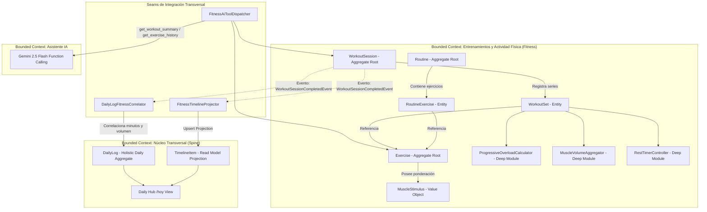

# Especificación Funcional: Fase 7 - Entrenamientos y Actividad Física (Gimnasio, Rutinas, Tracker en Vivo y Ponderación Muscular)

- **Feature**: Módulo de Entrenamientos y Actividad Física (`/fitness`)
- **Ruta del Artefacto**: `.specs/07-fitness/spec.md`
- **Fase**: 7 (Rendimiento Físico, Fuerza y Sobrecarga Progresiva)
- **Estado**: Aprobado (Puerta de Aprobación 1 superada)
- **Fecha**: 2026-09-10
- **Autor**: System Architect & Domain Specialist (SubiKit)
- **Aprobador**: Subi

---

## 1. Resumen del Problema y Propuesta de Valor

### 1.1 Contexto y Dolor Actual
El seguimiento de entrenamientos de fuerza e hipertrofia en aplicaciones móviles y cuadernos convencionales presenta puntos críticos de fricción que degradan la adherencia y el progreso atlético:
1. **Fricción extrema en la sala de pesas**: Registrar series entre intervalos de fatiga aguda con interfaces sobrecargadas, inputs diminutos, teclados alfanuméricos que tapan la pantalla y obligatoriedad de usar ambas manos.
2. **Pérdida de la referencia de sobrecarga progresiva**: No tener a la vista las cargas y repeticiones logradas la semana previa en el mismo ejercicio obliga a memorizar o buscar manualmente, comprometiendo el principio biológico de sobrecarga progresiva.
3. **Ponderación muscular plana y simplista**: Las aplicaciones tradicionales asignan un único grupo muscular o etiquetas binarias planas (ej. Press Plano = "Pecho"), ignorando la activación real de tríceps y deltoides anterior. Esto falsea el cálculo de volumen semanal efectivo (*effective sets*) y la gestión de fatiga.
4. **Catálogos rígidos y en inglés**: Bases de datos con terminología foránea, sin instrucciones biomecánicas en español, sin visualización rápida en bucle (GIFs) y con prohibición de crear ejercicios propios del equipamiento del gimnasio local.
5. **Desconexión con el sistema de vida**: El entrenamiento físico queda aislado de la fatiga reportada en la bitácora diaria (`DailyLog`), de los hábitos de descanso/hidratación y del Asistente IA de Soma.

### 1.2 Propuesta de Valor Aprobada por Subi
* **Live Workout Tracker en "One-Hand Operate Mode"**:
  - Diseñado para operar con una sola mano en el gimnasio: controles críticos en la zona inferior de alcance del pulgar (*Thumb Zone*), botones de incremento rápido (+0.5 kg, +1.25 kg, +2.5 kg, +1 rep), teclado numérico nativo de pantalla completa y marcado de serie con un solo toque.
* **Sobrecarga Progresiva Visibilizada ("Ghost Reference")**:
  - Cada serie proyecta de fondo los valores de la sesión anterior (`ej. Ant: 80 kg × 8`), permitiendo competir visualmente contra la marca previa sin esfuerzo cognitivo.
* **Rest Timer Automático y Resiliente**:
  - Al tildar una serie completada, se activa inmediatamente un temporizador regresivo flotante con control háptico (vibración), aviso sonoro sintetizado (Web Audio API) y botón de adición rápida `+30s`. El tiempo se calcula contra un timestamp absoluto en UTC, garantizando exactitud incluso si el usuario bloquea el móvil o cambia de pestaña.
* **Ponderación Muscular Proporcional (1-100%)**:
  - Innovación biomecánica aprobada por Subi: cada ejercicio define un array de músculos con su estímulo porcentual (ej. Fondos en Paralelas: 100% tríceps, 75% pecho inferior, 30% deltoides anterior). Permite calcular el volumen semanal efectivo ponderado y sentar las bases para mapas de calor anatómicos (*heatmaps*).
* **Catálogo Propio Sembrado en PostgreSQL**:
  - Dataset inicial exhaustivo de ejercicios esenciales de gimnasio en español, con técnica paso a paso, GIFs en bucle optimizados, enlaces a videos explicativos y soporte para crear variantes personalizadas (`is_custom: true`).
* **Gestor de Rutinas Reutilizables**:
  - Creación de plantillas (Push, Pull, Legs, Upper, Lower, Fullbody) con ordenamiento intuitivo, series objetivo y descansos predefinidos.
* **Integración al Spine Transversal (`timeline_items`) y Asistente IA**:
  - Proyección instantánea del entrenamiento finalizado en `/hoy` con volumen total, duración y músculos trabajados. Consulta y registro mediante lenguaje natural con Gemini 2.5 Flash.

---

## 2. Bounded Contexts y Arquitectura de Dominio



### 2.1 Principios de Diseño Aplicados
1. **Deep Modules (John Ousterhout)**:
   - `ProgressiveOverloadCalculator`: Recupera la última sesión finalizada del usuario para un ejercicio específico y extrae las series equivalentes, aislando por completo la complejidad de búsqueda histórica y emparejamiento de series.
   - `MuscleVolumeAggregator`: Procesa las series efectivas completadas y calcula el volumen acumulado en kg `(kg * reps)` y el volumen de series efectivas por músculo `Sum(1 * (stimulus_pct / 100))`.
   - `RestTimerController`: Encapsula el ciclo de vida del descanso post-serie utilizando timestamps UTC absolutos, liberando a la UI de la fragilidad de `setInterval` ante throttles del navegador o suspensión de pantalla.
2. **Seams (Michael Feathers)**:
   - `IFitnessTimelineProjector`: Desacopla la persistencia de entrenamientos de la tabla transversal `timeline_items`.
   - `IFitnessAiToolDispatcher`: Expone interfaces fuertemente tipadas para que el asistente IA ejecute consultas y registros de entrenamiento sin acoplarse a los repositorios de Fitness.
3. **Invariantes de Dominio**:
   - **Invariante 8**: Al menos un músculo con ponderación al 100% (motor primario); rango 1-100% para secundarios; taxonomía anatómica cerrada.
   - **Invariante 9**: Unicidad estricta de sesión activa por usuario.
   - **Invariante 10**: Inmutabilidad y recálculo atómico de métricas consolidadas en sesiones finalizadas.
   - **Invariante 11**: Catálogo base del sistema inmutable y ejercicios de usuario protegidos con borrado seguro.

---

## 3. Modelo de Entidades y Value Objects

### 3.1 Entidades Principales
* **`Exercise` (Aggregate Root)**:
  - `id`: UUID (PK)
  - `user_id`: UUID (nullable; NULL si pertenece al catálogo global del sistema)
  - `name`: Text (ej. "Press de Banca con Barra")
  - `slug`: Text (único)
  - `discipline`: Enum (`strength`, `cardio`, `calisthenics`, `mobility`)
  - `primary_muscle_group`: Enum (clasificación anatómica principal para filtros rápidos)
  - `muscle_stimulus`: JSONB (Array de `MuscleStimulus`)
  - `equipment`: Enum (`barbell`, `dumbbell`, `machine`, `cable`, `bodyweight`, `kettlebell`, `smith_machine`, `bands`, `other`)
  - `instructions`: Text[] (lista ordenada de pasos técnicos de ejecución)
  - `gif_url`: Text (enlace a GIF demostrativo en bucle)
  - `video_url`: Text (nullable; enlace a video de técnica)
  - `is_custom`: Boolean (false para catálogo oficial, true para creados por el usuario)
  - `created_at`: Timestamptz UTC

* **`Routine` (Aggregate Root)**:
  - `id`: UUID (PK)
  - `user_id`: UUID (FK profiles)
  - `name`: Text (ej. "Torso A - Fuerza e Hipertrofia")
  - `description`: Text (nullable)
  - `estimated_duration_minutes`: Integer
  - `is_archived`: Boolean (default false)
  - `exercises`: Colección 1:N de `RoutineExercise`:
    - `id`: UUID (PK)
    - `routine_id`: UUID (FK)
    - `exercise_id`: UUID (FK Exercise)
    - `order_index`: Integer
    - `target_sets`: Integer
    - `target_reps_min`: Integer
    - `target_reps_max`: Integer
    - `rest_timer_seconds`: Integer (default 90)
    - `notes`: Text (nullable)

* **`WorkoutSession` (Aggregate Root)**:
  - `id`: UUID (PK)
  - `user_id`: UUID (FK profiles)
  - `routine_id`: UUID (nullable; FK Routine si proviene de plantilla)
  - `name`: Text (ej. "Sesión Torso A")
  - `status`: Enum (`active`, `completed`, `discarded`)
  - `started_at`: Timestamptz UTC
  - `completed_at`: Timestamptz UTC (nullable)
  - `duration_seconds`: Integer (tiempo efectivo)
  - `total_volume_kg`: Numeric(12,2)
  - `total_sets_completed`: Integer
  - `notes`: Text (nullable)
  - `sets`: Colección 1:N de `WorkoutSet`:
    - `id`: UUID (PK)
    - `session_id`: UUID (FK)
    - `exercise_id`: UUID (FK Exercise)
    - `set_order`: Integer
    - `set_type`: Enum (`normal`, `warmup`, `drop_set`, `failure`)
    - `weight_kg`: Numeric(6,2)
    - `reps`: Integer
    - `rpe`: Numeric(3,1) (nullable; 1.0 a 10.0)
    - `rir`: Integer (nullable; Reps in Reserve)
    - `is_completed`: Boolean (default false)
    - `completed_at`: Timestamptz UTC (nullable)

### 3.2 Value Objects
* **`MuscleStimulus`**:
  ```typescript
  type MuscleStimulus = {
    muscle: MuscleGroup;       // ej. 'chest', 'triceps', 'anterior_deltoid'
    stimulus_pct: number;      // Entero de 1 a 100
  };
  ```
* **Taxonomía Cerrada `MuscleGroup`**:
  - `chest` (Pecho / Pectoral Mayor)
  - `upper_chest` (Pectoral Clavicular)
  - `lats` (Dorsal Ancho)
  - `rhomboids` (Romboides y Espalda Media)
  - `traps` (Trapecio)
  - `lower_back` (Lumbares / Erectores Espinales)
  - `anterior_deltoid` (Deltoides Anterior)
  - `lateral_deltoid` (Deltoides Lateral)
  - `posterior_deltoid` (Deltoides Posterior)
  - `biceps` (Bíceps Braquial)
  - `triceps` (Tríceps Braquial)
  - `forearms` (Antebrazos)
  - `quadriceps` (Cuádriceps)
  - `hamstrings` (Isquiosurales)
  - `glutes` (Glúteos)
  - `calves` (Gemelos y Sóleo)
  - `abs` (Abdomen Recto)
  - `obliques` (Oblicuos)

---

## 4. Alcance (Scope)

### 4.1 In Scope (Fase 7 MVP)
* **Biblioteca y Catálogo de Ejercicios (`/fitness/ejercicios`)**:
  - Explorador facetado con búsqueda por texto (debounce), filtro por grupo muscular y equipamiento.
  - Modal o Drawer con visualización de GIF en bucle, instrucciones técnicas en español, link a video y barras de estímulo muscular.
  - Creador de ejercicios personalizados con asignación de músculos y porcentajes (1-100%).
* **Gestor de Rutinas (`/fitness/rutinas`)**:
  - Listado de plantillas con duración estimada y cantidad de ejercicios.
  - Diseñador de rutina: selector múltiple de ejercicios, reordenamiento ergonómico, configuración de series objetivo, repeticiones y tiempo de descanso predeterminado.
* **Live Workout Tracker (`/fitness/sesion/activa`)**:
  - Modo operar con una sola mano optimizado para smartphone.
  - Indicador de Sobrecarga Progresiva en cada serie con datos de la sesión anterior.
  - Inputs numéricos rápidos de peso y reps con micro-botones `+` / `-` y teclado decimal nativo.
  - Rest Timer reactivo con cuenta regresiva, botón `+30s`, vibración háptica y bip sonoro.
  - Capacidad de agregar series, eliminar series o agregar ejercicios improvisados al vuelo.
  - Persistencia en almacenamiento local y sincronización con backend para soportar refrescos o caídas de red.
* **Resumen de Sesión e Historial (`/fitness/historial`)**:
  - Resumen post-entrenamiento: volumen total en kg, duración neta, total de series y desglose de series efectivas por grupo muscular estimulado.
  - Historial cronológico de entrenamientos con vista de detalle.
* **Integración Spine Transversal & IA**:
  - Proyección automática a `timeline_items` (`source_module = 'fitness'`).
  - Correlación con `DailyLog` para enriquecer la vista `/hoy`.
  - Herramientas para Gemini 2.5 Flash: consulta de historial de ejercicios y entrenamientos recientes.

### 4.2 Out of Scope (Fases Posteriores)
* Representación interactiva 3D con Three.js / WebGL del cuerpo humano (el MVP utiliza barras de porcentaje 2D limpias y minimalistas).
* Integración directa por bluetooth con bandas cardíacas o smartwatches.
* Cálculo automatizado de periodización ondulatoria o deloads automáticos.
* Reconocimiento de repeticiones por video o cámara del móvil.

---

## 5. Flujos de Usuario Detallados (User Flows)

### Flujo 1: Exploración y Creación en la Biblioteca de Ejercicios
1. El usuario accede a `/fitness/ejercicios`.
2. Filtra por grupo muscular (ej. "Pecho") y equipamiento ("Barra").
3. Hace clic en "Press de Banca Plano con Barra": se despliega el Drawer lateral con el GIF demostrativo en bucle, instrucciones paso a paso de colocación, agarre y retracción escapular, y el gráfico de ponderación muscular (Pecho 100%, Tríceps 60%, Deltoides Anterior 40%).
4. Para un ejercicio propio de su gimnasio, presiona "Nuevo Ejercicio", ingresa nombre, selecciona disciplina, añade instrucciones y configura con sliders el motor primario (100%) y los secundarios. Al guardar, el ejercicio queda disponible de inmediato para sus rutinas.

### Flujo 2: Creación de Plantilla de Rutina
1. El usuario va a `/fitness/rutinas` y selecciona "Crear Rutina".
2. Nombra la rutina "Tirón / Pull A" e ingresa una breve descripción.
3. Presiona "Agregar Ejercicio" y busca "Dominadas", "Remo con Barra" y "Curling de Bíceps con Mancuerna".
4. Configura 4 series para Dominadas (Reps 6-10, Descanso 120s) y 3 series para Bíceps (Reps 10-12, Descanso 60s).
5. Reordena arrastrando o usando flechas y guarda la rutina.

### Flujo 3: Ejecución de Sesión en Vivo con Tracker y Rest Timer
1. Desde `/fitness/rutinas`, presiona "Iniciar Entrenamiento" en "Tirón / Pull A".
2. La vista conmuta al Live Tracker de pantalla completa:
   - El cronómetro de la sesión inicia en tiempo real.
   - En el primer ejercicio ("Dominadas"), cada serie muestra la referencia de la sesión previa: `Ant: 8 reps (peso corporal)`.
3. El usuario completa su primera serie con 10 repeticiones y pulsa el botón circular de serie completada (Check).
4. El Check emite una micro-animación de éxito (150ms), el Rest Timer de 120s se despliega en la barra inferior fija, el teléfono emite una vibración corta y el temporizador comienza la cuenta regresiva.
5. Durante el descanso, el usuario presiona `+30s` si necesita más aire. Al completarse los segundos, el sistema genera un doble tono sutil sintetizado y una vibración rítmica.
6. El usuario completa todas las series de la rutina. Si añade un ejercicio extra en el momento, pulsa "+ Agregar Ejercicio".
7. Al finalizar, presiona "Terminar Entrenamiento", confirma en el diálogo modal y visualiza el resumen con 12.450 kg movidos en 58 minutos.

### Flujo 4: Consulta Transversal e Historial en Soma
1. El entrenamiento finalizado impacta de inmediato en `timeline_items` con módulo `fitness`.
2. En `/hoy`, el Daily Hub exhibe la tarjeta con el entrenamiento del día, minutos activos y volumen total.
3. En el chat con el Asistente IA, el usuario pregunta: *"¿Cuánto peso levanté en Remo con Barra en mi último entrenamiento?"*.
4. Gemini 2.5 Flash ejecuta `get_exercise_history` y responde con precisión citando los kg, reps y fecha del entrenamiento.

---

## 6. Criterios de Aceptación (Gherkin BDD)

### Escenario 1: Inicio de sesión en vivo desde plantilla con precarga de sobrecarga progresiva
```gherkin
Dado que Subi tiene una rutina "Torso A" que incluye el ejercicio "Press de Banca con Barra"
Y en la sesión previa completada de "Press de Banca" realizó Serie 1 con 80 kg × 8 reps
Cuando Subi presiona "Iniciar Entrenamiento" para la rutina "Torso A"
Entonces se crea una nueva "WorkoutSession" con estado "active" y timestamp de inicio actual
Y la Serie 1 de "Press de Banca" muestra visualmente el valor de referencia "Ant: 80 kg × 8"
Y los campos de peso y reps se inicializan editables para uso con una sola mano
```

### Escenario 2: Marcado de serie completada y activación automática del Rest Timer
```gherkin
Dado que Subi está en una sesión activa ejecutando "Sentadilla con Barra"
Y el ejercicio tiene configurado un tiempo de descanso de 90 segundos
Cuando Subi ingresa "100" en peso, "6" en reps y presiona el botón de confirmación de serie
Entonces la serie se marca como "is_completed = true" con su marca temporal UTC
Y el Rest Timer se activa de inmediato iniciando en 90 segundos con cuenta regresiva
Y el dispositivo ejecuta una vibración háptica corta de confirmación
```

### Escenario 3: Ajuste rápido y aviso de finalización del Rest Timer
```gherkin
Dado que el Rest Timer está en cuenta regresiva activa con 15 segundos restantes
Cuando Subi presiona el botón "+30s"
Entonces el tiempo restante del Rest Timer se incrementa inmediatamente a 45 segundos
Y cuando la cuenta regresiva llega a 0 segundos
Entonces se emite un doble tono de audio sintetizado de baja latencia
Y se dispara una vibración rítmica de aviso sin bloquear la interfaz
```

### Escenario 4: Cálculo de volumen efectivo ponderado por grupo muscular
```gherkin
Dado que Subi completa una sesión de entrenamiento que contiene:
  | Ejercicio | Series Efectivas | Pecho % | Tríceps % | Deltoides Ant % |
  | Press Plano con Barra | 4 | 100 | 60 | 40 |
  | Fondos en Paralelas | 3 | 70 | 100 | 30 |
Cuando finaliza la sesión de entrenamiento
Entonces el resumen de volumen efectivo por músculo computa:
  | Músculo | Series Efectivas Ponderadas |
  | Pecho | 6.1 (4.0 + 2.1) |
  | Tríceps | 5.4 (2.4 + 3.0) |
  | Deltoides Anterior | 2.5 (1.6 + 0.9) |
```

### Escenario 5: Unicidad de sesión activa e invariante de solapamiento
```gherkin
Dado que Subi tiene una sesión de entrenamiento en estado "active" iniciada hace 30 minutos
Cuando intenta iniciar una nueva sesión desde la rutina "Piernas B"
Entonces el sistema bloquea la creación y despliega una alerta de resolución obligatoria
Y ofrece las opciones exclusivas de: "Continuar sesión activa", "Finalizar sesión activa" o "Descartar sesión activa"
```

### Escenario 6: Creación de ejercicio personalizado con validación de motor primario
```gherkin
Dado que Subi accede al formulario de nuevo ejercicio personalizado
Cuando intenta guardar un ejercicio asignando como estímulos musculares: "Bíceps: 70%" y "Antebrazo: 40%" sin ningún músculo al 100%
Entonces el formulario rechaza el guardado indicando que debe existir al menos un motor primario con 100% de estímulo
Y cuando asigna "Bíceps: 100%" y guarda
Entonces el ejercicio se crea exitosamente con "is_custom = true" y queda asignado a su "user_id"
```

### Escenario 7: Finalización de sesión y proyección atómica al Spine Transversal
```gherkin
Dado que Subi finaliza una sesión de 55 minutos con 14 series completadas y 8.500 kg de volumen total
Cuando confirma "Terminar Entrenamiento"
Entonces el estado de la sesión cambia a "completed" con "completed_at" consolidado
Y se inserta atómicamente un registro en "timeline_items" con módulo "fitness" y tipo "workout_completed"
Y el evento refleja el título, duración, series y volumen total en el Daily Hub de "/hoy"
```

### Escenario 8: Resiliencia del Live Tracker ante refresco de navegador o pérdida de foco
```gherkin
Dado que Subi se encuentra en el minuto 24 de una sesión activa con 5 series tildadas
Cuando el navegador se refresca accidentalmente o el sistema operativo recarga la pestaña
Entonces el Live Tracker restaura el estado exacto de la sesión activa desde el servidor y caché local
Y el cronómetro general calcula el tiempo transcurrido exacto restando la hora actual menos "started_at"
Y las series previamente completadas conservan su estado verificado
```

### Escenario 9: Consulta de historial de ejercicio mediante Asistente IA
```gherkin
Dado que Subi interactúa con el Asistente IA en la vista del chat
Cuando consulta: "¿Cuánto levanté en Peso Muerto la última vez que entrené?"
Entonces el Asistente ejecuta la herramienta "get_exercise_history" con el parámetro "Peso Muerto"
Y responde detallando la fecha de la sesión, las series realizadas con sus respectivos pesos y repeticiones
```

---

## 7. Requerimientos de UI Craftsmanship (Visitor Mode: Operate)

### 7.1 Ergonomía Móvil y Ergonomía del Pulgar (Thumb Zone)
- **Superficie de Operación a Una Mano**:
  - Toda la interacción de la sesión activa se concentra en la mitad inferior de la pantalla (área de 0 a 400px desde el borde inferior del viewport).
  - Los botones de marcar serie completada, incrementar carga y añadir repeticiones tienen un área táctil mínima de **48 × 48 px**.
- **Inputs Numéricos Especializados**:
  - Inputs de peso con `inputMode="decimal"` y `fontSize >= 16px` para evitar el molesto auto-zoom de iOS Safari.
  - Tipografía numérica con espaciado uniforme: clase obligatoria `tabular-nums` (`font-variant-numeric: tabular-nums`) para prevenir vibraciones o movimientos de layout (*zero layout shift*) en cronómetros y contadores de peso.
  - Micro-controles laterales integrados: botones táctiles `[-0.5]` `[+0.5]` `[-2.5]` `[+2.5]` adyacentes al campo de peso para ajuste inmediato con el pulgar sudoroso sin necesidad de escribir.

### 7.2 Experiencia Sensorial del Rest Timer
- **Banner Flotante Inferior**:
  - Posicionado en `bottom-4` con `z-50`, fondo tintado con elevación sutil, barra de progreso lineal de alta legibilidad y botón prominente `+30s`.
- **Avisos Sensoriales Sin Fricción**:
  - Sonido: sintetizador nativo mediante **Web Audio API** (OscillatorNode de onda sinusoidal a 880Hz durante 100ms con decaimiento exponencial suave), garantizando cero latencia y prescindiendo de peticiones HTTP a archivos `.mp3` pesados.
  - Háptica: uso de `navigator.vibrate([80, 40, 80])` en navegadores móviles compatibles.

### 7.3 Valores Fantasma (Ghost Values) de Sobrecarga Progresiva
- Las filas de series no completadas presentan en color atenuado de alto contraste accesible (`text-muted-foreground/50`) los datos de la serie histórica equivalente (`80 kg × 8`).
- Al pulsar un botón de atajo "Copiar anterior", el input adopta automáticamente dichos valores para edición ultrarrápida.

### 7.4 Paleta de Color y Accesibilidad (OKLCH & WCAG AA)
- Superficies oscuras diseñadas en espacio OKLCH con neutros tintados fríos: fondo base `oklch(0.14 0.015 250)` y tarjetas en `oklch(0.18 0.02 250)` evitando el negro absoluto (`#000000`).
- Acentos funcionales:
  - Serie completada: Verde esmeralda de alto contraste `oklch(0.68 0.17 145)`.
  - Rest Timer activo: Ámbar enérgico `oklch(0.74 0.16 65)`.
  - Serie al fallo / Drop set: Carmesí sutil `oklch(0.62 0.20 25)`.
- Ratios de contraste WCAG AA verificados: texto primario con contraste > 7:1 contra el fondo; textos secundarios > 4.5:1.
- Soporte estricto de `prefers-reduced-motion`: transiciones espaciales sustituidas por cambios sutiles de opacidad de 150ms.
