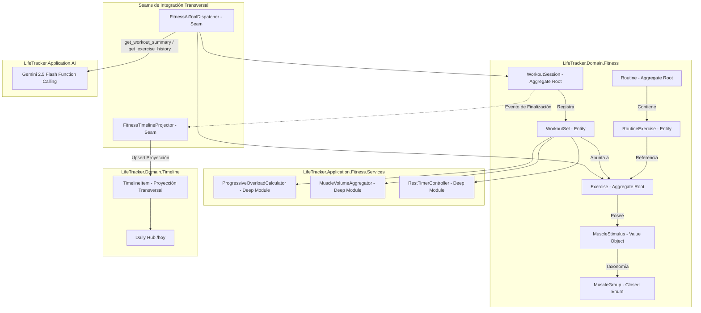

# Plan Técnico: Fase 7 - Entrenamientos y Actividad Física (Gimnasio, Rutinas, Tracker en Vivo y Ponderación Muscular)

- **Ruta**: `.specs/07-fitness/tech-plan.md`
- **Fase**: 3 (Plan Técnico y Arquitectura de Dominio)
- **Estado**: Propuesto (En espera de Puerta de Aprobación 3)
- **Fecha**: 2026-09-10
- **Autor**: Software Architect & Domain Specialist (SubiKit)
- **Aprobador**: Subi

---

## 1. Decisiones de Arquitectura & Design It Twice

### 1.1 Evaluación Técnica 1: Estructura de `WorkoutSet` y Agrupación de Ejercicios en Sesión

| Criterio | Opción A: Relacional Jerárquica Normalizada (`WorkoutSession` -> `WorkoutExerciseGroup` -> `WorkoutSet`) | Opción B (Seleccionada): Modelo Plano Desacoplado con `WorkoutSet` Directo y Referencia Ordinal |
| :--- | :--- | :--- |
| **Modelado de Datos** | Tres niveles relacionales obligatorios. Cada ejercicio en la sesión requiere un registro contenedor intermedio (`workout_exercise_groups`). | Dos niveles relacionales directos (`workout_sessions` y `workout_sets`). Cada serie almacena `session_id`, `exercise_id` y `set_order`. |
| **Ergonomía en el Gimnasio** | Rigidez extrema: cambiar el orden de ejercicios, alternar en biserie (superserie) o intercalar una máquina ocupada exige mutar y reindexar entidades intermedias. | Máxima flexibilidad: intercalar ejercicios o registrar series fuera de orden requiere únicamente insertar o reordenar tuplas planas de `WorkoutSet`. |
| **Latencia de Escritura en Vivo** | Alta contención: actualizar una serie puede requerir bloqueos de fila en la tabla grupal intermedia y en la sesión padre. | Ultrabaja latencia: inserción/actualización directa por `set_id` con cero contención de bloqueos cruzados en dispositivos móviles. |
| **Complejidad de Sobrecarga Progresiva** | Requiere joins recursivos entre grupos de ejercicios pasados para encontrar series homólogas. | Búsqueda directa y ultraveloz indexada por `(user_id, exercise_id, set_order, set_type)`. |
| **Testabilidad Unitaria** | Compleja: requiere instanciar jerarquías de agregados anidados con colecciones intermedias para cualquier cálculo. | Simple y elegante: los Deep Modules operan sobre listas planas de `WorkoutSet` fuertemente tipadas en memoria. |

> **Decisión**: Se adopta la **Opción B**. La experiencia en la sala de pesas exige latencia casi nula y tolerancia a cambios de orden sobre la marcha (máquinas ocupadas, superseries). El modelo plano desacoplado simplifica la concurrencia, acelera las consultas de sobrecarga progresiva y permite que `ProgressiveOverloadCalculator` y `MuscleVolumeAggregator` operen sin overhead jerárquico.

---

### 1.2 Evaluación Técnica 2: Persistencia de Estímulos y Ponderación Muscular (`MuscleStimulus`)

| Criterio | Opción A: Tabla Relacional Normalizada `exercise_muscle_stimuli` | Opción B (Seleccionada): Documento `JSONB` Estructurado en `exercises.muscle_stimulus` |
| :--- | :--- | :--- |
| **Normalización** | 3FN estricta con FK a catálogo de músculos. | Almacenamiento semi-estructurado en columna `JSONB` con validación de esquema CHECK. |
| **Performance de Lectura** | Requiere `JOIN` obligatorio o `Include()` en EF Core cada vez que se carga un ejercicio en el live tracker o catálogo. | Lectura atómica en una sola consulta de fila; deserialización instantánea en memoria sin `JOIN`s adicionales. |
| **Integridad de Invariante 8** | Validar que exista al menos un motor primario (100%) requiere triggers SQL o validaciones en múltiples filas de la tabla hija. | Validable en dominio (C# Value Object) y en PostgreSQL mediante función CHECK o esquema JSON constraint. |
| **Agregación de Volumen Semanal** | Consultas con múltiples `GROUP BY` y `JOIN` cruzados con `workout_sets`. | El `MuscleVolumeAggregator` en memoria procesa el snapshot sin saturar el motor de base de datos con joins masivos. |
| **Evolución Biomecánica** | Alterar porcentajes exige migraciones de datos en tablas normalizadas. | Modificación granular de arrays JSONB conservando inmutabilidad en sesiones consolidadas. |

> **Decisión**: Se selecciona la **Opción B**. Los ejercicios poseen una cantidad pequeña y cerrada de músculos estimulados (típicamente entre 1 y 4). Almacenarlo como `JSONB` en `exercises` otorga atomicidad de lectura en el tracker móvil, elimina joins costosos en la sala de pesas y permite al agregado de dominio validar la regla del motor primario (100%) en una sola operación atómica.

---

## 2. Arquitectura de Dominio y Deep Modules (Ousterhout)



### 2.1 Deep Module 1: `ProgressiveOverloadCalculator`
- **Problema que resuelve**: Encontrar con qué carga y repeticiones compite el usuario en la serie actual sin obligarlo a buscar sesiones anteriores ni recordar sus récords.
- **Interfaz concisa (Superficie Mínima)**:
  ```csharp
  public interface IProgressiveOverloadCalculator
  {
      IReadOnlyList<GhostSetReferenceDto> ResolveGhostSets(
          Guid exerciseId,
          IReadOnlyList<WorkoutSet> currentSets,
          IReadOnlyList<WorkoutSession> pastCompletedSessions);
  }
  ```
- **Lógica profunda oculta (Implementación Compleja)**:
  1. Filtra únicamente sesiones en estado `Completed`, ordenadas descendentemente por `CompletedAt`.
  2. Localiza la sesión más reciente que contenga series completadas (`IsCompleted == true`) para el `ExerciseId` especificado.
  3. Realiza un algoritmo de emparejamiento posicional y cualitativo:
     - Prioriza emparejar por `(SetOrder, SetType)`.
     - Si la sesión actual tiene más series que la anterior, proyecta como valor fantasma la última serie efectiva de la sesión previa.
     - Si la serie anterior fue de calentamiento (`Warmup`) y la actual es normal, busca la primera serie de trabajo efectiva (`Normal`) anterior.
  4. Calcula automáticamente el delta referencial (`diffKg`, `diffReps`).

---

### 2.2 Deep Module 2: `MuscleVolumeAggregator`
- **Problema que resuelve**: Superar el modelo plano y binario de la industria ("Press Banca = Pecho") calculando el volumen real de hipertrofia ponderada y fatiga por grupo muscular.
- **Fórmulas matemáticas de Dominio**:
  1. **Volumen Total en Kilogramos**:
     $$\text{TotalVolumeKg} = \sum_{i \in \text{CompletedSets}} (\text{weight\_kg}_i \times \text{reps}_i)$$
  2. **Series Efectivas Ponderadas por Músculo**:
     Las series de calentamiento (`Warmup`) se excluyen estrictamente del cálculo de hipertrofia:
     $$\text{EffectiveSets}(m) = \sum_{s \in \text{CompletedEffectiveSets}} \left(1.0 \times \frac{\text{StimulusPct}(s.\text{exercise}, m)}{100.0}\right)$$
- **Interfaz concisa**:
  ```csharp
  public interface IMuscleVolumeAggregator
  {
      WorkoutVolumeSummaryDto AggregateSession(
          WorkoutSession session,
          IReadOnlyDictionary<Guid, Exercise> exercisesLookup);

      WeeklyMuscleVolumeReportDto AggregateWeeklyVolume(
          IReadOnlyList<WorkoutSession> completedSessions,
          IReadOnlyDictionary<Guid, Exercise> exercisesLookup,
          DateOnly startOfWeek,
          DateOnly endOfWeek);
  }
  ```
- **Lógica profunda oculta**:
  - Filtro atómico de series donde `IsCompleted == true` y `SetType != SetType.Warmup`.
  - Normalización de pesos corporales en calistenia si aplica.
  - Ponderación de decimales con redondeo bancario a un decimal (`Math.Round(val, 1, MidpointRounding.AwayFromZero)`).
  - Clasificación de músculos en categorías de activación: Primario (100%), Secundario Fuerte (50-99%), Sinergista/Estabilizador (1-49%).

---

### 2.3 Deep Module 3: `RestTimerController`
- **Problema que resuelve**: Los temporizadores basados en `setInterval` en dispositivos móviles se desincronizan o detienen cuando la pantalla se bloquea o el navegador ralentiza timers de fondo.
- **Interfaz concisa**:
  ```csharp
  public interface IRestTimerController
  {
      RestTimerSnapshot Start(Guid sessionId, Guid setId, int durationSeconds, DateTimeOffset nowUtc);
      RestTimerSnapshot AddSeconds(RestTimerSnapshot current, int additionalSeconds, DateTimeOffset nowUtc);
      RestTimerSnapshot Stop(RestTimerSnapshot current, DateTimeOffset nowUtc);
      RestTimerSnapshot GetSnapshot(RestTimerSnapshot current, DateTimeOffset nowUtc);
  }
  ```
- **Lógica profunda oculta**:
  - Estado basado en marcas temporales absolutas UTC:
    $$\text{TargetEndUtc} = \text{StartedAtUtc} + \text{DurationSeconds}$$
    $$\text{RemainingSeconds} = \max(0, \lceil(\text{TargetEndUtc} - \text{NowUtc}).\text{TotalSeconds}\rceil)$$
  - Inmune a suspensiones de pantalla o cambios de app.

---

## 3. Seams de Integración Transversal (Michael Feathers)

### 3.1 Seam 1: `IFitnessTimelineProjector`
Desacopla la finalización de entrenamientos de la tabla transversal `timeline_items`:
```csharp
public interface IFitnessTimelineProjector
{
    Task ProjectCompletedWorkoutAsync(
        WorkoutSession session,
        WorkoutVolumeSummaryDto volumeSummary,
        CancellationToken ct = default);

    Task RemoveWorkoutProjectionAsync(
        Guid userId,
        Guid sessionId,
        CancellationToken ct = default);
}
```
- **Regla de Proyección**:
  - Solo impacta cuando `status == WorkoutStatus.Completed`.
  - `source_module`: `"fitness"`
  - `source_id`: `session.Id`
  - `event_type`: `"workout_completed"`
  - `title`: `"Entrenamiento: {session.Name}"`
  - `summary`: `"{session.DurationSeconds / 60} min | {session.TotalVolumeKg:N0} kg movidos | {session.TotalSetsCompleted} series"`
  - `metadata`: JSON enriquecido con `topMuscles`, `totalVolumeKg`, `durationMinutes` y `exercisesCount`.

---

### 3.2 Seam 2: `FitnessAiTools` & `AiToolDispatcher`
Permite al asistente IA (Gemini 2.5 Flash) interactuar con el módulo de entrenamientos sin acoplamiento con EF Core:
1. `get_workout_summary`:
   - Argumentos: `limit` (int, default 3), `startDate` (string YYYY-MM-DD), `endDate` (string YYYY-MM-DD).
2. `get_exercise_history`:
   - Argumentos: `exerciseName` (string, required), `limit` (int, default 5).
   - Retorna: Historial cronológico de sesiones donde se ejecutó el ejercicio, detallando series, cargas, repeticiones y RPE.

---

## 4. Esquema Relacional SQL (PostgreSQL en Supabase)

Migración: `supabase/migrations/20260912000000_fitness_schema.sql`

```sql
-- ==============================================================================
-- FASE 7: ENTRENAMIENTOS Y ACTIVIDAD FÍSICA (FITNESS)
-- Migration: 20260912000000_fitness_schema.sql
-- ==============================================================================

-- 1. ACTUALIZAR RESTRICCIÓN CHECK EN TIMELINE_ITEMS PARA SOPORTAR 'fitness'
ALTER TABLE public.timeline_items DROP CONSTRAINT IF EXISTS timeline_items_source_module_check;
ALTER TABLE public.timeline_items ADD CONSTRAINT timeline_items_source_module_check 
    CHECK (source_module IN ('health', 'habits', 'academics', 'work', 'notes', 'system', 'finances', 'fitness'));

-- ==============================================================================
-- 2. CATÁLOGO DE EJERCICIOS (public.exercises)
-- ==============================================================================
CREATE TABLE IF NOT EXISTS public.exercises (
    id UUID DEFAULT uuid_generate_v4() PRIMARY KEY,
    user_id UUID REFERENCES public.profiles(id) ON DELETE CASCADE, -- NULL para catálogo oficial del sistema
    name TEXT NOT NULL,
    slug TEXT NOT NULL,
    discipline TEXT NOT NULL CHECK (discipline IN ('strength', 'cardio', 'calisthenics', 'mobility')),
    primary_muscle_group TEXT NOT NULL CHECK (primary_muscle_group IN (
        'chest', 'upper_chest', 'lats', 'rhomboids', 'traps', 'lower_back',
        'anterior_deltoid', 'lateral_deltoid', 'posterior_deltoid',
        'biceps', 'triceps', 'forearms', 'quadriceps', 'hamstrings',
        'glutes', 'calves', 'abs', 'obliques'
    )),
    muscle_stimulus JSONB NOT NULL DEFAULT '[]'::jsonb,
    equipment TEXT NOT NULL CHECK (equipment IN (
        'barbell', 'dumbbell', 'machine', 'cable', 'bodyweight', 'kettlebell', 'smith_machine', 'bands', 'other'
    )),
    instructions TEXT[] DEFAULT '{}'::text[] NOT NULL,
    gif_url TEXT NOT NULL DEFAULT '',
    video_url TEXT,
    is_custom BOOLEAN DEFAULT false NOT NULL,
    created_at TIMESTAMPTZ DEFAULT timezone('utc'::text, now()) NOT NULL,
    updated_at TIMESTAMPTZ DEFAULT timezone('utc'::text, now()) NOT NULL,
    CONSTRAINT check_custom_exercise_owner CHECK (
        (is_custom = false AND user_id IS NULL) OR
        (is_custom = true AND user_id IS NOT NULL)
    )
);

CREATE INDEX IF NOT EXISTS idx_exercises_user_system ON public.exercises(user_id);
CREATE INDEX IF NOT EXISTS idx_exercises_primary_muscle ON public.exercises(primary_muscle_group);
CREATE INDEX IF NOT EXISTS idx_exercises_discipline ON public.exercises(discipline);
CREATE UNIQUE INDEX IF NOT EXISTS idx_exercises_user_slug ON public.exercises(COALESCE(user_id, '00000000-0000-0000-0000-000000000000'::uuid), slug);

ALTER TABLE public.exercises ENABLE ROW LEVEL SECURITY;

DROP POLICY IF EXISTS "exercises_read_all" ON public.exercises;
CREATE POLICY "exercises_read_all" ON public.exercises 
    FOR SELECT USING (user_id IS NULL OR auth.uid() = user_id);

DROP POLICY IF EXISTS "exercises_insert_own" ON public.exercises;
CREATE POLICY "exercises_insert_own" ON public.exercises 
    FOR INSERT WITH CHECK (auth.uid() = user_id AND is_custom = true);

DROP POLICY IF EXISTS "exercises_update_own" ON public.exercises;
CREATE POLICY "exercises_update_own" ON public.exercises 
    FOR UPDATE USING (auth.uid() = user_id AND is_custom = true);

DROP POLICY IF EXISTS "exercises_delete_own" ON public.exercises;
CREATE POLICY "exercises_delete_own" ON public.exercises 
    FOR DELETE USING (auth.uid() = user_id AND is_custom = true);

-- ==============================================================================
-- 3. PLANTILLAS DE RUTINAS (public.routines y public.routine_exercises)
-- ==============================================================================
CREATE TABLE IF NOT EXISTS public.routines (
    id UUID DEFAULT uuid_generate_v4() PRIMARY KEY,
    user_id UUID REFERENCES public.profiles(id) ON DELETE CASCADE NOT NULL,
    name TEXT NOT NULL,
    description TEXT,
    estimated_duration_minutes INT DEFAULT 60 NOT NULL CHECK (estimated_duration_minutes > 0),
    is_archived BOOLEAN DEFAULT false NOT NULL,
    created_at TIMESTAMPTZ DEFAULT timezone('utc'::text, now()) NOT NULL,
    updated_at TIMESTAMPTZ DEFAULT timezone('utc'::text, now()) NOT NULL
);

CREATE INDEX IF NOT EXISTS idx_routines_user ON public.routines(user_id);

ALTER TABLE public.routines ENABLE ROW LEVEL SECURITY;
DROP POLICY IF EXISTS "routines_all_own" ON public.routines;
CREATE POLICY "routines_all_own" ON public.routines FOR ALL USING (auth.uid() = user_id);

CREATE TABLE IF NOT EXISTS public.routine_exercises (
    id UUID DEFAULT uuid_generate_v4() PRIMARY KEY,
    routine_id UUID REFERENCES public.routines(id) ON DELETE CASCADE NOT NULL,
    exercise_id UUID REFERENCES public.exercises(id) ON DELETE RESTRICT NOT NULL,
    order_index INT NOT NULL CHECK (order_index >= 0),
    target_sets INT NOT NULL CHECK (target_sets > 0),
    target_reps_min INT NOT NULL CHECK (target_reps_min > 0),
    target_reps_max INT NOT NULL CHECK (target_reps_max >= target_reps_min),
    rest_timer_seconds INT DEFAULT 90 NOT NULL CHECK (rest_timer_seconds >= 0),
    notes TEXT,
    created_at TIMESTAMPTZ DEFAULT timezone('utc'::text, now()) NOT NULL,
    UNIQUE (routine_id, order_index)
);

CREATE INDEX IF NOT EXISTS idx_routine_exercises_routine ON public.routine_exercises(routine_id);
CREATE INDEX IF NOT EXISTS idx_routine_exercises_exercise ON public.routine_exercises(exercise_id);

ALTER TABLE public.routine_exercises ENABLE ROW LEVEL SECURITY;
DROP POLICY IF EXISTS "routine_exercises_all_own" ON public.routine_exercises;
CREATE POLICY "routine_exercises_all_own" ON public.routine_exercises 
    FOR ALL USING (
        EXISTS (
            SELECT 1 FROM public.routines r 
            WHERE r.id = routine_exercises.routine_id AND r.user_id = auth.uid()
        )
    );

-- ==============================================================================
-- 4. SESIONES DE ENTRENAMIENTO (public.workout_sessions)
-- ==============================================================================
CREATE TABLE IF NOT EXISTS public.workout_sessions (
    id UUID DEFAULT uuid_generate_v4() PRIMARY KEY,
    user_id UUID REFERENCES public.profiles(id) ON DELETE CASCADE NOT NULL,
    routine_id UUID REFERENCES public.routines(id) ON DELETE SET NULL,
    name TEXT NOT NULL,
    status TEXT NOT NULL CHECK (status IN ('active', 'completed', 'discarded')),
    started_at TIMESTAMPTZ NOT NULL,
    completed_at TIMESTAMPTZ,
    duration_seconds INT DEFAULT 0 NOT NULL CHECK (duration_seconds >= 0),
    total_volume_kg NUMERIC(12,2) DEFAULT 0.00 NOT NULL CHECK (total_volume_kg >= 0),
    total_sets_completed INT DEFAULT 0 NOT NULL CHECK (total_sets_completed >= 0),
    notes TEXT,
    created_at TIMESTAMPTZ DEFAULT timezone('utc'::text, now()) NOT NULL,
    updated_at TIMESTAMPTZ DEFAULT timezone('utc'::text, now()) NOT NULL
);

-- Invariante 9: Unicidad estricta de sesión activa por usuario mediante Partial Unique Index
CREATE UNIQUE INDEX IF NOT EXISTS idx_workout_sessions_single_active 
    ON public.workout_sessions(user_id) 
    WHERE (status = 'active');

CREATE INDEX IF NOT EXISTS idx_workout_sessions_user_status ON public.workout_sessions(user_id, status, started_at DESC);

ALTER TABLE public.workout_sessions ENABLE ROW LEVEL SECURITY;
DROP POLICY IF EXISTS "workout_sessions_all_own" ON public.workout_sessions;
CREATE POLICY "workout_sessions_all_own" ON public.workout_sessions FOR ALL USING (auth.uid() = user_id);

-- ==============================================================================
-- 5. SERIES DE ENTRENAMIENTO (public.workout_sets)
-- ==============================================================================
CREATE TABLE IF NOT EXISTS public.workout_sets (
    id UUID DEFAULT uuid_generate_v4() PRIMARY KEY,
    session_id UUID REFERENCES public.workout_sessions(id) ON DELETE CASCADE NOT NULL,
    exercise_id UUID REFERENCES public.exercises(id) ON DELETE RESTRICT NOT NULL,
    set_order INT NOT NULL CHECK (set_order >= 0),
    set_type TEXT NOT NULL CHECK (set_type IN ('normal', 'warmup', 'drop_set', 'failure')),
    weight_kg NUMERIC(6,2) NOT NULL CHECK (weight_kg >= 0),
    reps INT NOT NULL CHECK (reps >= 0),
    rpe NUMERIC(3,1) CHECK (rpe IS NULL OR (rpe >= 1.0 AND rpe <= 10.0)),
    rir INT CHECK (rir IS NULL OR (rir >= 0 AND rir <= 10)),
    is_completed BOOLEAN DEFAULT false NOT NULL,
    completed_at TIMESTAMPTZ,
    created_at TIMESTAMPTZ DEFAULT timezone('utc'::text, now()) NOT NULL
);

CREATE INDEX IF NOT EXISTS idx_workout_sets_session ON public.workout_sets(session_id);
CREATE INDEX IF NOT EXISTS idx_workout_sets_exercise_completed ON public.workout_sets(exercise_id, is_completed);

ALTER TABLE public.workout_sets ENABLE ROW LEVEL SECURITY;
DROP POLICY IF EXISTS "workout_sets_all_own" ON public.workout_sets;
CREATE POLICY "workout_sets_all_own" ON public.workout_sets 
    FOR ALL USING (
        EXISTS (
            SELECT 1 FROM public.workout_sessions s 
            WHERE s.id = workout_sets.session_id AND s.user_id = auth.uid()
        )
    );
```

---

## 5. Implementación Backend (.NET 9 Clean Architecture)

### 5.1 Entidades de Dominio (`LifeTracker.Domain/Fitness`)
- `Exercise`: Catálogo de ejercicios con validación de invariante 8 (al menos un motor primario con 100%) y mapeo JSONB para `MuscleStimulus`.
- `Routine` y `RoutineExercise`: Plantillas reutilizables.
- `WorkoutSession`: Agregado raíz de sesión con validación de estado activo para mutaciones.
- `WorkoutSet`: Entidad de serie individual con soporte para marcado de completado y campos opcionales de RPE/RIR.

### 5.2 Capa de Aplicación (`LifeTracker.Application/Fitness`)
- `IProgressiveOverloadCalculator` y `ProgressiveOverloadCalculator`.
- `IMuscleVolumeAggregator` y `MuscleVolumeAggregator`.
- `IRestTimerController` y `RestTimerController`.
- `IFitnessTimelineProjector` y `FitnessTimelineProjector`.
- Servicios/Handlers de aplicación para:
  * `GetExercisesQuery`, `CreateCustomExerciseCommand`.
  * `GetRoutinesQuery`, `CreateRoutineCommand`.
  * `StartWorkoutSessionCommand`, `LogWorkoutSetCommand`, `CompleteWorkoutSessionCommand`, `DiscardWorkoutSessionCommand`.

### 5.3 Capa de Infraestructura (`LifeTracker.Infrastructure`)
- Registro de 5 `DbSet`s en `ILifeTrackerDbContext` y `LifeTrackerDbContext`:
  `Exercises`, `Routines`, `RoutineExercises`, `WorkoutSessions`, `WorkoutSets`.
- Mapeos Fluent API en `LifeTracker.Infrastructure/Persistence/Configurations/FitnessConfigurations.cs`.

---

## 6. Arquitectura Frontend (Next.js 16 App Router)

### 6.1 Estructura de Rutas en `web/src/app/(dashboard)/entrenamientos/`
- `/entrenamientos/page.tsx`: Hub central con acceso rápido ("Iniciar entrenamiento rápido", seleccionar rutina, métricas de volumen de la semana).
- `/entrenamientos/ejercicios/page.tsx`: Catálogo facetado con búsqueda debounced, chips de filtro por músculo y drawer de detalle con GIF en bucle, instrucciones e indicador de activación muscular.
- `/entrenamientos/rutinas/page.tsx`: Gestor de plantillas y constructor visual de rutinas.
- `/entrenamientos/sesion/activa/page.tsx`: Live Workout Tracker en **modo operar** (botones táctiles grandes, Rest Timer flotante, sobrecarga progresiva visible).
- `/entrenamientos/historial/page.tsx`: Historial cronológico de entrenamientos con desglose de volumen.

### 6.2 Hooks Reactivos
- `useLiveWorkout`:
  - Manejo de estado local sincronizado con backend.
  - Soporte offline/recarga con persistencia en `localStorage`.
- `useRestTimer`:
  - Cálculo contra timestamp absoluto UTC (`targetEndUtc`).
  - Disparo de vibración háptica (`navigator.vibrate([80, 40, 80])`).
  - Síntesis de sonido suave con Web Audio API (cero peticiones externas).

---

## 7. Estrategia de Testing

1. **Unit Tests de Dominio (`LifeTracker.Domain.Tests/Fitness`)**:
   - `ExerciseTests`: Valida que se rechace un ejercicio sin motor primario al 100% (Invariante 8).
   - `MuscleVolumeAggregatorTests`: Verifica la fórmula ponderada de series efectivas y la exclusión de warmups.
   - `ProgressiveOverloadCalculatorTests`: Verifica el emparejamiento con la serie histórica correspondiente.
   - `RestTimerControllerTests`: Verifica la precisión contra marcas UTC y la función `+30s`.
2. **Integration Tests (`LifeTracker.Api.Tests/Fitness`)**:
   - `SingleActiveSessionConstraintTest`: Comprueba que la base de datos y la API rechacen iniciar una segunda sesión activa si ya existe una en curso (Invariante 9).
   - `FitnessTimelineProjectionTest`: Comprueba que al completar una sesión se inserte el registro proyectado en `timeline_items`.
